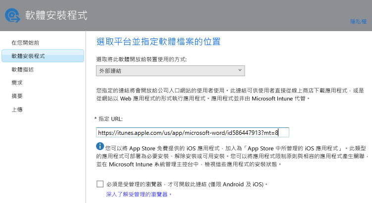

# 將已註冊裝置的應用程式新增至 Intune

您必須先將應用程式新增至 Microsoft Intune，才能部署或管理它。 本主題說明如何新增已註冊裝置的應用程式。

> [!IMPORTANT]
> 本主題的資訊可協助您新增想要部署至註冊的裝置與註冊的 Windows 電腦的應用程式。 如果您想要使用 Intune 用戶端軟體新增管理之 Windows 電腦的應用程式，請參閱[在 Microsoft Intune 中新增 Windows 電腦的應用程式](add-apps-for-windows-pcs-in-microsoft-intune.md)。

## 新增應用程式
您將使用 Intune 軟體發行者設定應用程式的內容，並在適用時使用下列程序，將應用程式上傳至您的雲端儲存空間：

1.  在 [Microsoft Intune 管理主控台]中，選擇 [應用程式] &gt; [新增應用程式]，以啟動 Intune 軟體發佈者。

    > [!TIP]
    > 您可能需要輸入 Intune 使用者名稱和密碼，才能啟動發佈者。

2.  在軟體的 [軟體安裝程式] 頁面上，為 [選取將此軟體開放給裝置使用的方式] 選擇下列其中一個選項：
    - **軟體安裝程式**，為包含副檔名 **.msi** 或 **.exe** 的應用程式指定︰
        - **選取軟體安裝程式檔案類型** - 這是您要部署的軟體類型。 例如，如果您想要安裝 iOS 應用程式，請選取 [iOS 應用程式套件 (*.ipa 檔案)]。
        - **指定軟體安裝檔的位置**輸入安裝檔的位置，或選擇 [瀏覽] 從清單中選取位置。
        - **包含同一個資料夾的其他檔案和子資料夾** - 僅適用於 **Windows Installer** 檔案類型。 某些使用 Windows Installer 的軟體需要支援檔案，這些檔案通常位於與安裝檔所在的相同資料夾中。 如果您也想要部署這些檔案，請選取這個選項。 這個安裝類型會佔用部分雲端儲存空間。

  -   **外部連結**，針對要將連結指定至應用程式市集所建立的應用程式，指定：

        - **指定 URL** - 將 URL 指定為下列其中一項︰
            - 您要部署之應用程式的 App Store URL。 例如，如果您想要部署適用於 Android 的 Microsoft 遠端桌面應用程式，請指定 **https://play.google.com/store/apps/details?id=com.microsoft.rdc.android**。 若要尋找應用程式的 URL，請使用搜尋引擎來尋找包含該應用程式的 Store 頁面。 例如，若要尋找遠端桌面應用程式，您可以搜尋 **Microsoft 遠端桌面 Android**。
            - 一個網站。 Intune 將部署捷徑圖示到裝置的站台 (又稱為網路美工圖案)。
            - 網站上的應用程式。 Intune 將捷徑圖示部署到裝置上的應用程式。
        - **需要受管理的瀏覽器以開啟此連結 (僅限 Android 和 iOS)** - 當您部署連結至使用者的網站或 Web 應用程式時，它們只能在受 Intune 管理的瀏覽器中開啟 (瀏覽器必須安裝在裝置上)。 如需受管理瀏覽器的詳細資訊，請參閱[透過 Microsoft Intune 使用受管理的瀏覽器原則管理網際網路存取](manage-internet-access-using-managed-browser-policies.md)。 這個安裝類型不會佔用任何雲端儲存空間。

  -   **應用程式商店中的受管理 iOS 應用程式**，針對想要使用 MAM 原則管理之 iTunes Store 的免費應用程式，指定︰

        - **指定 URL** - 輸入您要部署之應用程式的 App Store URL。 例如，如果您想要部署 iOS 的 Microsoft 工作資料夾應用程式，請指定 **https://itunes.apple.com/us/app/work-folders/id950878067?mt=8**。 這個安裝類型不會佔用任何雲端儲存空間。

        例如，如果您想要將 iTunes Store 的 Microsoft Word 應用程式部署到裝置，頁面將如下所示︰
        
        

3.  在 [軟體描述] 頁面上，設定下列項目：

    > [!TIP]
    > 根據您使用的安裝程式類型，其中有些值可能已自動輸入。

    - **發行者** - 輸入應用程式的發行者名稱。
    - **名稱** - 輸入要顯示在公司入口網站中的應用程式名稱。 確定您使用的所有應用程式名稱並未重複。 如果有重複的應用程式名稱，使用者只會在公司入口網站中看到其中一個應用程式。
    - **描述** - 輸入應用程式的描述。 使用者會在公司入口網站中看到這個描述。
    - **軟體資訊的 URL** - 只有在您選取 [軟體安裝程式] 後才能使用。 (選擇性) 輸入包含這個應用程式之相關資訊的網站 URL。 使用者會在公司入口網站中看到這個 URL。
    - **隱私權 URL** - 只有在您選取 [軟體安裝程式] 後才能使用。 (選擇性) 輸入包含這個應用程式之隱私權資訊的網站 URL。 使用者會在公司入口網站中看到這個 URL。
    - **類別** - (選擇性) 選取其中一個內建應用程式類別。 這可以讓使用者在瀏覽公司入口網站時，更輕鬆地找到應用程式。
    - **在公司入口網站中將此項目顯示為熱門應用程式並將它反白** - 當使用者瀏覽應用程式時，在公司入口網站的主頁面上以醒目的方式顯示應用程式。
    - **圖示** - (選擇性) 上傳要與應用程式相關聯的圖示。 這是使用者瀏覽公司入口網站時，會隨應用程式一起顯示的圖示。

        在此範例中，您可以設定 iOS 的 Microsoft Word 應用程式的描述︰

        

4.  在 [需求] 頁面上，選取必須符合才能讓應用程式在裝置上開始安裝的需求。 例如，針對 iOS 應用程式套件，您可以選取 iOS 的最低所需版本，以及所需的裝置類型，例如 iPhone 或 iPad。

    > [!TIP]
    > 並非所有類型的應用程式都會顯示[需求] 頁面。

5.  當您選取 [Windows Installer] 檔案類型時，會顯示進一步的精靈頁面。 您將軟體部署到執行 Windows 10 或更新版本的電腦 (其向 Intune 註冊) 上時，會使用此檔案類型。

6.  在 [摘要] 頁面上，檢閱您指定的資訊。 準備好後，選擇 [上傳]。

7.  選擇 [關閉] 來完成。

應用程式會顯示在 [應用程式] 工作區的 [應用程式] 節點上。

## 範例

### 將 MSI 應用程式部署至 Windows 10 裝置
在這個四分鐘的影片中，您將了解如何將 Microsoft Installer (msi) 應用程式部署至執行 Windows 10 的已註冊裝置。  

<iframe src="https://channel9.msdn.com/Series/How-to-Control-the-Uncontrolled/6--How-to-Deploy-MSI-Applications-to-Windows-10-Using-Intune-and-Mobile-Device-Management-MDM/player" width="640" height="360" allowFullScreen frameBorder="0"></iframe>

## 後續步驟

建立應用程式後，下一個步驟是將它部署。 若要深入了解，請參閱 [在 Microsoft Intune 中部署應用程式](deploy-apps.md)

<!--HONumber=Jun16_HO4-->

