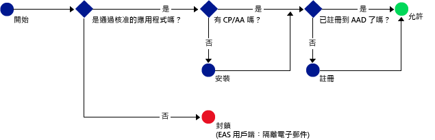

# 只允許支援 Intune MAM 原則的行動裝置應用程式存取 Office 365 服務
[Intune 行動應用程式管理 (MAM) 原則](protect-apps-and-data-with-microsoft-intune.md)可協助您在向 Intune 註冊管理的裝置上保護公司資料。 您也可以在**未向 Intune 註冊管理之屬員工擁有的裝置**上，使用 MAM 原則。  在此情況下，即使未管理裝置，仍然需要確定公司資料和資源受到保護。 透過 MAM (MAM CA) 的條件式存取，您可以建立原則，只允許支援 Intune MAM 原則的行動裝置應用程式存取 Exchange Online 等 O365 服務。

例如，您可以藉由只允許 **Microsoft Outlook 應用程式**存取 Exchange Online，來**封鎖 iOS 和 Android 上的內建郵件應用程式**，這些應用程式從**Exchange Online** 取得電子郵件時，不會受到 Intune MAM 原則所提供的資料保護。

下列圖表中的流程示範 MAM CA 原則在決定允許或禁止的時機時所使用的流程：。

圖表中使用的縮寫描述：
* **CP**：公司入口網站應用程式
* **AA**：Azure Authenticator 應用程式
* **AAD**：Azure Active Directory
* **EAS**：Exchange Active Sync

## 必要條件
設定 MAM CA 原則**之前**，您必須擁有 **Enterprise Mobility + Security 或 Azure Active Directory Premium 訂閱**，且使用者必須獲 EMS 或 Azure AD 授權。 如需詳細資訊，請參閱 [Enterprise Mobility 定價頁面](https://www.microsoft.com/en-us/cloud-platform/enterprise-mobility-pricing)或 [Azure Active Directory 定價頁面](https://azure.microsoft.com/en-us/pricing/details/active-directory/)。

## 支援的應用程式
**Exchange Online**：Android 版及 iOS 版的 **Microsoft Outlook**。

如需了解設有 MAM CA 原則之應用程式的使用者體驗，請參閱[使用設有 MAM CA 的應用程式須知](use-apps-with-mam-ca.md)。

## 後續步驟
[建立 MAM 應用程式的 Exchange Online 原則](mam-ca-for-exchange-online.md)

[封鎖沒有新式驗證的應用程式](block-apps-with-no-modern-authentication.md)

### 請參閱

[使用 MAM 原則保護應用程式資料](protect-app-data-using-mobile-app-management-policies-with-microsoft-intune.md)

<!--HONumber=Oct16_HO4-->

