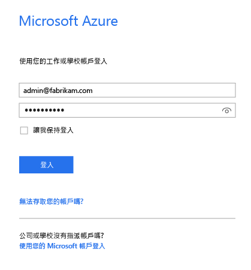
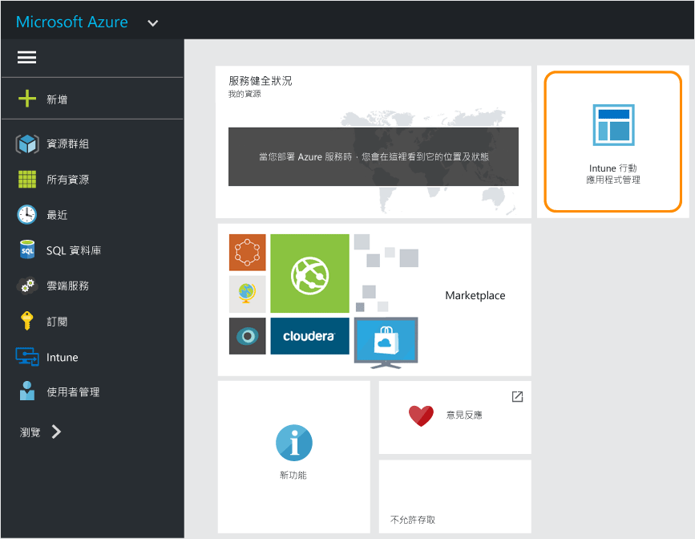

# Microsoft Intune MAM 原則的 Azure 入口網站
## 使用 Azure 入口網站
Azure 入口網站可讓您建立和管理行動應用程式管理 (MAM) 原則。

建立 MAM 原則的 Azure 入口網站支援︰
- **在 Intune 中註冊和管理**之裝置上執行的應用程式。
- **非**由任何 MDM 解決方案註冊之裝置上執行的應用程式。
- **在協力廠商 MDM 解決方案中註冊**之裝置上執行的應用程式。

>[!IMPORTANT]

> 若您是使用 [Intune 管理主控台](configure-and-deploy-mobile-application-management-policies-in-the-microsoft-intune-console.md)管理裝置，即可使用 Intune 管理主控台，為已在 Intune 中註冊的裝置建立支援應用程式的 MAM 原則。

> Intune 管理主控台可能不會顯示所有 MAM 原則設定。 Azure 入口網站是建立 MAM 原則的新管理主控台。 如果您同時在 Intune 管理主控台和 Azure 入口網站中建立 MAM 原則，系統會將 Azure 入口網站中的原則套用至應用程式並部署給使用者。

## 登入 Azure 入口網站並自訂起始畫面

1.  移至 [Azure 入口網站](https://portal.azure.com)，並使用 [!INCLUDE[wit_nextref](../includes/wit_nextref_md.md)] 認證登入。

    

2.  登入以後，您會看到 [儀表板] 頁面。 您可以自訂 [儀表板] 頁面。

    

3.  從 **[瀏覽]** 功能表中，尋找 **Intune**。![反白顯示 Intune [瀏覽] 功能表的螢幕擷取畫面](../media/AppManagement/AzurePortal_MAM_Browse_Intune.png)

4.  選擇 [Intune] > [Intune 行動應用程式管理] > [設定]。

    

    > [!TIP]
    > 若要將刀鋒視窗釘選到 [開始] 頁面，請選擇 [Intune 行動應用程式管理] 刀鋒視窗的釘選圖示，。

    

    
## 後續步驟
[準備設定行動應用程式管理原則](get-ready-to-configure-mobile-app-management-policies-with-microsoft-intune.md)

<!--HONumber=Oct16_HO3-->

