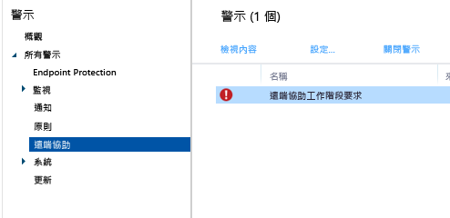

---
# required metadata

title: 一般 Windows 電腦管理工作 | Microsoft Intune
description:
keywords:
author: robstackmsft
manager: jeffgilb
ms.date: 04/28/2016
ms.topic: article
ms.prod:
ms.service: microsoft-intune
ms.technology:
ms.assetid: eb912c73-54d2-4d78-ac34-3cbe825804c7

# optional metadata

#ROBOTS:
#audience:
#ms.devlang:
ms.reviewer: owenyen
ms.suite: ems
#ms.tgt_pltfrm:
#ms.custom:

---

# 使用 Microsoft Intune 電腦用戶端的一般 Windows 電腦管理工作
請檢閱本主題中的工作，以瞭解如何管理執行 Intune 用戶端的電腦。 如果您尚未在電腦上安裝用戶端，請參閱[使用 Microsoft Intune 安裝 Windows 電腦用戶端](install-the-windows-pc-client-with-microsoft-intune.md)。

## 使用原則來簡化電腦管理
### 管理 Windows 防火牆
原則可簡化受管理電腦上的 Windows 防火牆設定管理。 如需詳細資訊，請參閱[在 Microsoft Intune 中使用 Windows 防火牆原則協助保護 Windows 電腦](help-protect-windows-pcs-using-windows-firewall-policies-in-microsoft-intune.md)。

### 管理 Microsoft Intune Center
Microsoft Intune Center 可讓使用者︰

-   從公司入口網站取得應用程式。

-   檢查更新。

-   管理 Microsoft Intune Endpoint Protection。

<!--- -   Request remote assistance.--->

Microsoft Intune Center 會安裝在所有受管理電腦上。 您可以在 Intune 中進行下列設定，而使用者會在 Microsoft Intune Center 中看到這些設定：

|原則設定|詳細資料|
|------------------|--------------------|
|**Name**|管理電腦的系統管理員名稱。  最大長度：40 個字元|
|**電話號碼**|管理電腦之系統管理員的電話號碼。  最大長度：20 個字元|
|**電子郵件地址**|管理電腦之系統管理員的電子郵件地址。  最大長度：40 個字元|
|**網站名稱**|使用者支援網站的名稱。  最大長度：40 個字元|
|**網站 URL**|您的支援網站的 URL。  最大長度：150 個字元|
|**附註**|使用者看到的附註。  最大長度：120 個字元|

### 管理軟體更新設定
請使用原則來設定受管理電腦用來檢查和下載 Microsoft 和協力廠商提供之軟體更新的設定。 如需詳細資訊，請參閱[在 Microsoft Intune 中使用軟體更新讓 Windows 電腦維持最新狀態](keep-windows-pcs-up-to-date-with-software-updates-in-microsoft-intune.md)。

### 管理 Endpoint Protection 設定
請使用原則來設定您隨後部署到受管理電腦的 Endpoint Protection 設定。 這包括掃描排程、偵測到惡意程式碼時採取的動作以及更多設定。 如需詳細資訊，請參閱[使用 Microsoft Intune 的 Endpoint Protection 協助保護 Windows 電腦](help-secure-windows-pcs-with-endpoint-protection-for-microsoft-intune.md)。

## 檢視硬體與軟體清查
Intune 會收集受管理電腦的硬體和軟體詳細資訊。 請使用下列程序中的資訊，瞭解如何建立：

-   列出電腦硬體功能相關資訊的報表。

-   列出每部電腦所安裝軟體的報表。

-   如何重新整理電腦清查以確保報表中的資料是最新的。

### 若要顯示電腦的相關資訊

1.  在 [Microsoft Intune 管理主控台](https://manage.microsoft.com/)中，選擇 [報表] &gt; [電腦清查報表]。

2.  在 [建立新報表]  頁面上，接受預設值或進行自訂，以篩選報表將傳回的結果。 例如，您可以選擇只讓執行 Windows 8.1 的電腦顯示在報表中。

3.  選擇 [檢視報表]，在新視窗中開啟 [電腦清查報表]。

    您可以選取每個欄標題，依任何一欄排序報表，例如 [名稱]、[底座類型] 或 [製造商]。

### 若要顯示電腦上安裝的軟體

1.  在 [Microsoft Intune 管理主控台](https://manage.microsoft.com/)中，選擇 [報表] &gt; [軟體清查報表]。

2.  在 [建立新報表]  頁面上，接受預設值或進行自訂，以篩選報表將傳回的結果。 例如，您可以選擇只讓 Microsoft 發佈的軟體顯示在報表中。

3.  選擇 [檢視報表]，在新視窗中開啟 [軟體清查報表]。

    您可以選擇每個欄標題，依任何一欄排序報表，例如 [名稱]、[發行者] 或 [類別]。 您可以選擇清單項目旁的方向箭頭，展開清單中的更新來顯示更多詳細資訊 (例如安裝軟體的電腦)。

### 若要重新整理電腦清查以確保它是最新的

1.  在 [Microsoft Intune 管理主控台](https://manage.microsoft.com/)中，選擇 [群組] &gt; [所有裝置] (或包含您想要重新整理清查之電腦的其他群組)。

2.  選取電腦，或按住 **Ctrl** 鍵選取多部電腦。

3.  在工作列上，選擇 [遠端工作] &gt; [重新整理清查]。

4.  若要檢視工作狀態，請選擇頁面右下角的 [遠端工作]。

    [工作狀態]  對話方塊會顯示目前的遠端工作、工作狀態、裝置名稱和任何回報的錯誤，並提供疑難排解資訊的連結。

## 從遠端重新啟動 Windows 電腦

1.  在 [Microsoft Intune 管理主控台](https://manage.microsoft.com/)中，選擇 [群組] &gt; [所有裝置] (或包含您想要重新啟動之電腦的其他群組)。

2.  選取一或多部電腦，然後選擇 [遠端工作] &gt; [重新啟動電腦]。

3.  若要檢視工作狀態，請選擇頁面右下角的 [遠端工作]。

4.  在 [工作狀態]  對話方塊中，檢閱目前的遠端工作、工作狀態、裝置名稱和任何回報的錯誤。

## 淘汰電腦

1.  在 [Microsoft Intune 管理主控台](https://manage.microsoft.com/)中，選擇 [群組] &gt; [所有裝置] (或包含您想要淘汰之電腦的其他群組)。

2.  選取您要淘汰的裝置，然後選擇 [淘汰/抹除]。

若要將電腦重新註冊到 Intune 中，請遵循[使用 Microsoft Intune 安裝 Windows 電腦用戶端](install-the-windows-pc-client-with-microsoft-intune.md)主題中的資訊，在電腦上重新安裝用戶端軟體。

如果電腦無法連線到 Intune，[儀表板] 工作區中會顯示訊息。

淘汰電腦時：

-   它會從 Intune 清查移除，而與該電腦相關聯的授權將可重複使用。

-   其狀態不再顯示在 Intune 主控台中。

-   Intune 會從電腦移除用戶端軟體。 如果電腦未連線到 Intune 服務，則會在下次連線時移除用戶端軟體。

-   Microsoft Intune Endpoint Protection 會從電腦移除。 如果電腦已安裝其他 Endpoint Protection 應用程式且已將它停用，則在移除 Microsoft Intune Endpoint Protection 之後，該應用程式可以重新啟用，以確保您的電腦受到保護。

-   所有原則都會從電腦移除，而且原則所設定的值將會變更。

-   電腦不會再從 Intune 服務接收軟體更新或惡意程式碼定義更新。

-   依據已淘汰電腦的設定方式，這些電腦仍可使用 Windows Server Update Services、Windows Update 或 Microsoft Update 繼續接收更新。

    > [!IMPORTANT] 如果用戶端軟體是使用群組原則物件 (GPO) 安裝，您必須先移除群組原則物件 (GPO)，然後才能移除用戶端軟體，以避免重新安裝軟體。

    如果用戶端無法解除安裝，請參閱[疑難排解 Endpoint Protection](/intune/troubleshoot/troubleshoot-endpoint-protection-in-microsoft-intune) 以取得更多協助。

## 管理使用者裝置連結
將軟體部署給使用者之前，您必須先將使用者連結到電腦。 您可以將單一使用者連結到多部電腦，但是每一部電腦只能連結到一個使用者。 使用者會自動連結到他們在 Intune 中使用公司入口網站註冊的任何電腦。

### 若要將使用者連結到電腦

1.  在 [Microsoft Intune 管理主控台](https://manage.microsoft.com/)中，選擇 [群組] &gt; [所有裝置] (或包含您想要連結至使用者之電腦的其他群組)。

2.  選取您想要連結使用者的電腦，然後選擇 [連結使用者]。

    [連結使用者]  對話方塊會顯示可用使用者清單，列出使用者的顯示名稱、使用者識別碼，以及每個使用者目前連結的電腦數目。 如果使用者已經連結到選取的電腦，該使用者的名稱和使用者識別碼便會顯示在 [目前使用者] 下。 如果電腦未連結到任何使用者，[目前使用者]  下方將會出現 [沒有使用者] 。

3.  請執行下列其中一項動作：

    -   若要讓電腦與目前的使用者保持連結 (如有)，請選擇 [取消]。

    -   若要移除與目前使用者的連結 (如有)，請選擇 [移除連結] &gt; [確定]。

    -   若要將電腦連結到新的使用者，請在 [所有使用者]  清單中選取使用者。 請確認使用者資料是否正確，然後選擇 [確定]。

> [!TIP] 如果您想要限制使用者將自己連結到電腦的能力，請啟用 [Microsoft Intune 代理程式設定] 原則中的 [限制使用者將自己連結到電腦的能力] 選項。

<!--- ## Request and provide remote assistance to Windows PCs that use the Intune client software

> [!IMPORTANT]
> You might not see the options to configure TeamViewer integration for remote assistance in the Intune admin console. This capability is not currently available to all customers, but will be rolling our more widely soon.
     

Microsoft Intune can use the [TeamViewer](https://www.teamviewer.com) software to let users of PCs that run the Intune client software get remote assistance help from you. When a user requests help from the Microsoft Intune Center, you are informed by an alert, can accept the request, and then provide assistance.
This functionality replaces the existing Windows Remote Assistance functionality in Intune.

### Before you start

Before you can begin to establish and respond to remote assistance requests, you must ensure the following prerequisites are in place:

- You must have [signed up for a TeamViewer account](https://login.teamviewer.com/LogOn#register) to log into the TeamViewer website.
- Windows PCs that you want to administer must be [managed by the Windows PC client](manage-windows-pcs-with-microsoft-intune.md)
- All Windows PC operating systems supported by Intune can be administered.

### Configure the TeamViewer Connector

1. In the [Microsoft Intune administration console](https://manage.microsoft.com), choose **Admin**.
2. In the **Admin** workspace, choose **TeamViewer**.
3. On the **TeamViewer** page, under **TeamViewer Connector**, choose **Enable**.
4. In the **Enable TeamViewer** dialog box, view, then **Accept** the license terms. If you don't already own a TeamViewer license, choose **Purchase a TeamViewer license**.
5. After the TeamViewer browser window opens, sign into the site with your TeamViewer credentials.
6. On the TeamViewer site, read, then accept the options to allow Intune to connect with TeamViewer.
7. In the Intune console, verify that the **TeamViewer Connector** item shows as **Enabled**.

### Open a remote assistance request (end user)

1. On a client Windows PC, open the **Microsoft Intune Center**.
2. Under **Remote Assistance**, choose **Request Remote Assistance**.
3. After you approve the request (see below), TeamViewer opens on the client. The user must accept any messages indicating that the web browser is trying to open the TeamViewer application.
4. The user sees a message asking if you can control their PC. They must accept this message to continue.
5. During the remote assistance session, the user sees a window that shows them you are connected. If they close this window, the remote session ends.

### Respond to a remote assistance request

1. When a user submits a remote assistance request, you can view it in the **Alerts** workspace, under **Monitoring** > **Remote Assistance**. For example:
> 

 If a request goes unanswered for more than 4 hours, it is removed.
2. To accept the request, choose **Approve request and launch Remote Assistance**.
3. In the **A New Remote Assistance Request is Pending** dialog box, choose **Accept the remote assistance request**. If it's not already installed, TeamViewer will install any necessary apps on your computer.
4. TeamViewer then notifies the end user that you want to take control of their PC. After the user has accepted the request, the TeamViewer windows opens, and you can control the PC. 
 
While in a remote assistance session, you can use all available TeamViewer commands to control the remote PC. For help with these commands, download the [Manual for remote control](http://www.teamviewer.com/en/support/documents/) from the TeamViewer website.

### Close the remote assistance session

From the **Actions** menu of the **TeamViewer** window, choose **End Session**.--->

<!--HONumber=Jun16_HO2-->

