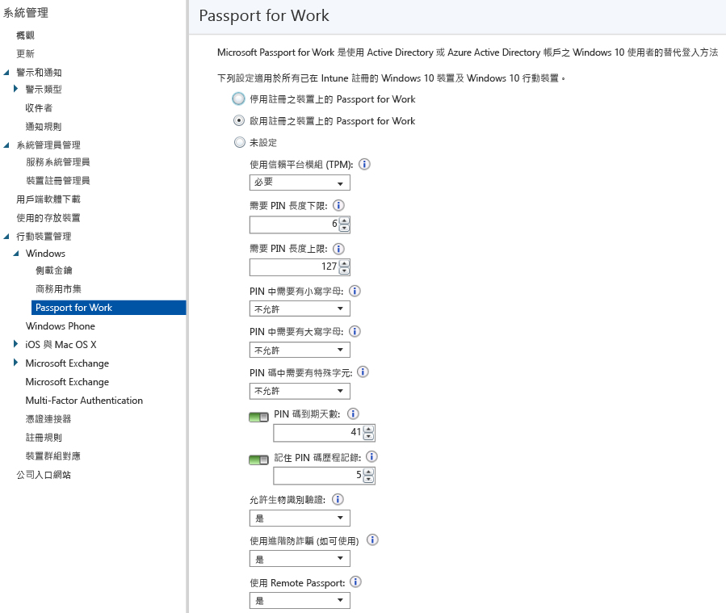

# 使用 Microsoft Intune 控制裝置上的 Microsoft Passport 設定
Microsoft Intune 與 Microsoft Passport for Work 整合運作，這是使用 Active Directory 或 Azure Active Directory 帳戶取代密碼、智慧卡或虛擬智慧卡的替代登入方法。

Passport 可讓您以「使用者筆勢」登入，而不使用密碼登入。 使用者筆勢可能是簡單的 PIN、生物識別驗證 (例如 Windows Hello) 或外部裝置 (例如指紋辨識器)。

>[!TIP]
>Microsoft Passport for Work 現在稱為 Windows Hello 企業版。 Intune 主控台尚未反映這項變更。

整合 Intune 與 Passport for Work 的兩種方式：

-   您可以使用 Intune 原則，控制使用者可以和無法用以登入的筆勢。

-   您可以將驗證憑證儲存在 Passport for Work 金鑰儲存提供者 (KSP) 中。 如需詳細資訊，請參閱[使用 Microsoft Intune 中的憑證設定檔來保護資源存取](secure-resource-access-with-certificate-profiles.md)。

## 建立 Passport for Work 原則

1.  在 [Microsoft Intune 管理主控台](https://manage.microsoft.com)中，選擇 **[系統管理]** &gt; **[行動裝置管理]** &gt;**[Windows]** &gt; **[Passport for Work]** 以開啟 Passport for Work 頁面。

    

2.  選擇下列其中一項設定：
    - **在已註冊的裝置上停用 Passport for Work**。 如果不想在 Windows 10 裝置上使用 Passport for Work，請選取此設定。 螢幕上的所有其他設定也都無法停用。
    - **在已註冊的裝置上啟用 Passport for Work**。 若要在所有 Windows 10 裝置上進行 Passport for Work 設定，請選取此設定。
    - **未設定**。 如果不想使用 Intune 來控制 Passport for Work 設定，請選取此設定。 將不會變更 Windows 10 裝置上任何現有的 Passport for Work 設定。 螢幕上的所有其他設定都無法停用。
3.  如果您選取 **[Enable Passport for Work on enrolled devices (在已註冊的裝置上啟用 Passport for Work)]**，請進行必要設定以套用至所有已註冊的 Windows 10 和 Windows 10 行動裝置版裝置。
4.  完成之後，請選擇 **[儲存]**。

## Passport for Work：PIN 設定

- **需要 PIN 長度下限**/**需要 PIN 長度上限**。 設定裝置以使用您指定的最小和最大 PIN 長度，協助確保安全的登入。 預設的 PIN 長度為 6 個字元，但您可以強制執行最小長度 (4 個字元)。 PIN 長度上限為 127 個字元。
- **PIN 中需要小寫字母**/**PIN 中需要大寫字母**/**PIN 中需要特殊字元**。 您可以要求在 PIN 中使用大寫字母、小寫字母及特殊字元，以強制使用強度更高的 PIN。 從下列選項進行選擇：
    - **允許**。 使用者可在其 PIN 中使用字元類型，但不是強制性。
    - **必要**。 使用者必須在其 PIN 中包含至少一個字元類型。 比方說，是常見的作法是需要至少一個大寫字母和一個特殊字元。
    - **不允許** (預設)。 使用者不得在其 PIN 中使用這些字元  (這也是未進行設定時的行為)。
    > [!TIP]
    > 特殊字元包含：**! " # $ % &amp; ' ( ) &#42; + , - . / : ; &lt; = &gt; ? @ [ \ ] ^ _ &#96; { &#124; } ~**。
- **PIN 到期 (天數)**。 建議為 PIN 指定到期時間，使用者必須在該時間後變更 PIN。 預設為 41 天。
- **記住 PIN 記錄**。 限制重複使用先前用過的 PIN。 預設為不能重複使用最後 5 個 PIN。

## Passport for Work︰其他設定

- **使用信賴平台模組 (TPM)**。 TPM 晶片提供額外一層資料安全性。 選擇下列其中一個值：
    - **必要** (預設)。 只有能存取 TPM 的裝置可以佈建 Passport for Work。
    - **慣用**。 第一次嘗試使用 TPM 的裝置。 如果無法使用此值，則可以使用軟體加密。
- **允許生物識別驗證**。 啟用生物識別驗證 (例如臉部辨識或指紋) 以替代 Passport for Work 的 PIN。 使用者仍然必須設定公司 PIN 以免生物識別驗證失敗。 從下列選項進行選擇：
    - **是**。 Passport for Work 允許生物識別驗證。
    - **否**。 Passport for Work 防止生物識別驗證 (針對所有帳戶類型)。
- **使用增強的防詐騙功能 (如其可用)**。 設定是否在支援 Windows Hello 反詐騙功能的裝置上使用該功能 (例如，偵測臉正面相片而非真正的臉孔)。 如果這設為 **[是]**，Windows 即要求所有使用者在支援的情況下，使用臉部特徵防詐騙。
- **使用 Remote Passport**。 若此選項設為 [是]，使用者即可使用遠端 Passport 作為桌上型電腦驗證的可攜式配套裝置。 桌上型電腦必須已加入 Azure Active Directory，且配套裝置必須設有 Passport for Work 的 PIN。

## 進一步資訊
如需 Microsoft Passport 的詳細資訊，請參閱 Windows 10 文件中的[指南](https://technet.microsoft.com/library/mt589441.aspx)。

<!--HONumber=Aug16_HO1-->

