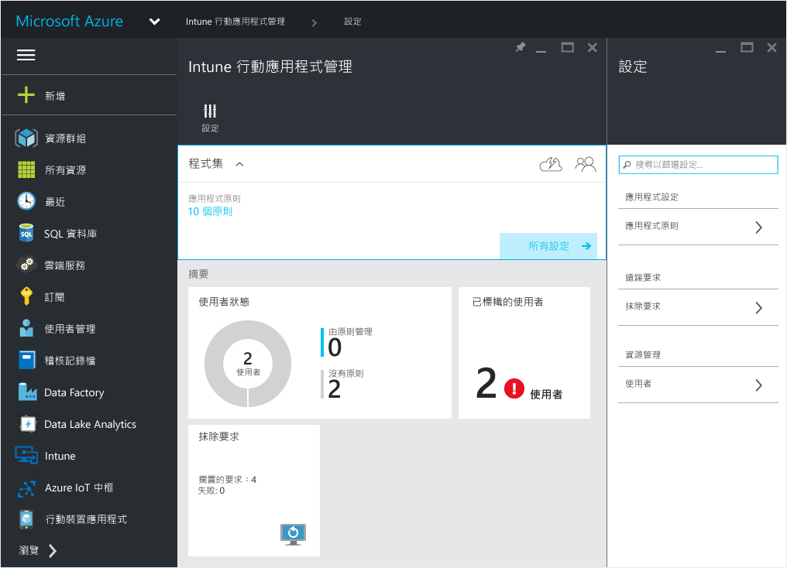
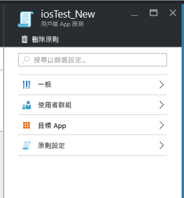

# 使用 Microsoft Intune 建立及部署行動應用程式管理原則
不論裝置是否由 Intune 管理，行動應用程式管理 (MAM) 原則都可以套用至這些裝置上執行的應用程式。 如需 MAM 原則的運作方式詳細資訊，以及 Intune MAM 原則支援的案例，請參閱[使用行動應用程式管理原則來保護應用程式資料](protect-app-data-using-mobile-app-management-policies-with-microsoft-intune.md)主題。

本主題描述在 **Azure 入口網站**中建立 MAM 原則的程序 。 Azure 入口網站是用於建立 MAM 原則的新管理主控台，並建議您使用這個入口網站建立 MAM 原則。 Azure 入口網站支援下列 MAM 案例：
- Intune 中註冊的裝置
- 協力廠商 MDM 解決方案管理的裝置
- 未受任何 MDM 解決方案 (BYOD) 管理的裝置。

>[!IMPORTANT]
如果您目前正在使用 **Intune 管理主控台**來管理您的裝置，請考慮下列項目︰

> * 您可以建立 MAM 原則，該原則使用 [Intune 管理主控台](configure-and-deploy-mobile-application-management-policies-in-the-microsoft-intune-console.md)支援 Intune 中註冊之裝置的應用程式。
> * 在 Intune 管理主控台中建立的 MAM 原則無法匯入到 Azure 入口網站中。  MAM 原則必須在 Azure 入口網站中重新建立。

> * 您可能看不到 Intune 管理主控台中的所有 MAM 原則設定。 Azure 入口網站是建立 MAM 原則的新管理主控台。

> * 若要部署管理應用程式，您必須在 Intune 管理主控台中建立 MAM 原則。 在此情況下，您可能想要在 Intune 管理主控台和 Azure 入口網站中建立 MAM 原則︰在 Intune 管理主控台中建立 MAM 原則，可確定您能夠部署受管理的應用程式，而在 Azure 入口網站中建立 MAM 原則，則是由於它是具有所有 MAM 原則設定的新管理主控台。

> * 如果您在 Intune 管理主控台和 Azure 入口網站上建立 MAM 原則，則會將在 Azure 入口網站中建立的原則套用至應用程式。

若要查看為 Android 和 iOS 平台支援的原則設定清單，請選取下列其中一項︰

> [!div class="op_single_selector"]
- [iOS 原則](ios-mam-policy-settings.md)
- [Android 原則](android-mam-policy-settings.md)

##  建立 MAM 原則
建立 MAM 原則之前，請檢閱[必要條件和支援](get-ready-to-configure-mobile-app-management-policies-with-microsoft-intune.md)資訊。
1.  選擇 [Intune 行動應用程式管理]**&gt;[設定]**開啟 [設定] 刀鋒視窗。

    

    > [!TIP]
    > 如果這是您第一次使用 Azure 入口網站，請先閱讀 [Microsoft Intune MAM 原則的 Azure 入口網站](azure-portal-for-microsoft-intune-mam-policies.md)以熟悉入口網站。

2.  在 [設定] 刀鋒視窗中，選擇 [應用程式原則]。  這會開啟 [應用程式原則] 刀鋒視窗，您將在其中建立新的原則及編輯現有的原則。 選擇 **[新增原則]**。

    ![反白顯示 [新增原則] 功能表選項的 [應用程式原則] 刀鋒視窗的螢幕擷取畫面 ](../media/AppManagement/AzurePortal_MAM_AddPolicy.png)

3.  輸入原則的名稱、新增簡短描述並選取平台類型，以建立適用於 iOS 或 Android 的原則。  您可以針對每部平台建立多項原則。

    ![[新增原則] 刀鋒視窗的螢幕擷取畫面](../media/AppManagement/AzurePortal_MAM_AddPolicy_only.png)

4.  選擇 [應用程式] 開啟 [應用程式]  刀鋒視窗，其中會顯示可用的應用程式清單。 您可以從清單中選取要與所建立之原則建立關聯的一或多個應用程式。 選取應用程式之後，選擇 [應用程式] 刀鋒視窗底部的 [選取] 按鈕儲存您的選擇。

    > [!IMPORTANT]
    > 您至少必須選取一個應用程式，才能建立原則。

5.  在 [新增原則] 刀鋒視窗上，選擇 [設定必要設定] 開啟 [原則設定] 刀鋒視窗。

    原則設定分為兩類：[資料重新配置] 和 [存取]。  資料重新配置原則適用於在應用程式中移入及移出資料，而存取原則決定使用者如何存取工作內容中的應用程式。
    原則設定中的預設值可協助您開始使用。  如果預設值符合您的需求，則不需要進行任何變更。

    > [!TIP]
    > 只有在工作內容中使用應用程式時，才會強制執行這些原則設定。  當使用者使用應用程式來執行個人工作時，不會受到這些原則的影響。

    ![設定刀鋒視窗與 [新增原則] 刀鋒視窗的螢幕擷取畫面](../media/AppManagement/AzurePortal_MAM_PolicySettings.png)

6.  選擇 [確定] 儲存這項設定。  現在您已回到 [新增原則]  刀鋒視窗。 選擇 [建立] 建立原則並儲存您的設定。

    ![顯示已設定的應用程式和設定的 [新增原則] 刀鋒視窗的螢幕擷取畫面](../media/AppManagement/AzurePortal_MAM_CreatePolicy.png)

當您如先前程序中所述完成建立原則時，該原則不會部署給任何使用者。  請遵循以下所述的步驟來部署原則。

> [!IMPORTANT]
> 如果您使用 Intune 管理主控台建立應用程式的 MAM 原則，及使用 Azure 入口網站建立 MAM 原則，則使用 Azure 入口網站建立的原則會優先適用。 不過，Intune 或 Configuration Manager 主控台中的報表會報告從 Azure 入口網站建立的原則設定。 例如：
>
> -   您在 Intune 管理主控台中，建立了封鎖從應用程式複製的行動應用程式管理原則。
> -   您在 Azure 主控台中，建立了允許從應用程式複製的行動應用程式管理原則。
> -   您將這兩個原則與同一個應用程式建立關聯。
> -   結果是會優先使用您從 Azure 主控台建立的原則並允許複製。
> -   不過，Intune 主控台中的狀態和報表會不正確地表示該複製遭到封鎖。

## 將原則部署給使用者

1.  在 [原則] 刀鋒視窗中，選擇 [使用者群組] 開啟 [使用者群組] 刀鋒視窗。 在 [使用者群組] 刀鋒視窗中，選擇 [新增使用者群組] 開啟 [新增使用者群組] 刀鋒視窗。

    ![反白顯示 [新增使用者群組] 功能表選項的 [使用者群組] 刀鋒視窗的螢幕擷取畫面](../media/AppManagement/AzurePortal_MAM_AddUserstoPolicy.png)

2.  [新增使用者群組]  刀鋒視窗中會顯示使用者群組清單。 這是 **Azure Active Directory**中的所有安全性群組清單。  您可以選取要套用這項原則的使用者群組，然後選擇 [選取]。 選擇 [選取] 可將原則部署給使用者。

    ![顯示 Azure Active Directory 使用者清單的 [新增使用者群組] 刀鋒視窗的螢幕擷取畫面](../media/AppManagement/AzurePortal_MAM_SelectUserstoDeploy.png)

    您現在已建立原則並將其部署給使用者。

只有指派 [!INCLUDE[wit_nextref](../includes/wit_nextref_md.md)] 授權的使用者會受到此原則的影響。  您選取之安全性群組中的使用者若未指派 [!INCLUDE[wit_nextref](../includes/wit_nextref_md.md)] 授權，則不會受到影響。

>[!IMPORTANT]
> 如果您使用 Intune 和 Configuration Manager 來管理您的 iOS 和 Android 裝置，則只會將原則套用至您選取之群組中的直屬使用者，  而不會影響巢狀於您選取之群組中的子群組成員。

使用者可以從應用程式市集或 Google Play 下載應用程式。 如需詳細資訊，請參閱：
* [當 Android 應用程式由 MAM 原則管理時會有何情況](user-experience-for-mam-enabled-android-apps-with-microsoft-intune.md)
* [當 iOS 應用程式由 MAM 原則管理時會有何情況](user-experience-for-mam-enabled-ios-apps-with-microsoft-intune.md)
##  變更現有的原則
您可以編輯現有的原則，並將它套用到目標使用者。 不過，當您變更現有的原則時，已登入應用程式的使用者將有 8 小時看不到變更。

若要立即查看變更的影響，使用者必須登出應用程式再重新登入。

### 變更與原則相關聯的應用程式清單

1.  在 [應用程式原則] 刀鋒視窗中，選擇您要變更的原則。 這會開啟您剛才選取之原則的特定刀鋒視窗。

    

2.  在 [原則] 刀鋒視窗中，選擇 [目標應用程式] 開啟應用程式清單。

3.  在清單中移除或新增應用程式，然後選擇儲存圖示  儲存您的變更。

### 變更使用者群組清單

1.  在 [應用程式原則] 刀鋒視窗中，選擇您要變更的原則。 這會開啟您選取之原則的特定刀鋒視窗。

2.  在 [原則] 刀鋒視窗中，選擇 [使用者群組] 開啟 [使用者群組] 刀鋒視窗，其中會顯示具有這項原則的目前使用者群組清單。

3.  若要**將新的使用者群組加入原則中**，請選擇 [新增使用者群組]，然後選取使用者群組。 選擇 [選取] 將原則部署到您選取的群組。

    ![選取兩個使用者的 [新增使用者群組] 刀鋒視窗的螢幕擷取畫面](../media/AppManagement/AzurePortal_MAM_ChangePolicy_SelectUser.png)

4.  若要**刪除使用者群組**，請反白顯示您要移除的使用者群組，選擇省略符號 (...)，然後選擇 [刪除] 以移除使用者群組。

    ![顯示 [刪除] 選項的螢幕擷取畫面 ](../media/AppManagement/AzurePortal_MAM_ChangePolicy_DeleteUser.png)

### 變更原則設定

1.  在 [應用程式原則] 刀鋒視窗中，選擇您要變更的原則。 這會開啟您剛才選取之原則的特定刀鋒視窗。

    

2.  選擇 [原則設定] 開啟 [原則設定] 刀鋒視窗。

3.  變更設定，然後選擇**儲存圖示**儲存您的變更。

    ![在頂端顯示儲存功能表選項的 [原則設定] 刀鋒視窗的螢幕擷取畫面](../media/AppManagement/AzurePortal_MAM_ChangePolicy_ChangeSettings.png)

## 原則設定
若要查看 iOS 和 Android 的原則設定的完整清單，請選取下列其中一項︰

> [!div class="op_single_selector"]
- [iOS 原則](ios-mam-policy-settings.md)
- [Android 原則](android-mam-policy-settings.md)

## 後續步驟
[監視相容性和使用者狀態](monitor-mobile-app-management-policies-with-microsoft-intune.md)

### 請參閱
* [當 Android 應用程式由 MAM 原則管理時會有何情況](user-experience-for-mam-enabled-android-apps-with-microsoft-intune.md)
* [當 iOS 應用程式由 MAM 原則管理時會有何情況](user-experience-for-mam-enabled-ios-apps-with-microsoft-intune.md)

<!--HONumber=Oct16_HO3-->

