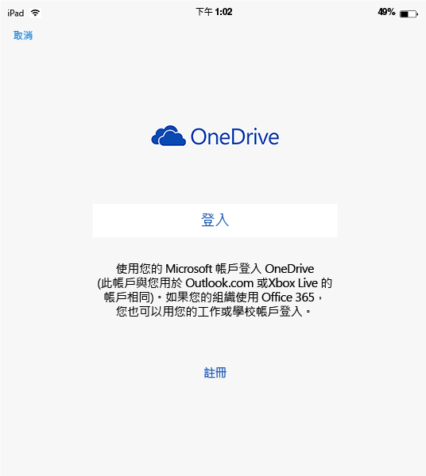
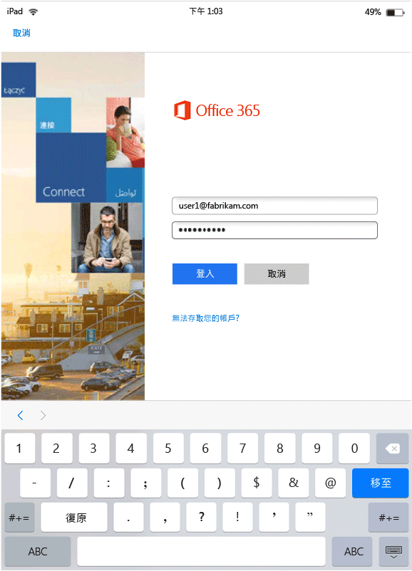

# 使用 Microsoft Intune 執行 MAM 啟用應用程式的使用者經驗
只有在應用程式用於工作內容時，才會套用行動應用程式管理 (MAM) 原則。  閱讀下列案例以了解受管理應用程式的運作方式。
##  在 IOS 裝置上存取 OneDrive

1.  啟動  **OneDrive** 應用程式以開啟登入頁面。

    

    > [!NOTE]
    > 使用者通常會在個人裝置上下載應用程式。  如果裝置受到 MDM 解決方案的管理，您可以將應用程式部署至裝置。

2.  輸入您的工作帳戶使用者名稱。 系統會將您重新導向至 [O365 驗證]  頁面，以輸入您的工作認證。

    

3.  Azure AD 成功驗證您的認證之後，會套用 MAM 原則，並要求您重新啟動 **OneDrive** 應用程式。
  >[NOTE!] [需要重新啟動] 對話方塊只會在未於 Intune 註冊的裝置上顯示。

    ![[需要重新啟動] 對話方塊的螢幕擷取畫面](../media/AppManagement/iOS_AppRestartforMAM.png)

4.  當您重新啟動 **OneDrive** 應用程式時，應用程式會隨即啟動並開啟 MAM 原則。 現在會提示您設定應用程式的 **PIN** (如果您設定原則執行這項動作)。

    

5.  設定並確認 PIN 之後，您便能夠存取 **商務用 OneDrive**上的檔案。

    

    > [!NOTE] 當您變更已部署的原則時，會在下次開啟應用程式時套用這些變更。

##  在 Android 裝置上存取 OneDrive

1.  啟動 OneDrive 應用程式以開啟登入頁面。

    > [!NOTE]
    > 使用者通常會在個人裝置上下載應用程式。  如果裝置是由 MDM 解決方案管理，您可以將應用程式部署至裝置。

2.  輸入您的工作帳戶使用者名稱。 系統會將您重新導向至 [O365 驗證]  頁面，以輸入您的工作認證。

    

3.  當 **Azure AD**成功驗證您的認證之後，如果裝置上尚未安裝公司入口網站應用程式，您應該會看到內含安裝指示的訊息。  點選 [取得應用程式]  以繼續。

>[!NOTE]
>Android 裝置上 MAM 原則相關聯的所有應用程式都需要公司入口網站應用程式。 對於不在 Intune 中註冊的裝置，此應用程式必須安裝在裝置上，但不需要啟動或登入應用程式。  

  

4.  您現在位於 **Google Play** 市集中，可從中下載並安裝 **公司入口網站** 應用程式。

    公司入口網站應用程式可協助確保資料安全且受到保護。

    

5.  完成安裝之後，選擇 [接受] 以接受條款。

6.  **OneDrive** 應用程式會自動啟動。

7.  下次開啟 OneDrive 時，如果原則設定已設定為需要 PIN 才能存取 **OneDrive**應用程式，您會看到設定 **PIN** 的提示。

    

8.  設定並確認 PIN 之後，您可以繼續使用現在是由應用程式原則管理的 **OneDrive**。

##  使用多重身分識別支援的應用程式
Microsoft Word 作為此案例的範例。

1.  在您的裝置上開啟 **Word** 應用程式。 我們將使用 iOS 裝置來示範這些步驟。

2.  點選 [新增]  建立新的 Word 文件。

    ![在畫面底部顯示 [新增] 功能表選項的 iOS 裝置的螢幕擷取畫面](../media/AppManagement/iOS_WordCreateNewDoc.png)

3.  輸入您選擇的句子。  當您嘗試儲存這份文件時，會顯示個人和工作位置選項，以供您儲存剛才建立的文件。  在這個步驟中，由於尚未建立這個工作/個人內容，因此尚未套用應用程式原則。

4.  將文件儲存至您的商務用 OneDrive 位置。 這份文件現在會標記為公司資料，而且會套用原則限制。

    

5.  開啟您儲存至工作位置的文件。  複製文字，開啟您個人的 **Facebook** 帳戶，然後嘗試貼上複製的文字。  您應無法將內容貼到新的 Facebook 文章。 [貼上] 選項不會呈現灰色，但是當您按下 [貼上] 時，不會有任何作用。

    

    

6.  現在重複步驟 2 和 3 以建立另一個新的文件，輸入所選的一個句子，然後將其儲存至個人位置 (例如 **[OneDrive - 個人]**)，而不是儲存至工作位置。

    

7.  開啟已儲存的個人文件。  複製文字，開啟 **Facebook** 應用程式，然後嘗試貼上複製的文字。 您會發現可以將內容貼到新的 Facebook 文章。

    

##  管理使用者帳戶

Intune 僅支援將 MAM 原則部署到每個裝置的一個使用者帳戶。 如果一個裝置有一個以上的工作帳戶，只有一個工作帳戶受 MAM 原則管理。

根據您所使用的應用程式，可能或不會封鎖裝置上的第二位使用者。 不過，在所有情況下，只有取得 MAM 原則的第一個使用者會受原則影響。

如果裝置在 MAM 原則部署之前結束多個使用者帳戶，則 MAM 原則部署到的第一個帳戶會受 Intune MAM 原則影響。

**Microsoft Word**、**Excel** 和 **PowerPoint** 不會封鎖第二個使用者帳戶，但第二個使用者帳戶不會受 MAM 原則影響。  

若為 **OneDrive 和 Outlook 應用程式**，您只能使用一個工作帳戶。  在這些應用程式中新增多個工作帳戶會遭到封鎖。  不過，您可以在裝置上移除使用者並新增不同的使用者。

閱讀下列案例範例以深入了解如何處理多個使用者帳戶。

使用者 A 為兩家公司服務 - **X 公司**和 **Y 公司**。使用者 A 在每個公司有一個工作帳戶，且兩者都使用 Intune 來部署 MAM 原則。 **X 公司**在 **Y 公司****之前**部署 MAM 原則。**X 公司**相關聯的帳戶將得到 MAM 原則，Y 公司的相關聯帳戶則否。如果您希望 Y 公司相關聯的使用者帳戶受 MAM 原則管理，您必須移除與 X 公司相關聯的使用者帳戶。
### 新增第二個帳戶
#### IOS
如果您使用 iOS 裝置，當您嘗試在同一部裝置上新增第二個工作帳戶時，您會看到封鎖訊息。  您也會看到可移除現有帳戶並新增帳戶的選項。 選擇 [是] 即可執行這項動作。

![包含封鎖訊息和 [是] 與 [否] 選項之對話方塊的螢幕擷取畫面](../media/AppManagement/iOS_SwitchUser.PNG)
####  Android
如果您使用 Android 裝置，您會看到封鎖訊息，其中包含有關如何移除現有帳戶並新增帳戶的指示。  在 Android 裝置上，若要移除現有的帳戶，請移至 **[設定] &gt; [一般]&gt; [應用程式管理員] &gt; [公司入口網站]，然後選取 [清除資料]**。

##  使用 Rights Management 共用應用程式檢視媒體檔案
若要在 Android 裝置上檢視公司 AV、PDF 和影像檔，請使用 [Microsoft Rights Management (RMS) 共用應用程式](https://play.google.com/store/apps/details?id=com.microsoft.ipviewer)。

從 Google Play 商店下載這個應用程式。  在裝置上安裝應用程式後，請啟動應用程式，並使用公司認證進行驗證。 您現在應該能夠檢視來自其他原則管理應用程式的未受保護和受保護檔案。

以下是支援的檔案類型：

* **音訊︰**AAC LC、HE-AACv1 (AAC+)、HE-AACv2 (增強 AAC+)、AAC ELD (增強低延遲 AAC)、AMR-NB、AMR-WB、FLAC、MP3、MIDI、Vorbis、PCM/WAVE。
* **視訊︰**H.263、H.264 AVC、MPEG-4 SP、VP8。
* **影像︰**jpg、pjpg、png、ppng、bmp、pbmp、gif、pgif、jpeg、pjpeg。
* PDF、PPDF

------------
|**pfile**|**文字**|
|----|----|
|Pfile 是適用於受保護檔案的泛型「包裝函式」格式，它會封裝已加密的內容和 RMS 授權，而且可以用來保護任何檔案類型。|文字檔案，包括 XML、CSV 等可以在應用程式中開啟以便進行檢視，即使它們受保護也一樣。 檔案類型︰txt、ptxt、csv、pcsv、log、plog、xml、pxml。|
---------------
**未在 Intune 註冊的 Android 裝置**

您必須先啟動 RMS 應用程式，並驗證您的工作帳戶，才能使用 RMS 共用應用程式來檢視 Intune 所管理之其他應用程式的檔案。  在您登入時，**只有在沒有 RMS 授權時**才會看到下列訊息：

**驗證成功 - 您現在可以檢視企業檔案，但您的組織未設定成讓您保護檔案。 如需詳細資訊，請連絡 IT 系統管理員。**

這不會禁止您使用 RMS 共用應用程式來檢視公司檔案。 您仍然可以開啟和檢視 Intune 所管理之其他應用程式的公司檔案，也仍然會套用 MAM 原則。  這則訊息指出您將無法新增 RMS 共用應用程式所提供的額外保護功能。  您必須具有 RMS 授權才能新增您檔案的保護。 若要深入了解 RMS 檔案保護功能，請參閱 [Protect a file on a device](https://docs.microsoft.com/en-us/rights-management/rms-client/sharing-app-protect-in-place) (保護裝置上的檔案) 和 [Protect a file that you share by email](https://docs.microsoft.com/en-us/rights-management/rms-client/sharing-app-protect-by-email) (保護您透過電子郵件共用的檔案)。

### 請參閱
[使用 Microsoft Intune 建立及部署行動應用程式管理原則](create-and-deploy-mobile-app-management-policies-with-microsoft-intune.md)

<!--HONumber=Jun16_HO3-->

