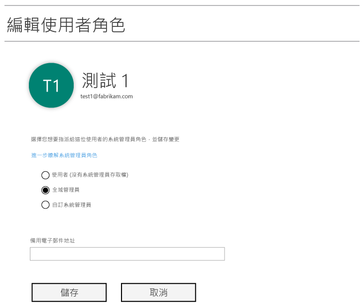
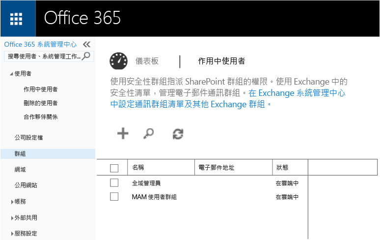

# 準備使用 Microsoft Intune 設定行動應用程式管理原則
本主題說明您在 Azure 入口網站中建立行動應用程式管理 (MAM) 原則之前，需要執行的事項。

Azure 入口網站是建立 MAM 原則的新管理主控台。 建議您使用此入口網站來建立 MAM 原則。 Azure 入口網站支援下列 MAM 案例：
- 在 Intune 中註冊的裝置
- 由協力廠商 MDM 解決方案管理的裝置
- 未受任何 MDM 解決方案管理的裝置 (BYOD)

如果您是使用 Azure 入口網站的新手，請閱讀 [Microsoft Intune MAM 原則的 Azure 入口網站](azure-portal-for-microsoft-intune-mam-policies.md)主題，以取得快速概觀。

>[!IMPORTANT]

> 如果您目前使用「Intune 管理主控台」來管理裝置，則可以使用 Intune 管理主控台，為在 Intune 中註冊的裝置建立支援應用程式的 MAM 原則。 但我們建議您使用 Azure 入口網站，即使是針對在 Intune 中註冊的裝置也一樣。 如需有關如何使用 Intune 管理主控台建立 MAM 原則的指示，請參閱[在 Microsoft Intune 主控台中設定和部署行動應用程式管理原則](configure-and-deploy-mobile-application-management-policies-in-the-microsoft-intune-console.md)。

> 您可能看不到 Intune 管理主控台中的所有 MAM 原則設定。 如果您同時在 Intune 管理主控台和 Azure 入口網站中建立 MAM 原則，則會將 Azure 入口網站中的原則套用至應用程式並部署至使用者。
> 在 Intune 管理主控台中建立的 MAM 原則無法匯入到 Azure 入口網站中。  您必須在 Azure 入口網站中重新建立 MAM 原則。

##  支援的平台
- iOS 8.1 或更新版本

- Android 4 或更新版本

目前不支援 Windows 裝置。
##  支援的應用程式
* **Microsoft 應用程式︰**這些應用程式已內建 Intune App SDK，而在您套用 MAM 原則之前將不需要進一步處理。
若要查看受支援的 Microsoft 應用程式完整清單，請移至 Microsoft Intune 應用程式合作夥伴頁面上的 [Microsoft Intune 行動應用程式庫](https://www.microsoft.com/en-us/server-cloud/products/microsoft-intune/partners.aspx)。 按一下應用程式來查看支援的案例和平台，並查看該應用程式是否支援多重身分識別。
* **您組織的企業營運應用程式**：這些都需要先準備應用程式來包含 Intune App SDK，才能套用 MAM 原則。

  * 針對 Intune 所管理的裝置，請參閱[決定如何準備應用程式以進行 MAM](decide-how-to-prepare-apps-for-mobile-application-management-with-microsoft-intune.md)。
  * 對於不受管理的裝置 (如員工擁有的裝置) 或由協力廠商行動裝置管理解決方案所管理的裝置，請參閱[保護未在 Intune 註冊之裝置上的企業營運應用程式和資料](protect-line-of-business-apps-and-data-on-devices-not-enrolled-in-microsoft-intune.md)。

在您設定 MAM 原則*之前*，您需要下列項目：

-   Microsoft Intune 訂閱。    使用者需要 [!INCLUDE[wit_nextref](../includes/wit_nextref_md.md)] 授權才能取得使用 MAM 原則的應用程式。

-   下列作業需要 Office 365 訂閱：
  - 將 MAM 原則套用至具有多重身分識別支援的應用程式。
  - 建立 SharePoint Online 和 Exchange Online 公司帳戶。 不支援 Exchange 內部部署和 SharePoint 內部部署。
-   針對新式驗證的商務用 Skype Online 設定。 如需詳細資訊，請參閱[啟用新式驗證](http://social.technet.microsoft.com/wiki/contents/articles/34339.skype-for-business-online-enable-your-tenant-for-modern-authentication.aspx.md)。

- Azure Active Directory (Azure AD) 以建立使用者。 當使用者開啟應用程式並輸入公司認證時，Azure AD 便會驗證使用者。

    > [!NOTE]
    > 如果您正在使用 [!INCLUDE[wit_nextref](../includes/wit_nextref_md.md)] 主控台設定使用者，請注意 MAM 原則設定即將移至 Azure 入口網站。 若要使用此入口網站，您需要使用 Office 365 入口網站設定 Azure AD 使用者群組。

## 建立使用者及指派 Microsoft Intune 授權

1. 請確定您有 Intune 訂閱。 如果您目前使用 [!INCLUDE[wit_nextref](../includes/wit_nextref_md.md)] 來管理裝置，表示您已經有 [!INCLUDE[wit_nextref](../includes/wit_nextref_md.md)] 訂閱。  如果您已經購買 Enterprise Mobility Suite (EMS) 授權，則您也會擁有 [!INCLUDE[wit_nextref](../includes/wit_nextref_md.md)] 訂閱。 如果您正在嘗試 [!INCLUDE[wit_nextref](../includes/wit_nextref_md.md)] 以查看 MAM 功能，您可以在 [Microsoft Intune 網頁](http://www.microsoft.com/en-us/server-cloud/products/microsoft-intune/)上取得試用帳戶。

    若要檢查您是否擁有 [!INCLUDE[wit_nextref](../includes/wit_nextref_md.md)] 訂閱，請移至 Office 入口網站的 [帳單] 頁面。  您在訂閱中應該會看到 [!INCLUDE[wit_nextref](../includes/wit_nextref_md.md)] 為 [作用中]。

2.  使用您的系統管理員認證登入 [Office 入口網站](http://portal.office.com)。

3.  移至 [作用中使用者] 頁面以新增使用者並指派 [!INCLUDE[wit_nextref](../includes/wit_nextref_md.md)] 授權。

    ![Office 入口網站中的 [作用中使用者] 頁面](../media/AppManagement/OfficePortal_AddUsers.png)

    ![Office 入口網站中的 [編輯使用者] 頁面](../media/AppManagement/OfficePortal_AssignLicenses.png)

4.  若要讓使用者能夠存取 Office 入口網站、Azure AD 入口網站和 Azure 入口網站，請將 [全域管理員角色] 指派給使用者。

    

5.  MAM 原則會部署到 Azure Active Directory 的使用者群組。 若要為 MAM 原則建立使用者群組，請移至 Office 入口網站的 [群組] 頁面，然後在頂端功能表中，選擇 [新增群組選項] 以建立新的安全性群組。  輸入名稱和描述，然後按一下 [建立]。 當群組建立後，您可以按一下 [編輯成員] 將使用者新增到群組。 安全性群組建立在 Azure Active Directory 中。

    

下表列出您可以指派給系統管理員使用者的角色和權限。

|||
|--|----|
|**角色**|**權限**|
|全域管理員 (Office 365 入口網站)|存取 Office 365 入口網站和 Azure AD 入口網站。  存取 Azure 入口網站 (可同時執行角色管理和行動應用程式管理工作)。|
|擁有者 (Azure 入口網站)|存取 Azure 入口網站 (可同時執行角色管理和行動應用程式管理工作)。|
|參與者 (Azure 入口網站)|存取 Azure 入口網站 (只能執行行動應用程式管理工作)。|

## 將參與者角色指派給使用者

全域管理員可以存取 [Azure 入口網站](https://portal.azure.com)。  如果您想讓其他系統管理員使用者能夠設定原則，以及執行其他的行動裝置應用程式管理工作，您可以將參與者角色指派給使用者：

1.  在 [設定] 刀鋒視窗上的 [資源管理] 區段，按一下 [使用者]。

    ![Azure 入口網站中的 [使用者] 刀鋒視窗](../media/AppManagement/AzurePortal_MAM_AddUsers.png)

2.  按一下 [加入]  開啟 [加入存取]  刀鋒視窗。

3.  按一下 [選取角色] 然後按一下 [參與者]。

    ![Azure 入口網站中的 [選取角色] 刀鋒視窗](../media/AppManagement/AzurePortal_MAM_AddRole.png)

4.  按一下 [加入使用者]，依名稱或電子郵件地址搜尋使用者。 您在這份清單中看到的使用者，是您之前使用 Office 入口網站在 Azure AD 中建立的前 1,000 名使用者。 按一下 [加入存取] 刀鋒視窗的 [確定]，儲存並指派角色給使用者。

    ![Azure 入口網站中的 [加入使用者] 刀鋒視窗](../media/AppManagement/AzurePortal_MAM_AddusertoRole.png)

    > [!IMPORTANT]
    > 如果您選取的使用者沒有獲指派 [!INCLUDE[wit_nextref](../includes/wit_nextref_md.md)] 授權，就不能夠存取入口網站。

## 後續步驟
[使用 Microsoft Intune 建立及部署行動應用程式管理原則](create-and-deploy-mobile-app-management-policies-with-microsoft-intune.md)

<!--HONumber=Jul16_HO4-->

