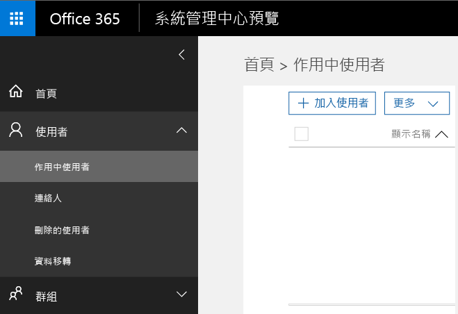

---
# required metadata

title: 準備設定行動應用程式管理原則 | Microsoft Intune
description:
keywords:
author: karthikaraman
manager: jeffgilb
ms.date: 04/28/2016
ms.topic: article
ms.prod:
ms.service: microsoft-intune
ms.technology:
ms.assetid: 7e6a85e7-e007-41b6-9034-64d77f547b87

# optional metadata

#ROBOTS:
#audience:
#ms.devlang:
ms.reviewer: joglocke
ms.suite: ems
#ms.tgt_pltfrm:
#ms.custom:

---

# 準備使用 Microsoft Intune 設定行動應用程式管理原則
本主題描述您在 Azure 入口網站中建立行動應用程式管理原則 (MAM) 之前所需執行的作業。

Azure 入口網站是用於建立 MAM 原則的新管理主控台，並建議您使用這個入口網站建立 MAM 原則。 Azure 入口網站支援下列 MAM 案例：
- Intune 中註冊的裝置
- 協力廠商 MDM 解決方案管理的裝置
- 未受任何 MDM 解決方案 (BYOD) 管理的裝置。

如果您是使用 Azure 入口網站的新手，請閱讀 [Microsoft Intune MAM 原則的 Azure 入口網站](azure-portal-for-microsoft-intune-mam-policies.md)主題，以取得快速概觀。

如果您目前使用 **Intune 管理主控台**來管理裝置，則可以使用 **Intune 管理主控台**，為 Intune 註冊的裝置建立支援應用程式的 MAM 原則，但建議使用 Azure 入口網站，即使是在 Intune 中註冊的裝置也是一樣。 如需如何使用 Intune 管理主控台建立 MAM 原則的指示，請參閱[這裡](configure-and-deploy-mobile-application-management-policies-in-the-microsoft-intune-console.md)。

>[!IMPORTANT]
> 您可能看不到 Intune 管理主控台中的所有 MAM 原則設定。 如果您在 Intune 管理主控台和 Azure 入口網站上建立 MAM 原則，則會將 Azure 入口網站中的原則套用至應用程式並部署至使用者。

##  支援的平台
- iOS 8.1 或更新版本

- Android 4 或更新版本

目前不支援 Windows 裝置。
##  支援的應用程式
* **Microsoft 應用程式︰**這些應用程式具有內建的 Intune App SDK，而且套用 MAM 原則之前不需要進一步處理。
若要查看受支援 Microsoft 應用程式的完整清單，請移至 Microsoft Intune 應用程式夥伴頁面上的 [Microsoft Intune mobile application gallery](https://www.microsoft.com/en-us/server-cloud/products/microsoft-intune/partners.aspx) (Microsoft Intune 行動應用程式庫)。 按一下應用程式來查看支援的案例、平台和應用程式是否支援多重身分識別。
* 您的內建**企業營運應用程式**：這些都需要先準備應用程式來包含 Intune App SDK，才能套用 MAM 原則。

  * 針對 Intune 所管理的裝置，請參閱[決定如何準備應用程式以進行 MAM](decide-how-to-prepare-apps-for-mobile-application-management-with-microsoft-intune.md)。
  * 對於不受管理的裝置 (如員工擁有的裝置) 或協力廠商行動裝置管理解決方案所管理的裝置，請參閱[保護未在 Intune 註冊之裝置上的企業營運應用程式和資料](protect-line-of-business-apps-and-data-on-devices-not-enrolled-in-microsoft-intune.md)。

您需要有下列項目，才能設定 MAM 原則︰

-   **Microsoft Intune 訂閱**。    使用者需要 [!INCLUDE[wit_nextref](../includes/wit_nextref_md.md)] 授權，才能取得使用 MAM 原則的應用程式。

-   下列作業需要的 **Office 365 (O365)** 訂閱：
  - 將 MAM 原則套用至具有多重身分識別支援的應用程式。
  - 建立 SharePoint Online 和 Exchange Online 公司帳戶。 不支援 Exchange 內部部署和 SharePoint 內部部署。
-    對**商務用 Skype Online** **啟用新式驗證**。 登入 Microsoft Connect，填寫[此表單](https://connect.microsoft.com/office/Survey/NominationSurvey.aspx?SurveyID=17299&ProgramID=8715)，以註冊在新式驗證程式中。

- **Azure Active Directory (Azure AD)** 來建立使用者。 當使用者啟動應用程式並輸入其工作認證時，Azure AD 會驗證使用者。

    > [!NOTE] 如果使用 [!INCLUDE[wit_nextref](../includes/wit_nextref_md.md)] 主控台來設定使用者，請注意 MAM 原則設定會移至 Azure 入口網站，若要繼續並使用這個入口網站，您需要使用 Office 365 入口網站設定 Azure AD 使用者群組。

## 建立使用者及指派 Microsoft Intune 授權

1. 您需要 Intune 訂閱︰如果您目前使用 [!INCLUDE[wit_nextref](../includes/wit_nextref_md.md)] 管理裝置，表示已有 [!INCLUDE[wit_nextref](../includes/wit_nextref_md.md)] 訂閱。  如果已購買 EMS 授權，也會有 [!INCLUDE[wit_nextref](../includes/wit_nextref_md.md)] 訂閱。 如果您嘗試 [!INCLUDE[wit_nextref](../includes/wit_nextref_md.md)] 以簽出 MAM 功能，可以在[這裡](http://www.microsoft.com/en-us/server-cloud/products/microsoft-intune/)取得試用帳戶。

    若要檢查是否有 [!INCLUDE[wit_nextref](../includes/wit_nextref_md.md)] 訂閱，請在 Office 入口網站上移至 [帳單] 頁面。  訂閱下應該會看到 [!INCLUDE[wit_nextref](../includes/wit_nextref_md.md)] 為 [作用中]。

2.  以系統管理員認證登入   [Office 入口網站](http://portal.office.com) 。

3.  瀏覽至 [作用中使用者] 頁面以新增使用者並指派 [!INCLUDE[wit_nextref](../includes/wit_nextref_md.md)] 授權。

    

4.  若要讓使用者能夠存取 Office 入口網站、Azure AD 入口網站和 Azure 入口網站，請將 [全域管理員角色] 指派給使用者。

    ![顯示 [作用中使用者] 頁面之 Office 入口網站的螢幕擷取畫面 ](../media/AppManagement/OfficePortal_AddRoletoUser.png)

5.  MAM 原則會部署到 Azure Active Directory 的使用者群組。 若要建立用於 MAM 原則的使用者群組，請瀏覽至 **Office 入口網站** 的 [群組] 頁面，然後按一下 **+** 圖示建立新的安全性群組。  輸入名稱和描述，然後按一下 [建立] 。 建立群組時，您可以按一下新建安全性群組的 [編輯成員]  ，將使用者加入群組。 安全性群組建立在 Azure Active Directory 中。

    ![顯示 [編輯使用者角色] 頁面上 [全域管理員角色] 選項之頁面的螢幕擷取畫面](../media/AppManagement/OfficePortal_CreateGroups.png)

下表列出您可以指派給系統管理員使用者的角色和權限。

|||
|--|----|
|**角色**|**權限**|
|全域管理員 (O365 入口網站)|存取 O365 入口網站和 Azure AD 入口網站  存取 Azure 入口網站 (可以執行角色管理和行動應用程式管理工作)。|
|擁有者角色 (Azure 入口網站)|存取 Azure 入口網站 (可以執行角色管理和行動應用程式管理工作)。|
|參與者角色 (Azure 入口網站)|存取 Azure 入口網站 (只能執行行動應用程式管理工作)。|

## 將參與者角色指派給使用者

**全域管理員**可以存取 [Azure 入口網站](https://portal.azure.com)。  如果想讓其他系統管理員使用者能夠設定原則，以及執行其他的行動裝置應用程式管理工作，您可以將 **參與者角色** 指派給使用者，如下所述：

1.  在 **[設定]** 刀鋒視窗上，按一下 **[資源管理]** 區段中的 **[使用者]**。

    ![Azure 入口網站上 [使用者] 刀鋒視窗的螢幕擷取畫面](../media/AppManagement/AzurePortal_MAM_AddUsers.png)

2.  按一下 [加入]  開啟 [加入存取]  刀鋒視窗。

3.  依序按一下 [選取角色] 和 [參與者角色] 。

    ![Azure 入口網站上 [選取角色] 刀鋒視窗的螢幕擷取畫面](../media/AppManagement/AzurePortal_MAM_AddRole.png)

4.  選取角色之後，按一下 [加入使用者] ，依使用者名稱或電子郵件地址搜尋使用者。 您在這份清單中看到的使用者，是您之前使用 Office 入口網站在 Azure AD 中建立的前 1000 名使用者。 按一下 [加入存取]  刀鋒視窗的 [確定]  ，儲存並指派角色給使用者。

    ![Azure 入口網站上 [新增使用者] 刀鋒視窗的螢幕擷取畫面](../media/AppManagement/AzurePortal_MAM_AddusertoRole.png)

    > [!IMPORTANT] 如果您選取的使用者沒有獲指派 [!INCLUDE[wit_nextref](../includes/wit_nextref_md.md)] 授權，就不能夠存取入口網站。

## 後續步驟
[使用 Microsoft Intune 建立及部署行動應用程式管理原則](create-and-deploy-mobile-app-management-policies-with-microsoft-intune.md)

<!--HONumber=Jun16_HO2-->

