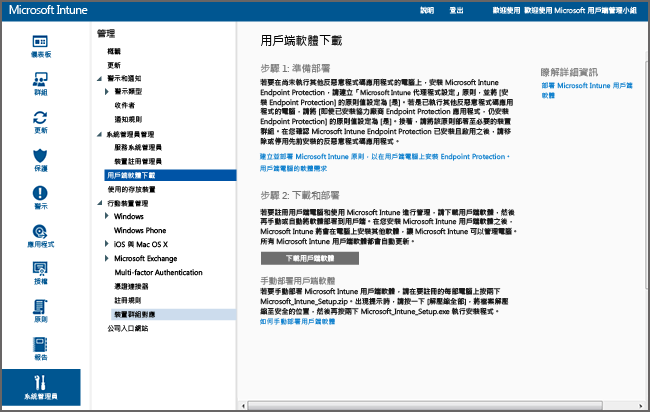

---
# required metadata

title: 使用 Microsoft Intune 安裝 Windows 電腦用戶端 | Microsoft Intune
description:
keywords:
author: NathBarn
manager: jeffgilb
ms.date: 04/28/2016
ms.topic: article
ms.prod:
ms.service: microsoft-intune
ms.technology:
ms.assetid: 64c11e53-8d64-41b9-9550-4b4e395e8c52

# optional metadata

#ROBOTS:
#audience:
#ms.devlang:
ms.reviewer: jeffgilb
ms.suite: ems
#ms.tgt_pltfrm:
#ms.custom:

---

# 使用 Microsoft Intune 安裝 Windows 電腦用戶端
使用本指南可協助您透過 Microsoft Intune 用戶端軟體管理 Windows 電腦。

## 開始之前
在您開始安裝 Intune 用戶端軟體之前，請參閱[解決 GPO 和 Microsoft Intune 原則衝突](resolve-gpo-and-microsoft-intune-policy-conflicts.md)主題，以了解哪些項目必須先準備就緒才能正確安裝用戶端，然後再回頭執行這些指示。

## 安裝用戶端
請使用下列步驟安裝用戶端：

-   [下載用戶端軟體](#to-download-the-client-software)

接著使用下列一種或多種方法來安裝用戶端：

-   [手動部署用戶端軟體](#to-manually-deploy-the-client-software)

-   [使用群組原則自動部署用戶端軟體](#to-automatically-deploy-the-client-software-by-using-group-policy)

-   [使用者如何自行註冊電腦](#how-users-can-self-enroll-their-computers)

-   [將 Microsoft Intune 用戶端軟體隨著映像一起安裝](#install-the-microsoft-intune-client-software-as-part-of-an-image)

如果您已經不需要使用 Intune 管理電腦，您可以淘汰電腦，淘汰電腦的動作也會將用戶端軟體從電腦移除。 如需詳細資訊，請參閱[使用 Microsoft Intune 電腦用戶端的一般 Windows 電腦管理工作](common-windows-pc-management-tasks-with-the-microsoft-intune-computer-client.md)

### 下載用戶端軟體

1.  在 [Microsoft Intune 管理主控台](https://manage.microsoft.com/)中，按一下 [管理] &gt; [用戶端軟體下載]

  

2.  在 [用戶端軟體下載] 頁面上，按一下 [下載用戶端軟體]，並將包含軟體的 Microsoft_Intune_Setup.zip 套件儲存到您網路上的安全位置。

    > [!NOTE]
    > Intune 用戶端軟體安裝套件包含您的帳戶相關資訊。 如果未經授權的使用者取得安裝套件的存取權，他們就可以將電腦註冊到其內嵌憑證所代表的帳戶。

3.  將安裝套件的內容解壓縮到您的網路上安全的位置。

    > 請勿重新命名或移除已解壓縮的 ACCOUNTCERT 檔案，否則用戶端軟體安裝將會失敗。

### 手動部署用戶端軟體

1.  在電腦上，瀏覽到放置用戶端軟體安裝檔案的資料夾，然後執行 Microsoft_Intune_Setup.exe 以安裝用戶端軟體。

    > 當您將游標停留在用戶端電腦上工作列中的圖示上時，即可顯示安裝的狀態。

### 使用群組原則自動部署用戶端軟體

1.  在包含 Microsoft_Intune_Setup.exe 和 MicrosoftIntune.accountcert 檔案的資料夾中，執行下列命令以解壓縮適用於 32 位元和 64 位元電腦的 Windows Installer 安裝程式：

    ```
    Microsoft_Intune_Setup.exe/Extract <destination folder>
    ```

2.  將 Microsoft_Intune_x86.msi 檔案、Microsoft_Intune_x64.msi 檔案和 MicrosoftIntune.accountcert 檔案複製到要安裝用戶端軟體之所有電腦都可存取的檔案位置。

    > 請勿將這些檔案分開或重新命名，否則用戶端軟體安裝將會失敗。

3.  使用群組原則將軟體部署到您網路上的電腦。

    如需有關如何使用群組原則自動部署軟體的詳細資訊，請參閱您的 Windows Server 文件。

### 使用者如何自行註冊電腦
使用者可以透過 Intune 公司入口網站自行註冊每一部電腦。 註冊過的每一部電腦都會連結到用來安裝用戶端軟體的使用者帳戶。

> [!NOTE]
> -   使用者必須是電腦的系統管理員，才能安裝用戶端軟體。
> -   用戶端電腦必須安裝 Internet Explorer，才能進行自行註冊。
> -   每次使用者自行註冊電腦時，都會使用 Intune 授權。
> -   您必須使用公司或學校帳戶來自行註冊電腦。 您不能使用 Microsoft 帳戶來自行註冊電腦。
> -   如果用戶端軟體已經安裝在電腦上，使用者將會收到錯誤。

### 若要自行註冊電腦 (適用於使用者的資訊)

1.  從您要註冊的電腦登入公司入口網站。

2.  按一下 [新增裝置]

3.  按一下 [下載軟體]，然後按一下 [執行]

4.  按 [下一步]，以啟動 Microsoft Intune 安裝精靈。

5.  安裝精靈完成後，請按一下 [完成]

### 將 Microsoft Intune 用戶端軟體隨著映像一起安裝
您可以使用下列範例程序作為基礎，將 Intune 用戶端軟體隨著作業系統映像一起部署到電腦。

1.  將用戶端安裝檔案 Microsoft_Intune_Setup.exe 和 MicrosoftIntune.accountcert 複製到參照電腦上的 %系統磁碟機%\Temp\Microsoft_Intune_Setup 資料夾。

2.  將下列命令新增至 SetupComplete.cmd 指令碼，以建立 WindowsIntuneEnrollPending 登錄項目：

    ```
    %windir%\system32\reg.exe add HKEY_LOCAL_MACHINE\Software\Microsoft\Onlinemanagement\Deployment /v
    WindowsIntuneEnrollPending /t REG_DWORD /d 1
    ```

3.  將下列命令新增至 setupcomplete.cmd，以使用 /PrepareEnroll 命令列引數執行註冊套件：

    ```
    %systemdrive%\temp\Microsoft_Intune_Setup\Microsoft_Intune_Setup.exe /PrepareEnroll
    ```
    > [!TIP]
    >  SetupComplete.cmd 指令碼可讓 Windows 安裝程式在使用者登入之前修改系統。 /PrepareEnroll 命令列引數會準備目標電腦，以在 Windows 安裝程式完成後自動註冊到 Intune 中。

4.  將 SetupComplete.cmd 放在參照電腦的 %Windir%\Setup\Scripts 資料夾中。

5.  擷取參照電腦的映像，然後將映像部署到目標電腦。

當目標電腦在 Windows 安裝程式完成後重新啟動時，便會建立 WindowsIntuneEnrollPending 登錄機碼。 註冊套件會檢查電腦是否已註冊。 如果電腦已註冊，將不會採取進一步的動作。 如果電腦未註冊，註冊套件會建立「Microsoft Intune 自動註冊工作」。

當自動註冊工作在下次排程時間執行時，會檢查 WindowsIntuneEnrollPending 登錄值是否存在，並會嘗試在 Intune 中註冊目標電腦。 如果註冊因為任何原因失敗，工作下次執行時會重新嘗試註冊。 重新嘗試將會持續一個月的時間。

當註冊順利完成，或是過一個月之後，會從目標電腦刪除 Intune 自動註冊工作、WindowsIntuneEnrollPending 登錄值與帳戶憑證。

## 監視並驗證成功的用戶端部署
請使用下列其中一個程序協助您監視及驗證成功的用戶端部署。

### 若要從 Microsoft Intune 系統管理員主控台確認用戶端軟體的安裝

1.  在 [Microsoft Intune 管理主控台](https://manage.microsoft.com/)中，按一下 [群組] &gt; [所有裝置] &gt; [所有電腦]

2.  向下捲動電腦清單，尋找正在與 Intune 通訊的受管理電腦，或是在 [搜尋裝置] 方塊中輸入電腦名稱或名稱的任何部分，以搜尋特定的受管理電腦。

3.  在主控台的下層窗格中檢查電腦的狀態，並解決任何錯誤。

### 若要建立電腦清查報表以顯示所有已註冊的電腦

1.  在 [Microsoft Intune 管理主控台](https://manage.microsoft.com/)中，按一下 [報表] &gt; [電腦清查報表]

2.  在 [建立新報表] 頁面上，保留所有欄位的預設值 (除非您要套用篩選器)，然後按一下 [檢視報表]

3.  [電腦清查報表] 頁面會隨即在新視窗中開啟，顯示已在 Intune 中註冊成功的所有電腦。

    > 按一下報表中的任意欄標題，依該欄的內容排序清單。


### 另請參閱
[使用 Microsoft Intune 管理 Windows 電腦](manage-windows-pcs-with-microsoft-intune.md)


<!--HONumber=May16_HO2-->


