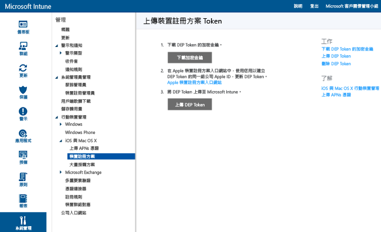
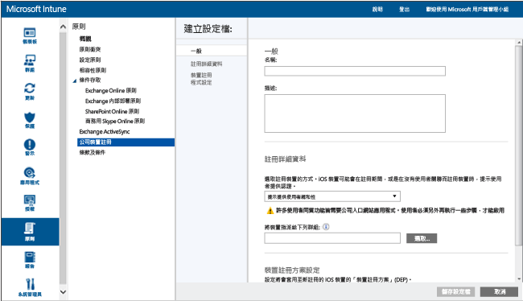

# 註冊屬公司擁有的裝置註冊方案 iOS 裝置
Microsoft Intune 可以部署註冊設定檔，該設定檔會以「無線」方式註冊透過裝置註冊方案 (DEP) 購買的 iOS 裝置。 註冊套件可以包括裝置的設定助理選項。 透過 DEP 註冊的裝置不能由使用者取消註冊。

## 使用 Microsoft Intune 管理 iOS 裝置的 Apple DEP
若要使用 Apple 的裝置註冊方案 (DEP) 來管理屬公司擁有的 iOS 裝置，您的組織必須加入 Apple DEP，並透過該方案取得裝置。 下列網址提供該程序的詳細資料：  [https://deploy.apple.com](https://deploy.apple.com)。 這個方案的優點包括無操作安裝裝置，而不需要透過 USB 將每部裝置連線到電腦。

在您以 DEP 註冊公司所擁有的 iOS 裝置之前，您須要從 Apple 取得 DEP 權杖。 此權杖可讓 Intune 同步處理貴公司所擁有的 DEP 參與裝置資訊。 它也允許 Intune 執行註冊設定檔上傳至 Apple ，並將這些設定檔指定給裝置。

1.  **開始使用 Microsoft Intune 管理 iOS 裝置**：您必須先完成啟用 Intune 的 iOS 管理，才能夠註冊 iOS 裝置註冊方案 (DEP) 裝置。

2.  **取得加密金鑰**：以系統管理使用者身分開啟 [Microsoft Intune 管理主控台](http://manage.microsoft.com)，並移至 **[系統管理]** &gt; **[行動裝置管理]** &gt; **[iOS]** &gt; **[裝置註冊方案]**，然後按一下 **[下載加密金鑰]**。 將加密金鑰 (.pem) 檔案儲存在本機。 這個 .pem 檔案會用於向 Apple 裝置註冊程式入口網站要求信任關係憑證。

      

3.  **取得裝置註冊方案權杖**：前往[裝置註冊方案入口網站](https://deploy.apple.com) (https://deploy.apple.com)，並使用公司的 Apple ID 登入。 未來必須使用這個 Apple 識別碼來更新 DEP 權杖。

    1.  在[裝置註冊方案入口網站](https://deploy.apple.com)中，移至 **[裝置註冊方案]** &gt; **[管理伺服器]**，然後按一下 **[新增 MDM 伺服器]**。

    2.  輸入 [MDM 伺服器名稱]  ，然後按 [下一步] 。 伺服器名稱可用於識別 MDM 伺服器。 其不是 Microsoft Intune 伺服器的名稱或 URL。

    3.  [新增 &lt;伺服器名稱&gt;] 對話方塊隨即開啟。 按一下 [選擇檔案] 上傳 .pem 檔案，然後按一下 [下一步]。

    4.  [新增 &lt;伺服器名稱&gt;] 對話方塊會顯示 [您的伺服器 Token] 連結。 將伺服器權杖 (.p7m) 檔案下載到您的電腦，然後按一下 [完成] 。

    此憑證 (.p7m) 檔案會用於建立 Intune 與 Apple 裝置註冊程式伺服器之間的信任關係。

4.  **將 DEP 權杖新增至 Intune**：在 [Microsoft Intune 管理主控台](http://manage.microsoft.com)中，移至 **[系統管理]** &gt; **[行動裝置管理]** &gt; **[iOS]** &gt; **[裝置註冊方案]**，然後按一下 **[上傳 DEP 權杖]**。 **瀏覽** 至憑證 (.p7m) 檔案，輸入您的 **Apple ID**，然後按一下 [上傳] 。

5.  **新增公司裝置註冊原則**：在 [Microsoft Intune 管理主控台](http://manage.microsoft.com)中，移至 **[原則]** &gt; **[公司裝置註冊]**，然後按一下 **[新增]**。

    提供 **[一般]** 詳細資料 (包括 **[名稱]** 和 **[描述]**)，並指定指派給設定檔的裝置是否具有使用者親和性，或隸屬於某個群組。
      - **使用者親和性的提示**：裝置必須在初始設定期間與使用者建立關聯，之後便可以該使用者身分存取公司資料與電子郵件。  應針對使用者所擁有且需要使用公司入口網站 (如安裝 App) 之受 DEP 管理的裝置設定**使用者親和性**。 **注意**︰具有使用者親和性的 DEP 裝置不支援多重要素驗證。
      - **無使用者親和性**：該裝置不會與使用者建立關聯。 針對執行工作而不需存取本機使用者資料的裝置，請使用此關係。 需要使用者關聯的應用程式 (包含用於安裝企業營運應用程式的公司入口網站應用程式) 將無法運作。

    您也可以**將裝置指派給以下群組**。 按一下 [Select...] (選取…) 選擇群組。

    [!INCLUDE[groups deprecated](../includes/group-deprecation.md)]

    接著，啟用 **[設定此設定檔的裝置註冊方案設定]** 來支援 DEP。

      

     以下是可用於 DEP 管理之裝置的設定：

     - **部門** - 使用者在啟用期間點選 [About Configuration (關於設定)] 時出現
     - **支援電話號碼** - 使用者在啟用期間按一下 **[需要協助]** 按鈕時顯示
     - **準備模式** - 這個狀態是在啟用期間設定，而且需要將裝置重設為出廠預設值才能進行變更︰
        - **不受監督** - 有限的管理功能
        - **受監督** - 啟用更多管理選項，並且預設會停用 [啟用鎖定]
     - **將註冊設定檔鎖定到裝置** - 這個狀態是在啟用期間設定，而且需要重設為出廠預設值才能進行變更
        - **停用** - 允許從 **[設定]** 功能表中移除管理設定檔
        - **啟用** - (需要**準備模式** = **受監督**) 停用允許移除管理設定檔的 iOS 設定
     - **設定助理選項** - 這些是選用設定，稍後可以在 iOS **[設定]** 功能表中進行設定
        - **密碼** - 在啟用期間提示輸入密碼。 除非裝置將受到保護，或以某種方式控制存取 (即將裝置限制為一個應用程式的 Kiosk 模式)，否則一律需要密碼。
        - **定位服務** - 啟用時，設定助理會在啟用期間提示服務
        - **還原** - 啟用時，設定助理會在啟用期間提示 iCloud 備份
        - **Apple ID** - 需要有 Apple ID，才能下載 iOS App Store 應用程式 (包含 Intune 所安裝的應用程式)。 啟用時，如果 Intune 嘗試不使用 Apple ID 來安裝應用程式，則 iOS 將提示使用者輸入 ID。
        - **條款及條件** - 啟用時，設定助理會在啟用期間提示使用者接受 Apple 的條款及條件
        - **Touch ID** - 啟用時，設定助理會在啟用期間提示此服務
        - **Apple Pay** - 啟用時，設定助理會在啟用期間提示此服務
        - **縮放** - 啟用時，設定助理會在啟用期間提示此服務
        - **Siri** - 啟用時，設定助理會在啟用期間提示此服務
        - **傳送診斷資料給 Apple** - 啟用時，設定助理會在啟用期間提示此服務
     -  **啟用其他 Apple Configurator 管理功能** - 設為 **[不允許]** 防止使用 iTunes 同步處理檔案或透過 Apple Configurator 進行管理。 Microsoft 建議您設為 **[不允許]**，並從 Apple Configurator 匯出任何進一步設定，然後透過 Intune 部署為自訂 iOS 組態設定檔，而不是使用此設定來允許使用或不使用憑證進行手動部署。
        - **不允許** - 防止裝置透過 USB 進行通訊 (停用配對)
        - **允許** - 允許裝置透過任何電腦或 Mac 的 USB 連線進行通訊
        - **需要憑證** - 允許使用匯入至註冊設定檔的憑證與 Mac 配對

6.  **指派要管理的 DEP 裝置**：前往[裝置註冊方案入口網站](https://deploy.apple.com) (https://deploy.apple.com)，並使用公司 Apple ID 登入。 移至 **[部署方案]** &gt; **[裝置註冊方案]** &gt; **[管理裝置]**。 指定您 **選擇裝置**的方式、提供裝置資訊，並利用裝置的 [序號] 、[訂單號碼] 或 [上傳 CSV 檔案] 指定詳細資料。 接著，選取 **[Assign to Server]** (指派給伺服器)，然後選取針對 Microsoft Intune 指定的 &lt;伺服器名稱&gt;，然後按一下 **[確定]**。

7.  **同步處理 DEP 管理的裝置**：以系統管理使用者身分開啟 [Microsoft Intune 管理主控台](http://manage.microsoft.com)，並移至 **[系統管理]** &gt; **[行動裝置管理]** &gt; **[iOS]** &gt; **[裝置註冊方案]**，然後按一下 **[Sync now]** (立即同步處理)。 同步處理要求會傳送至 Apple。 若要在同步處理之後查看 DPE 管理的裝置，請在 [Microsoft Intune 管理主控台](http://manage.microsoft.com)中，移至 [群組] &gt; [所有裝置] &gt; [公司預先註冊的裝置] &gt;[依 iOS 序號]。 在 [依 iOS 序號] 工作區中，受管理裝置的 [狀態] 會顯示為 [未連線]，直到裝置開機並執行 [設定助理] 來註冊裝置為止。

    若要符合可接受 DEP 流量的 Apple 詞彙，Intune 具有下列限制︰
     -  完整 DEP 同步處理每 7 天只能執行一次。 在完整同步處理期間，Intune 會重新整理 Apple 已指派給 Intune 的每個序號，不論先前是否已同步處理序號。 如果在前一個完整同步處理的 7 天內嘗試進行完整同步處理，Intune 只會重新整理尚未列在 Intune 中的序號。
     -  任何同步處理要求都會在 10 分鐘內完成。 在此期間或直到要求成功，會停用 [同步處理] 按鈕。

8.  **將裝置散發給使用者**：現在您可以將屬公司擁有的裝置散發給使用者。 當 iOS 裝置開機時，就會加以註冊交由 Intune 管理。

## Intune 群組指派的變更

從 11 月開始，裝置群組管理會移至 Azure Active Directory。 轉換至 Azure Active Directory 群組之後，群組指派不會出現在 [公司註冊設定檔] 選項中。 因為此變更將在連續幾個月的時間推出，您可能不會立即看到變更。 在移動到新的入口網站後，動態裝置群組指派可以根據公司的註冊設定檔名稱來定義。 此程序可確保預先指派裝置群組的裝置會自動註冊到群組中並部署原則和應用程式。 [深入了解 Azure Active Directory 群組](https://azure.microsoft.com/documentation/articles/active-directory-accessmanagement-manage-groups/)

### 請參閱
[準備註冊裝置](get-ready-to-enroll-devices-in-microsoft-intune.md)

<!--HONumber=Sep16_HO2-->

