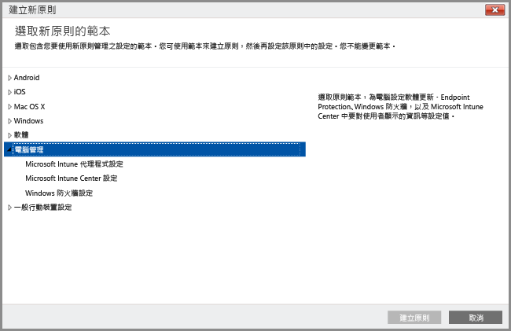

# 使用 Intune 電腦用戶端軟體管理 Windows 電腦
不同於[將 Windows 電腦註冊為行動裝置](set-up-windows-device-management-with-microsoft-intune.md)，您可以透過安裝 Intune 用戶端軟體來註冊並管理 Windows 電腦。

Intune 使用原則來管理 Windows 電腦，其管理方式類似 Windows Server Active Directory 網域服務 (AD DS) 群組原則物件 (GPO)。 如果您想要使用 Intune 來管理已加入 Active Directory 網域的電腦，您應該[確定 Intune 原則不會與組織中任何現有的 GPO 衝突](resolve-gpo-and-microsoft-intune-policy-conflicts.md)。

雖然 Intune 軟體用戶端透過管理軟體更新、Windows 防火牆，和 Endpoint Protection 支援[協助保護電腦的管理功能](policies-to-protect-windows-pcs-in-microsoft-intune.md)，但使用 Intune 軟體用戶端管理的電腦無法作為其他 Intune 原則的目標，包括那些專用於行動裝置管理的 **Windows** 原則設定。

> [!NOTE]
> 執行 Windows 8.1 或更新版本的裝置可以當作 intune 用戶端或行動裝置管理。 本主題適用於執行 Intune 軟體用戶端的電腦。 不支援安裝 Intune 用戶端以及在行動裝置管理中進行註冊。

## Intune 電腦用戶端管理的需求

**硬體：**以下列出安裝 Intune 用戶端的最低硬體需求：

|需求|詳細資訊|
|---------------|--------------------|
|網路|用戶端要求電腦必須具有網際網路連線。|
|處理器和記憶體|請參考電腦作業系統的處理器和 RAM 需求。|
|磁碟空間|安裝用戶端軟體之前需有 200 MB 的可用磁碟空間。|

**軟體**：下表列出安裝用戶端的軟體需求：

|需求|詳細資訊|
|---------------|--------------------|
|作業系統 | 執行 Windows Vista 或更新版本的 Windows 裝置。 不支援 Home Edition 版本。|
|系統管理權限|安裝用戶端軟體的帳戶必須擁有該裝置的本機系統管理員權限。|
|Windows Installer 3.1|電腦至少必須有 Windows Installer 3.1。  若要檢視電腦上的 Windows Installer 版本：  -   在電腦上，在 **%windir%\System32\msiexec.exe** 上按一下滑鼠右鍵，然後按一下 [內容]。  您可以從 Microsoft Developer Network (MSDN) 網站上的 [Windows Installer Redistributables (Windows Installer 可轉散發套件)](http://go.microsoft.com/fwlink/?LinkID=234258) 下載最新版的 Windows Installer。|
|移除不相容的用戶端軟體|安裝 Intune 用戶端軟體之前，您必須從該電腦解除安裝任何 Configuration Manager 或 System Management Server 用戶端軟體。|

## 使用 Intune 電腦用戶端管理電腦
安裝 Intune 用戶端軟體之後，管理功能包括：[應用程式管理](deploy-apps-in-microsoft-intune.md)、[即時監視與 Endpoint Protection](help-secure-windows-pcs-with-endpoint-protection-for-microsoft-intune.md)、[Windows 防火牆設定管理](help-protect-windows-pcs-using-windows-firewall-policies-in-microsoft-intune.md)、硬體和軟體清查、遠端控制 (透過遠端協助要求)、[軟體更新設定](keep-windows-pcs-up-to-date-with-software-updates-in-microsoft-intune.md)，以及相容性設定報告。

有些管理選項可供作為行動裝置受管理的電腦使用，但受軟體用戶端管理的電腦則無法使用，包括：

-   完整抹除 (可使用選擇性抹除)
-   條件式存取
-   **電腦管理**原則以外的 Windows 原則

除了在個別電腦本機所採取的 Intune 用戶端代理程式動作之外，您也可以使用 Intune 管理主控台，在安裝用戶端的 Windows 電腦上執行其他[一般電腦管理工作](common-windows-pc-management-tasks-with-the-microsoft-intune-computer-client.md)，以便：

-   檢視有關受管理電腦的硬體和軟體清查資訊

-   從遠端重新啟動電腦

-   淘汰電腦以解除安裝用戶端軟體，並從 Intune 的管理中移除

-   將使用者連結到特定的受管理電腦

-   回應遠端協助要求

Intune 用戶端代理程式通常是在背景中以無訊息模式執行，不需要太多使用者互動或疑難排解。 不過，如果您需要協助以解決電腦管理問題，有幾個可[協助您解決問題的資源](/intune/troubleshoot/troubleshoot-client-setup-in-microsoft-intune)。

<!--HONumber=Sep16_HO2-->

