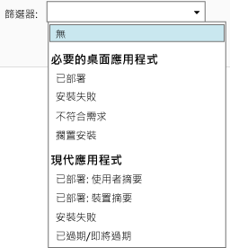

---
# required metadata

title: 監視應用程式部署 | Microsoft Intune
description:
keywords:
author: robstackmsft
manager: jeffgilb
ms.date: 04/28/2016
ms.topic: article
ms.prod:
ms.service: microsoft-intune
ms.technology:
ms.assetid: 5daad56d-71c8-455b-8a55-f8b33e279a8a

# optional metadata

#ROBOTS:
#audience:
#ms.devlang:
ms.reviewer: jeffgilb
ms.suite: ems
#ms.tgt_pltfrm:
#ms.custom:

---

# 在 Microsoft Intune 中監視應用程式部署

## 監視應用程式部署
您可以在 Intune 管理主控台中看到所管理的應用程式，以及任何部署的狀態。

### 檢視您管理的應用程式及其狀態
在 [應用程式] 工作區中，按一下 [應用程式] 節點，然後按一下 [應用程式]

您管理的應用程式清單隨即顯示。 您可以按一下任何應用程式，以在主控台視窗的下方窗格中查看安裝狀態。 按一下這個狀態可查看進一步的詳細資料。 例如，如果狀態顯示 [1 個使用者備有此軟體]，您可以按一下該訊息以查看使用者的名稱。

> 您可以使用 [篩選器] 下拉式清單，只顯示符合您指定之準則的應用程式，例如無法安裝的應用程式，或已成功部署的應用程式。
> 
> 

此外，[儀表板] 工作區會顯示應用程式的狀態概觀。 如果按一下概觀中的任何位置，則會前往應用程式清單。

## 檢視應用程式的更詳細資訊
在應用程式清單中，選取任何應用程式，然後按一下 [檢視內容]

在應用程式的 [軟體內容] 頁面上，按一下以下其中一個索引標籤︰一般 - 顯示關於應用程式的一般資訊和其安裝狀態；裝置 - 顯示已成功安裝應用程式的目標部署的裝置；使用者 - 顯示其裝置已成功安裝應用程式的目標部署的使用者。

如前所述，您可以使用 [篩選器] 下拉式清單，來設定每個索引標籤所顯示的值。

<!--HONumber=May16_HO2-->

