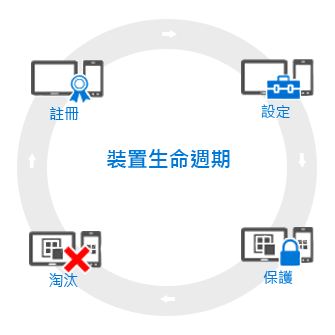

# 行動裝置管理 (MDM) 生命週期的概觀

您所管理的所有裝置都有所謂的*生命週期*。 Intune 可協助您管理這個生命週期，從註冊開始，一直到不再需要裝置時將其淘汰︰

## 註冊
現今的行動裝置管理 (MDM) 策略可以處理各種行動電話和資料表 (iOS、Android、Windows 和 Mac OS X)。 如果您需要能夠管理裝置，通常是公司擁有裝置的情況，第一個步驟是[設定裝置註冊](enroll-devices-in-microsoft-intune.md)。 您也可以向 Intune (MDM) 註冊 Windows 電腦或[安裝 Intune 用戶端軟體](manage-windows-pcs-with-microsoft-intune.md)，來管理電腦。

## 設定
註冊您的裝置是第一個步驟。 若要充分利用 Intune 提供的選項，並確定您的裝置安全且與公司標準相容，您可以從可讓您設定受管理裝置運作方式的幾乎各個層面的各種不同的**原則**中選擇。 例如，使用者是否應該擁有內含公司資料之裝置的密碼？ 您可以擁有密碼。 您的公司有 Wi-Fi 嗎？ 您可以自動設定它。 以下是可用的組態選項類型︰

- [**設定原則**](manage-settings-and-features-on-your-devices-with-microsoft-intune-policies.md) - 這些原則可讓您設定您所管理裝置的特性和功能的運作方式。 比方說，您可以在 Windows Phone 上要求使用密碼，或在 iPhone 上停用相機。
- [**公司資源的存取原則**](enable-access-to-company-resources-with-microsoft-intune.md) - 讓使用者存取在其個人裝置上存取其工作時，這可能會造成您的問題。 例如，您如何確保已正確設定所有需要存取公司電子郵件的裝置？ 您如何確保使用者可以使用 VPN 連線來存取公司網路，而不需要知道一般所需的複雜設定？ 透過將您管理的裝置自動設定為可存取常用的公司資源，Intune 可幫助減輕此項負擔。
- [**Windows 電腦管理原則 (使用 Intune 用戶端軟體)**](common-windows-pc-management-tasks-with-the-microsoft-intune-computer-client.md) - 雖然使用 Intune 註冊 Windows 電腦，可提供您最多的裝置管理功能，Intune 會繼續支援使用 Intune 用戶端軟體來管理 Windows 電腦。 如果您需要可使用電腦執行之部分工作的相關資訊，從這裡開始。

## 保護
在現代的 IT 世界裡，防止裝置未經授權的存取是您會執行的其中一項最重要的工作。 除了裝置生命週期的**設定**步驟中的項目，Intune 提供進一步的功能，可協助保護您管理的裝置不受未經授權的存取或惡意攻擊︰
- [**多重要素驗證**](protect-windows-devices-with-multi-factor-authentication.md) - 在使用者登入中加入了額外一層的驗證，可協助讓裝置更為安全。 Windows、Windows Phone 和 Windows Mobile 裝置提供多重要素驗證，其在使用者能夠取得存取之前，要求第二個層級的驗證 (例如通話或簡訊)。
- [**Microsoft Passport 設定**](control-microsoft-passport-settings-on-devices-with-microsoft-intune.md) - Microsoft Passport 是替代登入方法，可讓使用者使用*手勢*，例如指紋，或 Windows Hello 登入，而不需要密碼。
- [**保護 Windows 電腦的原則 (使用 Intune 用戶端軟體)**](policies-to-protect-windows-pcs-in-microsoft-intune.md) - 當您使用 Intune 用戶端軟體來管理 Windows 電腦時，原則可供使用，讓您控制 Endpoint Protection、軟體更新以及您管理的電腦上的 Windows 防火牆設定。

## 淘汰
當裝置遺失或遭竊而必須進行取代，或當使用者移到另一個位置時，通常是[淘汰或抹除](use-remote-wipe-to-help-protect-data-using-microsoft-intune.md)裝置的時候。 執行此動作有數種方式，範圍從重設裝置、從管理中移除裝置，或在抹除裝置上的公司資料。

<!--HONumber=Jul16_HO2-->

