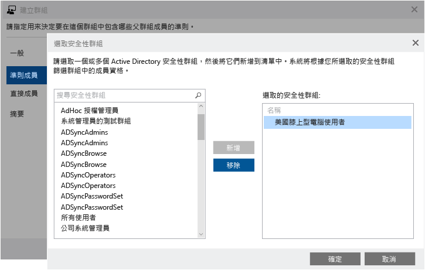
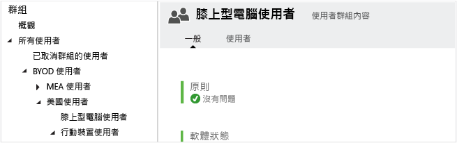
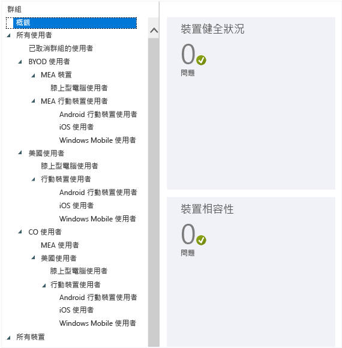
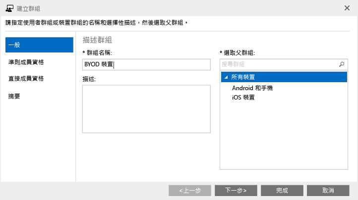
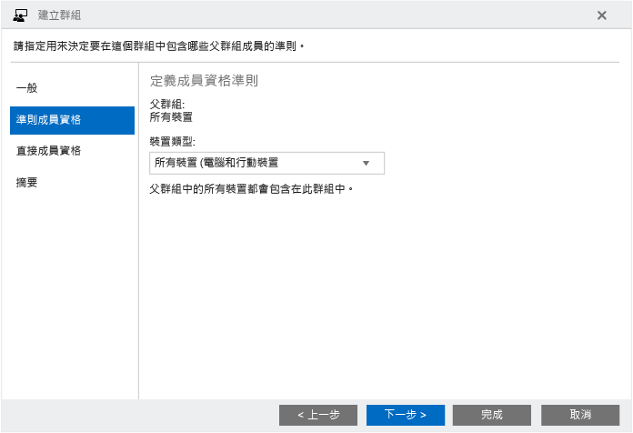
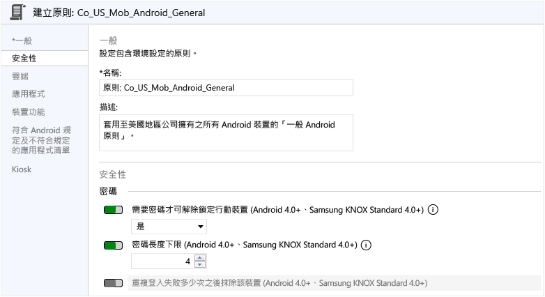

# 規劃您的使用者和裝置群組
Intune 中的群組讓您在管理裝置和使用者時有絕佳的彈性。 您可以根據下列各項來設定群組以符合組織需求：

- 地理位置
- department
- 硬體特性
- 作業系統
- 裝置是使用者擁有或公司擁有

## Intune 群組如何運作

此為在 Intune 管理主控台中，[群組] 節點的預設檢視︰

原則會部署到群組，因此群組階層是您的重要設計考量之一。 請務必了解，在建立群組之後，您將無法變更該群組的父群組。 從您開始使用 Intune 服務，設計您群組的方式至關重要。 一些根據組織需求之設計群組階層的建議做法如下所示。

## 群組成員資格規則

- 群組可包含使用者或裝置，但不能同時包含兩者。

    * **裝置群組**。 此群組包括電腦及行動裝置。 新增電腦到群組之前，您必須先註冊電腦。 將行動裝置加入群組中之前，您的環境必須先設定成可支援行動裝置，且必須註冊裝置，或是在 Exchange ActiveSync 中探索裝置。

    * **使用者群組**。 群組中可具有安全性群組的使用者。 安全性群組會與您的 Active Directory 執行個體進行同步處理。 如果並未和 Active Directory 進行同步處理，您可以手動建立這些群組。

- 單一裝置或使用者可隸屬於多個群組。

- 群組可以根據下列成員資格規則來包含及排除成員：

    * **準則成員資格**。 這些是動態規則，Intune 會執行這些規則以包含或排除成員。 這些準則使用從您的本機 Active Directory 執行個體同步處理的安全性群組和其他資訊。 安全性群組或資料變更時，群組成員資格會在您與 Active Directory 同步處理時變更。

    * **直接成員資格**。 這些是會明確新增或排除成員的靜態規則。 成員資格清單是靜態清單。

-   當您建立使用者群組或包含使用者或電腦的裝置群組時，不需要 Active Directory 網域服務 (AD DS)。 但是，針對包含行動裝置的裝置群組，您的環境必須設定成支援行動裝置。

    此外，您還必須探索裝置並將它們新增到 Intune。

## 群組關聯性規則

- 您建立的每個群組都必須有父群組。 在建立群組之後，您將無法變更該群組的父群組。

- 新增使用者或裝置到子群組時：

    * 子群組一定是父群組的子集。

    * 您新增到子群組的新成員會自動新增到該群組的父群組。

    * 您不能將從父群組排除的成員新增到子群組。

- 父群組的成員資格限定了子群組的可用成員資格。

- 當您刪除父群組時，將會刪除所有的子群組。

- 您可以將內容和原則部署到父群組，但排除子群組的部署。

- 如果使用者或裝置不是父群組的成員，則您可將特定使用者或裝置加入子群組中。 如果您這麼做，子群組的新成員會加入父群組中。

    不過，您不能將從父群組排除的成員加入子群組中。

- 群組成員資格具遞迴性質。 例如：

    * **Pat** 只隸屬於一個群組：[膝上型電腦使用者]  安全性群組。

    * [膝上型電腦使用者]  群組是 [已核准的使用者]  安全性群組的成員。

    * 您在 Intune 中建立一個群組，而這個群組使用包含 [已核准的成員] 群組成員的動態成員資格查詢。 結果是您的 Intune 使用者群組包含 **Pat**。

> [!TIP]
> 當您建立群組時，請考慮將如何套用原則。 例如，您可能會有裝置作業系統特定的原則，以及您已於 Active Directory 服務中定義之不同角色或組織單位的特定原則。 有些系統管理員覺得建立專用於 iOS、Android 和 Windows 的裝置群組很有幫助。 這是除了建立每個組織角色使用者群組以外的事項。

<!--- should we just link to a policies topic at this point and remove this? Ask Rob
 You'll probably want to create a default policy that applies to all groups and devices, to establish the basic compliance requirements of your organization. Then, you create more specific policies for the broadest categories of users and devices, for example, email policies for each of the device operating systems.

 Be careful when you name your policies, so that you can easily identify them later. For example, a good, descriptive policy name is **WP Email Policy for Entire Company**.

 Each time you create a restrictive policy, you'll want to communicate it to your users. After you create the more general groups and policies, pay attention to how you create smaller groups so that you can reduce unnecessary communication.--->

## 內建群組
Intune 具有九個內建群組，您無法加以編輯或刪除： <!--maybe a screen shot would be best?-->

-   **所有使用者**
    -   已取消群組的使用者
-   **所有裝置**
    -   所有電腦
    -   所有行動裝置
        -   所有受直接管理的裝置
        -   所有受 Exchange ActiveSync 管理的裝置
    -   公司擁有的所有裝置
    -   已取消群組的裝置

> [!NOTE]
> 讓您的座右銘成為︰*保持簡單*。 如果您的組織沒有如以下章節所述的特定需求，請保持簡單並採用預設群組結構和原則。 長期而言，這會讓服務更容易管理。 如果您會一致地對待使用者，則維護會更容易。 群組之間的差異較小的話，您就只需維護較少的原則。

### 組織中的所有使用者及裝置
定義組織中所有使用者和裝置的父群組。 您很有可能會有套用到所有項目的原則。 針對此目的，您可以使用 Intune 預設的 [所有使用者] 和 [所有裝置]群 組。 依詳情來組織裝置的子群組，例如一個群組給攜帶您自己的裝置 (BYOD)，而另一個群組用於公司擁有 (CO) 的裝置，可以是 [所有使用者] 和 [所有裝置] 父群組的子系。

## 自訂您組織的群組

### BYOD 與公司所擁有的裝置
如果您的組織允許員工使用自己的裝置及/或提供公司擁有的裝置，建議您為這些裝置類別套用不同的原則。

如果是 BYOD 或混合，請仔細規劃不會侵犯當地隱私權法規的原則。 為攜帶自己裝置的所有使用者建立父群組。 您可以使用此群組來套用適用於此類別中所有使用者的原則。

同樣地，您可以為組織中的 CO 裝置使用者建立群組︰

<!---START HERE--->

### 地理區域的群組
如果您的組織需要特定地區的原則，您可以根據地理區域建立群組。 您可以根據已在 Active Directory 執行個體中建立之區域群組的原則，然後將它們與 Azure Active Directory 服務進行同步處理。 您也可以直接在 Azure Active Directory 中建立區域群組。

下一張螢幕擷取畫面顯示如何根據與內部部署 Active Directory 執行個體進行同步處理的群組，建立 Intune 群組。 這些範例假設您有稱為**美國使用者群組**的 Active Directory 安全性群組。

首先，提供一般資訊。

在 [成員資格準則] 下，選取 [美國使用者群組]、與 Active Directory 同步處理，作為要在成員資格規則之下使用的安全性群組。

![[編輯群組] 對話方塊的螢幕擷取畫面](../media/Intune_Planning_Groups_AD_Criteria_small.png)

檢閱項目，然後選擇 [完成] 以建立群組。

![[編輯群組] 對話方塊的螢幕擷取畫面](../media/Intune_Planning_Groups_AD_Summary_small.png)

在此範例中，我們也建立了稱為 **MEA** 的中東和亞洲群組。

> [!NOTE]
> 如果未以安全群組成員資格來填入群組成員資格，請確定您是否已指派 Intune 授權給群組成員。

### 特定硬體的群組
如果您的組織需要適用於特定硬體類型的原則，您可以根據這項需求建立群組。 您可以根據已在 Active Directory 內部部署執行個體中建立的特定群組原則，然後將它們與 Azure Active Directory 進行同步處理。 您也可以直接在 Azure Active Directory 中建立群組。 在此範例中，我們使用 [美國使用者群組] 作為 [膝上型電腦使用者] 群組的父群組。

此時，您的群組階層看起來應該類似下面的螢幕擷取畫面。 您可以看見現在在 Intune 群組 [膝上型電腦使用者]  內具有成員。 套用到此群組的任何原則，將套用到來自美國地區的 BYOD 膝上型電腦使用者。

### 特定作業系統的群組
如果您的組織要求適用於特定作業系統 (例如 Android、iOS 或 Windows 等) 的原則，則您可以根據此需求建立群組。 如先前的範例所示，您可以根據已在 Active Directory 內部部署執行個體中建立之特定作業系統群組的原則，然後將它們與 Azure Active Directory 進行同步處理。 您也可以直接在您的 Azure Active Directory 執行個體中建立它們。

藉由使用和先前範例相同的方法，您可以根據使用特定作業系統平台的使用者 <!--devices?--> 來建立群組。

> [!NOTE]
> 如果有會使用多種行動平台或作業系統的使用者，且您沒有自動化的方式來將使用者分類為 Android 使用者、iOS 使用者或 Windows 使用者，請考慮在裝置層級套用原則。 這樣可以獲得更大的彈性來套用指定至一個作業系統的原則。
>
> 您無法根據裝置的作業系統動態佈建群組。 相反地，必須使用 Active Directory 或 Azure Active Directory 安全性群組完成這項動作。

您的所有使用者群組都已根據組織需求填入之後，群組階層看起來應該像這樣︰

您可以使用此階層來套用組織的原則。

### 裝置群組
您也可以如下所示，為 BYOD 案例的裝置建立類似的群組，從包含所有屬員工擁有之裝置的廣泛群組開始。

確定您選取 [所有裝置 (電腦和行動裝置)]，讓群組包含所有 BYO 裝置︰

檢閱項目，然後選擇 [完成] 以建立 BYOD 群組。

繼續建立裝置群組，直到您的裝置群組階層類似於使用者群組階層。 Intune 主控台中的群組節點看起來會像這樣︰

## 群組階層和命名慣例
為了讓原則的管理更輕鬆，我們建議您依據用途、平台和其套用範圍來命名每個原則。 使用一套命名標準，該標準遵循您準備要套用原則時所建立的群組結構。

例如，針對要套用至位於美國地區層級之所有公司裝置、Android 裝置及行動裝置的 Android 原則，您可以將該原則命名為 **CO_US_Mob_Android_General**。

當您使用這種方式為原則命名，您可以從 [原則] 節點中快速識別原則及其用途和範圍，如下所示︰

## 後續步驟
[建立群組](use-groups-to-manage-users-and-devices-with-microsoft-intune.md)

<!--HONumber=Aug16_HO3-->

