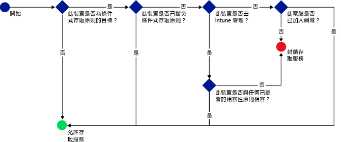

# 使用 Microsoft Intune 限制電子郵件、O365 和其他服務的存取
您可以使用 Intune 的條件式存取來限制公司電子郵件和 O365 服務的存取。 Intune 的條件式存取功能可讓您確保只有與您所設定的規則相容的裝置，才能存取公司電子郵件和 O365 服務。
## 條件式存取的運作方式
相容性原則設定用來評估裝置的相容性。 條件式存取原則使用評估來限制或允許對特定服務的存取。 條件式存取原則與相容性原則搭配使用時，只有相容的裝置才能存取服務。 相容性原則和條件式存取原則會部署至使用者。 使用者用來存取服務的所有裝置都會受到檢查是否符合原則。

請記住，必須將相容性原則部署至使用裝置的使用者，才能評估裝置的相容性。
如果沒有將相容性原則部署至使用者，裝置就視為相容，將不會套用存取限制。

當裝置不符合原則中設定的條件時，將會引導使用者註冊並修正造成裝置不相容的問題。

條件式存取的一般流程︰

## 如何設定條件式存取？
使用條件式存取來管理 Microsoft **Exchange 內部部署**、**Exchange Online**、**Exchange Online Dedicated**、**SharePoint Online** 和**商務用 Skype Online** 的存取。

若要設定條件式存取，請設定裝置相容性原則和條件式存取原則。

相容性原則包含密碼、加密及裝置是否已進行 JB 破解等設定。 裝置必須符合這些規則才算相容。

您可以根據下列資訊，設定條件式存取原則來限制存取︰
- 裝置相容性狀態。
- 在裝置上執行的平台。
- 用來存取服務的應用程式類型。

不同於其他 Intune 原則，您不用部署條件式存取原則。 反之，一旦您設定原則並選取應該有此原則的使用者，此原則就會套用至所有目標使用者。 當使用者成為原則的目標時，他們使用的每個裝置都必須相容，才能存取資源。

## 後續步驟
1. [了解裝置相容性原則及其運作方式 ](introduction-to-device-compliance-policies-in-microsoft-intune.md)

2. [建立相容性原則](create-a-device-compliance-policy-in-microsoft-intune.md)

2.  針對下列項目建立條件式存取原則：
> [!div class="op_single_selector"]
  - [建立 Exchange Online 的條件存取原則](restrict-access-to-exchange-online-with-microsoft-intune.md)
  - [建立 Exchange 內部部署的條件存取原則](restrict-access-to-exchange-onpremises-with-microsoft-intune.md)
  - [建立 Exchange Online Dedicated 的條件存取原則](restrict-access-to-exchange-online-with-microsoft-intune.md)
  - [建立舊版 Exchange Online Dedicated 的條件存取原則](restrict-access-to-exchange-onpremises-with-microsoft-intune.md)
  - [建立 SharePoint Online 的條件式存取原則](restrict-access-to-sharepoint-online-with-microsoft-intune.md)
  - [建立商務用 Skype Online 的條件式存取原則](restrict-access-to-skype-for-business-online-with-microsoft-intune.md)
  - [建立 Dynamics CRM Online 的條件式存取原則](restrict-access-to-dynamics-crm-online-with-microsoft-intune.md)

<!--HONumber=Jul16_HO3-->

