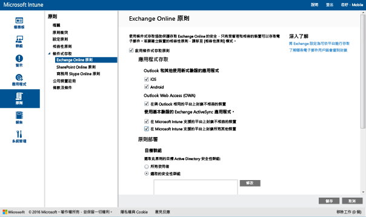

# 使用 Intune 限制 Exchange Online 和新版 Exchange Online Dedicated 的電子郵件存取

如果您有 Exchange Online Dedicated 環境，而且需要了解它是使用新版或舊版的設定，請連絡您的帳戶管理員。

若要控制 Exchange Online 或新的 Exchange Online Dedicated 環境的電子郵件存取，請在 Intune 中設定 Exchange Online 的條件式存取。
若要深入了解條件式存取如何運作，請參閱[限制存取電子郵件、O365 和其他服務](restrict-access-to-email-and-o365-services-with-microsoft-intune.md)一文。

>[!IMPORTANT]
>透過使用新式驗證的應用程式來設定電腦和 Windows 10 行動裝置版的條件式存取，目前未提供給所有 Intune 客戶使用。 如果您已經在使用這些功能，您不需要採取任何動作。 您可以繼續使用它們。

>如果您尚未針對使用新式驗證的應用程式建立電腦或 Windows 10 行動裝置版的條件式存取原則，但想要這樣做，您必須提交要求。  您可以在 [Microsoft Connect 網站](http://go.microsoft.com/fwlink/?LinkId=761472)了解已知問題及如何存取這項功能的詳細資訊。

在設定條件式存取**之前**，您必須：

-   具有**包含 Exchange Online (例如 E3) 的 Office 365 訂用帳戶**，而且使用者必須獲得 Exchange Online 的授權。

-  考慮設定選擇性 **Microsoft Intune 服務對服務連接器**，它可將 [!INCLUDE[wit_nextref](../includes/wit_nextref_md.md)] 連接至 Microsoft Exchange Online，並協助您透過 [!INCLUDE[wit_nextref](../includes/wit_nextref_md.md)] 主控台管理裝置資訊。 使用相容性原則或條件存取原則並不需要使用連接器，但必須執行報告，以協助評估條件存取的影響。

   > [!NOTE]
   > 如果您想要對 Exchange Online 和 Exchange 內部部署都使用條件式存取，請勿設定服務對服務連接器

   如需連接器的設定指示，請參閱 [Intune 服務對服務連接器](intune-service-to-service-exchange-connector.md)

設定條件式存取原則並以使用者為目標後，使用者使用的**裝置**必須符合下列條件，使用者才能連接到其電子郵件：

-   已向 [!INCLUDE[wit_nextref](../includes/wit_nextref_md.md)] **註冊**或是已加入網域的電腦。

-  已在 **Azure Active Directory** 中註冊。 這會在裝置向 [!INCLUDE[wit_nextref](../includes/wit_nextref_md.md)] 註冊時自動完成。 此外，必須向 Azure Active Directory 註冊用戶端 Exchange ActiveSync 識別碼。

  Intune 和 Office 365 客戶將會自動啟用 AAD DRS。 已部署 ADFS 裝置註冊服務的客戶不會在其內部部署 Active Directory 中看到已註冊的裝置。

-   與部署到該裝置的 [!INCLUDE[wit_nextref](../includes/wit_nextref_md.md)] 相容性原則**相容**，或已加入內部部署網域。

如果不符合條件式存取原則，使用者在登入時會看見下列其中一個訊息：

- 如果裝置未向 [!INCLUDE[wit_nextref](../includes/wit_nextref_md.md)] 註冊，或未在 Azure Active Directory 中註冊，就會顯示訊息，指示如何安裝公司入口網站應用程式、註冊裝置及啟用電子郵件。 此程序也會將裝置的 Exchange ActiveSync 識別碼與 Azure Active Directory 中的記錄產生關聯。

-   如果裝置評估為不符合相容性原則規則，則會將使用者引導至 [!INCLUDE[wit_nextref](../includes/wit_nextref_md.md)] 公司入口網站或公司入口網站應用程式，讓他們找到問題的相關資訊，以及如何修復問題的方法。

下圖說明 Exchange Online 的條件式存取原則使用的流程。

## 支援行動裝置
您可以限制從 **Outlook** 和其他 **使用新式驗證的應用程式**存取 Exchange Online 電子郵件：-

- Android 4.0 和更新版本、Samsung Knox Standard 4.0 和更新版本
- iOS 7.1 和更新版本
- Windows Phone 8.1 和更新版本

**新式驗證**將 Active Directory 驗證程式庫 (ADAL) 登入整合到 Office 用戶端中。

-   ADAL 型驗證可讓 Office 用戶端進行以瀏覽器為基礎的驗證 (又稱為被動驗證)。  系統會將使用者導向登入網頁，以便進行驗證。 這個新的登入方法提供更高的安全性，例如**多因素驗證**和**憑證式驗證**。
這篇[文章](https://support.office.com/en-US/article/How-modern-authentication-works-for-Office-2013-and-Office-2016-client-apps-e4c45989-4b1a-462e-a81b-2a13191cf517)包含新式驗證運作方式的詳細資訊。
設定 ADFS 宣告規則來封鎖非新式驗證通訊協定。 案例 3 提供詳細指示 ─ [除使用瀏覽器架構的應用程式外，封鎖所有對 O365 的存取](https://technet.microsoft.com/library/dn592182.aspx)。

您可以在從 **iOS** 和 **Android** 裝置上的瀏覽器進行存取時，限制存取 Exchange Online 上的 **Outlook Web Access (OWA)**。  將只允許從相容裝置上的支援瀏覽器進行存取︰

* Safari (iOS)
* Chrome (Android)
* 受管理的瀏覽器 (iOS 和 Android)

**不支援的瀏覽器將會被封鎖**。

不支援適用於 iOS 和 Android 的 OWA 應用程式。  它們應該透過 ADFS 宣告規則封鎖。

您可以限制從下列平台內建的 **Exchange ActiveSync 電子郵件用戶端**存取 Exchange 電子郵件：

- Android 4.0 和更新版本、Samsung Knox Standard 4.0 和更新版本

- iOS 7.1 和更新版本

- Windows Phone 8.1 和更新版本

## 對電腦的支援

您可以針對執行 Office 桌面應用程式的電腦安裝條件存取，以便針對符合下列需求的電腦存取 **Exchange Online** 和 **SharePoint Online** ：

-   電腦必須執行 Windows 7.0 或 Windows 8.1。

-   電腦必須已加入網域或符合相容性規則。

    電腦必須在 [!INCLUDE[wit_nextref](../includes/wit_nextref_md.md)] 註冊且符合原則才算相容。

    已加入網域的電腦必須設為向 Azure Active Directory [自動註冊裝置](https://azure.microsoft.com/documentation/articles/active-directory-conditional-access-automatic-device-registration/)。

-   [必須啟用 Office 365 新式驗證](https://support.office.com/en-US/article/Using-Office-365-modern-authentication-with-Office-clients-776c0036-66fd-41cb-8928-5495c0f9168a)，並安裝所有最新的 Office 更新。

    新式驗證將 Active Directory 驗證程式庫 (ADAL) 登入整合到 Office 2013 Windows 用戶端中，並啟用更佳的安全性，例如 **Multi-Factor Authentication** 和**憑證式驗證**。

-   設定 ADFS 宣告規則來封鎖非新式驗證通訊協定。 案例 3 提供詳細指示 ─ [除使用瀏覽器架構的應用程式外，封鎖所有對 O365 的存取](https://technet.microsoft.com/library/dn592182.aspx)。

## 設定條件式存取
### 步驟 1：設定及部署相容性原則
確定您[建立](create-a-device-compliance-policy-in-microsoft-intune.md)相容性原則，並[部署](deploy-and-monitor-a-device-compliance-policy-in-microsoft-intune.md)到也將取得條件式存取原則的使用者群組。

> [!IMPORTANT]
> 如果您尚未部署相容性原則，則會將裝置視為相容，並允許存取 Exchange。

### 步驟 2：評估條件式存取原則的效果
您可以使用**行動裝置清查報表**，識別在您設定條件式存取原則之後可能不允許存取 Exchange 的裝置。

若要這麼做，請使用 [Microsoft Intune Service to Service Connector](intune-service-to-service-exchange-connector.md) 來設定 [!INCLUDE[wit_nextref](../includes/wit_nextref_md.md)] 和 Exchange 之間的連線。
1.  瀏覽至 [報表] -> [行動裝置清查報表]。
![[行動裝置清查報表] 頁面的螢幕擷取畫面](../media/IntuneSA2bMobileDeviceInventoryReport.png)

2.  在報表參數中，選取您要評估的 [!INCLUDE[wit_nextref](../includes/wit_nextref_md.md)] 群組，以及將套用該原則的裝置平台 (如有需要)。
3.  選取符合組織需求的準則之後，請選擇 [檢視報表]。
報表檢視器會在新視窗中開啟。

執行報表之後，請檢查下列四欄以判斷是否會封鎖使用者：

-   **管理通道** - 指出裝置是否受到 Intune、Exchange ActiveSync 或兩者所管理。

-   **AAD 已登錄** - 指出是否已向 Azure Active Directory 登錄裝置 (又稱為「加入工作場所」)。

-   **相容性** - 指出裝置是否可與您部署的任何相容性原則相容。

-   **Exchange ActiveSync 識別碼** - iOS 和 Android 裝置必須將其 Exchange ActiveSync 識別碼關聯至 Azure Active Directory 中的裝置登錄記錄。 這會在使用者選擇隔離電子郵件中的 [啟用電子郵件] 連結時發生。

    > [!NOTE]
    > Windows Phone 裝置永遠都會在此欄中顯示值。

除非欄值符合下表所列的值，否則隸屬於目標群組一部分的裝置將遭到封鎖而無法存取 Exchange：

--------------------------
|管理通道|AAD 已登錄|相容|Exchange ActiveSync 識別碼|產生的動作|
|----------------------|------------------|-------------|--------------------------|--------------------|
|**受到 Microsoft Intune 和 Exchange ActiveSync 所管理**|是|是|顯示值|允許電子郵件存取|
|任何其他值|否|否|不會顯示任何值|封鎖電子郵件存取|
----------------------
您可以匯出報表的內容，並使用 [電子郵件地址]  欄，通知使用者他們即將遭到封鎖。

### 步驟 3：針對條件式存取原則設定使用者群組
條件式存取原則以不同的 Azure Active Directory 使用者安全性群組為目標。 您也可以將特定使用者群組豁免於此原則。  當使用者成為原則的目標時，他們使用的每個裝置都必須相容，才能存取電子郵件。

您可以在 **Office 365 系統管理中心**或 **Intune 帳戶入口網站**中設定這些群組。

您可以在每個原則中指定兩種群組類型：

-   **目標群組** - 套用原則的使用者群組。

-   **免套用的群組** - 免於套用原則的使用者群組 (選擇性)

如果使用者隸屬於這兩個群組，他們將免套用原則。

只會評估條件式存取原則的目標群組。

### 步驟 4：設定條件式存取原則

1.  在 [Microsoft Intune 管理主控台]中，選擇 [原則]  >  [條件式存取]  >  [Exchange Online 原則]。

2.  在 **Exchange Online 原則** 頁面上，選取 **啟用 Exchange Online 的條件式存取原則**。

    > [!NOTE]
    > 如果您尚未部署相容性原則，則會將裝置視為相容。
    >
    > 所有使用者無論其相容性狀態如何，此原則皆會要求他們向 [!INCLUDE[wit_nextref](../includes/wit_nextref_md.md)] 註冊其裝置。

3.  在 [應用程式存取] 下，針對使用新式驗證的應用程式，您有兩種方法可選擇應該套用原則的平台。 支援的平台包括 Android、iOS、Windows 和 Windows Phone。

    -   **所有平台**

        任何用來存取 **Exchange  Online** 的裝置都必須在 Intune 中註冊並符合原則。  任何使用**新式驗證**的用戶端應用程式都必須遵守條件式存取原則；如果該平台目前不受 Intune 支援，則會封鎖對 **Exchange Online** 的存取。

        選取 [所有平台] 選項表示 Azure Active Directory 會將此原則套用至所有驗證要求，而不論用戶端應用程式所回報的平台為何。  所有平台都需要註冊並變成相容，除了︰
        *   Windows 裝置必須註冊並相容，使用內部部署 Active Directory 加入網域，或兩者兼具
        * 不支援例如 Mac OS 的平台。  不過，使用來自這些平台之新式驗證的應用程式，仍然會被封鎖。

        >[!TIP]
           如果您尚未對電腦使用條件式存取，可能看不到此選項。  請改用 [特定平台]。 電腦的條件式存取目前未提供給所有 Intune 客戶使用。   您可以在 [Microsoft Connect 網站](http://go.microsoft.com/fwlink/?LinkId=761472)了解已知問題及如何存取這項功能的詳細資訊。

    -   **特定平台**

         條件式存取原則會套用至在您指定的裝置平台上使用**新式驗證**的任何用戶端應用程式。

4. 在 [Outlook Web Access (OWA)] 下，您可以選擇允許只能透過支援的瀏覽器來存取 Exchange Online︰Safari (iOS)，以及 Chrome (Android)。 將會封鎖從其他瀏覽器的存取。 您為 Outlook 應用程式存取所選取的相同平台限制也適用於此處。

  在 **Android** 裝置，使用者必須啟用瀏覽器存取。  若要這樣做，使用者必須啟用已註冊裝置上的 [允許瀏覽器存取] 選項，如下所示︰
  1.    啟動公司入口網站應用程式。
  2.    從三個點 (...) 或硬體功能表按鈕移至 [設定] 頁面。
  3.    按下 [允許瀏覽器存取] 按鈕。
  4.    在 Chrome 瀏覽器中，登出 Office 365 並重新啟動 Chrome。

  在 **iOS 和 Android** 平台上，為了識別用來存取服務的裝置，Azure Active Directory 會發行傳輸層安全性 (TLS) 憑證給裝置。  裝置會顯示憑證，並提示使用者選取憑證，如以下螢幕擷取畫面所示。 使用者必須選取此憑證，才能繼續使用瀏覽器。

  **iOS**

  

  **Android**

  

5.  在 [Exchange ActiveSync 應用程式] 下，您可以選擇禁止不相容的裝置存取 Exchange Online。 您也可以選擇當裝置不是執行支援的平台時允許或封鎖存取電子郵件。 支援的平台包括 Android、iOS、Windows 和 Windows Phone。

6.  在 [目標群組] 下方，選取要套用原則之使用者的 Active Directory 安全性群組。 您可以選擇針對所有使用者或選取的使用者群組清單。
![Exchange Online 條件式存取原則頁面的螢幕擷取畫面，其中顯示 [目標] 和 [豁免] 群組選項](../media/IntuneSA5eTargetedExemptedGroups.PNG)
    > [!NOTE]
    > 針對 [目標群組] 中的使用者，Intune 原則會取代 Exchange 規則和原則。
    >
    > 只有在下列情況中，Exchange 才會強制 Exchange 允許、封鎖和隔離規則及 Exchange 原則：
    >
    > -   使用者未取得使用 Intune 的授權。
    > -   使用者已取得使用 Intune 的授權，但不屬於條件式存取原則中的任何目標安全性群組。

6.  在 [免套用的群組] 下方，選取免套用此原則之使用者的 Active Directory 安全性群組。 若使用者同時隸屬於目標群組及免套用的群組，則他們將免套用此原則。

7.  完成之後，請選擇 [儲存]。

-   您不需部署條件式存取原則，它會立即生效。

-   在使用者建立電子郵件帳戶之後，裝置會立即遭到封鎖。

-   如果封鎖的使用者向 [!INCLUDE[wit_nextref](../includes/wit_nextref_md.md)] 註冊裝置並修復任何不相容性問題，則會在 2 分鐘內解除封鎖電子郵件存取。

-   如果使用者取消註冊其裝置，大約會在 6 小時後封鎖電子郵件。

**若要查看一些如何設定條件式存取原則以限制裝置存取的範例案例，請參閱[限制電子郵件存取範例案例](restrict-email-access-example-scenarios.md)。**

## 監視相容性及條件式存取原則

#### 檢視遭 Exchange 封鎖的裝置

在 [!INCLUDE[wit_nextref](../includes/wit_nextref_md.md)] 儀表板上，選擇 [遭 Exchange 封鎖的裝置] 磚，以顯示已封鎖的裝置數目以及其他更多資訊的連結。

## 後續步驟
[限制存取 SharePoint Online](restrict-access-to-sharepoint-online-with-microsoft-intune.md)

[限制存取商務用 Skype Online](restrict-access-to-skype-for-business-online-with-microsoft-intune.md)

<!--HONumber=Jul16_HO3-->

