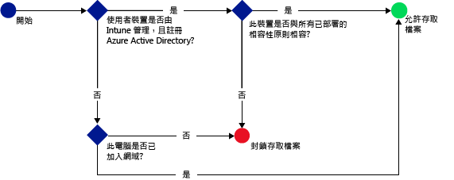

# 使用 Microsoft Intune 限制存取 SharePoint Online
使用 [!INCLUDE[wit_firstref](../includes/wit_firstref_md.md)] 條件式存取來控制存取位於 SharePoint Online 的檔案。
條件式存取有兩個元件：
- 裝置相容性原則，裝置必須符合此原則才算相容。
- 條件式存取原則，其中指定裝置必須符合才能存取服務的條件。
若要深入了解條件式存取如何運作，請參閱[限制存取電子郵件、O365 和其他服務](restrict-access-to-email-and-o365-services-with-microsoft-intune.md)主題。

當使用者嘗試在其裝置 (例如 OneDrive) 上使用支援的應用程式連接到檔案時，將會進行下列評估：

>[!IMPORTANT]
>透過使用新式驗證的應用程式來設定電腦和 Windows 10 行動裝置版的條件式存取，目前未提供給所有 Intune 客戶使用。 如果您已經在使用這些功能，您不需要採取任何動作。 您可以繼續使用它們。

>如果您尚未針對使用新式驗證的應用程式建立電腦或 Windows 10 行動裝置版的條件式存取原則，但想要這樣做，您必須提交要求。  您可以在 [Connect 網站](http://go.microsoft.com/fwlink/?LinkId=761472)了解已知問題及如何存取這項功能的詳細資訊。

設定 SharePoint Online 的條件式存取原則**之前**，您必須：
- 具有 **SharePoint Online 訂用帳戶**，且使用者必須獲得 SharePoint Online 的授權。
- 成為 **Enterprise Mobility Suite** 或 **Azure Active Directory Premium** 的訂用帳戶。

  若要連接到所需的檔案，裝置必須：
-   已向 [!INCLUDE[wit_nextref](../includes/wit_nextref_md.md)] **註冊**或是已加入網域的電腦。

-   在 Azure Active Directory 中**註冊裝置** (裝置向 [!INCLUDE[wit_nextref](../includes/wit_nextref_md.md)] 註冊時即會自動發生)。

-   與所有已部署的 [!INCLUDE[wit_nextref](../includes/wit_nextref_md.md)] 相容性原則相容

裝置狀態儲存在 Azure Active Directory，它會根據您指定的條件，授與或封鎖檔案的存取權。

如不符合條件，使用者會在登入時看見下列訊息之一：

-   如果裝置未向 [!INCLUDE[wit_nextref](../includes/wit_nextref_md.md)] 註冊，或未在 Azure Active Directory 中註冊，就會顯示訊息，指示如何安裝公司入口網站應用程式並註冊。

-   如果裝置不相容，就會顯示訊息，將使用者引導至 [!INCLUDE[wit_nextref](../includes/wit_nextref_md.md)] 公司入口網站，讓他們找到問題的相關資訊，以及如何修復問題的方法。

## 支援行動裝置
- iOS 7.1 和更新版本
- Android 4.0 和更新版本、Samsung Knox Standard 4.0 或更新版本
- Windows Phone 8.1 和更新版本

您可以在從 **iOS** 和 **Android** 裝置上的瀏覽器進行存取時，限制存取 SharePoint Online。  將只允許從相容裝置上支援的瀏覽器進行存取︰
* Safari (iOS)
* Chrome (Android)
* 受管理的瀏覽器 (iOS 和 Android)

**不支援的瀏覽器將會被封鎖**。

## 對電腦的支援
- Windows 8.1 及更新版本 (已向 Intune 註冊)
- Windows 7.0 或 Windows 8.1 (已加入網域時)

  - 已加入網域的電腦必須設定為向 Azure Active Directory [自動登錄](https://azure.microsoft.com/en-us/documentation/articles/active-directory-conditional-access-automatic-device-registration/)。
Intune 和 Office 365 客戶將會自動啟用 AAD DRS。 已部署 ADFS 裝置註冊服務的客戶不會在其內部部署 Active Directory 中看到已註冊的裝置。

  - 如果原則設為需要加入網域，而電腦未加入網域，即會顯示連絡 IT 管理員的訊息。

  - 如果原則設為需要加入網域或相容，但電腦不符合任一要求，即會顯示訊息，指示如何安裝公司入口網站應用程式並註冊。
-    [必須啟用 Office 365 新式驗證](https://support.office.com/en-US/article/Using-Office-365-modern-authentication-with-Office-clients-776c0036-66fd-41cb-8928-5495c0f9168a)，並安裝所有最新的 Office 更新。

    新式驗證將 Active Directory 驗證程式庫 (ADAL) 登入整合到 Office 2013 Windows 用戶端中，並啟用更佳的安全性，例如 **Multi-Factor Authentication** 和**憑證式驗證**。

## 設定 SharePoint Online 的條件式存取

### 步驟 1：設定 Active Directory 安全性群組
在開始之前，請先為條件式存取原則設定 Azure Active Directory 安全性群組。 您可以在 **Office 365 系統管理中心**或 **Intune 帳戶入口網站**中設定這些群組。 這些群組將用於設定原則的目標使用者，或將使用者豁免於原則。 當使用者成為原則的目標時，他們使用的每個裝置都必須相容，才能存取資源。

您可以在 SharePoint Online 原則中指定兩種群組類型：

-   **目標群組** - 包含套用原則的使用者群組。

-   **豁免群組** - 包含豁免於原則的使用者群組。

如果使用者隸屬於這兩個群組，他們將免套用原則。

### 步驟 2：設定及部署相容性原則
如果您尚未這麼做，請建立相容性原則，並部署到 SharePoint Online 原則的目標使用者。

> [!NOTE]
> 雖然相容性原則會部署到 [!INCLUDE[wit_nextref](../includes/wit_nextref_md.md)] 群組，但條件式存取原則以 Azure Active Directory 安全性群組為目標。

如需如何設定相容性原則的詳細資料，請參閱[建立相容性原則](create-a-device-compliance-policy-in-microsoft-intune.md)。

> [!IMPORTANT]
> 如果您尚未部署相容性原則，則會將裝置視為相容。

當您準備好時，請繼續執行 **步驟 3**。

### 步驟 3：設定 SharePoint Online 原則
接著，設定原則要求只有受管理和相容的裝置才可以存取 SharePoint Online。 這項原則會儲存在 Azure Active Directory。

#### 

1.  在 [Microsoft Intune 管理主控台] 中，選擇 [原則]  >  [條件式存取]  >  [SharePoint Online 原則]。
![[SharePoint Online 原則] 頁面的螢幕擷取畫面](../media/mdm-ca-spo-policy-configuration.png)

2.  選取 [啟用 SharePoint Online 的條件式存取原則]。

3.  在 [應用程存取] 下，您可以選擇將條件式存取原則套用至：

    -   **所有平台**

        任何用來存取 **SharePoint Online** 的裝置都必須在 Intune 中註冊並符合原則。  任何使用**新式驗證**的用戶端應用程式都必須遵守條件式存取原則。 如果 Intune 目前不支援此平台，則會禁止存取 **SharePoint Online**

        選取 [所有平台] 選項表示 Azure Active Directory 會將此原則套用至所有驗證要求，而不論用戶端應用程式所回報的平台為何。  所有平台都需要註冊並變成相容，除了︰
        *   Windows 裝置必須註冊並相容，使用內部部署 Active Directory 加入網域，或兩者兼具
        * 不支援例如 Mac 的平台。  不過，使用來自這些平台之新式驗證的應用程式，仍然會被封鎖。
        >[!TIP]
        >如果您尚未對電腦使用條件式存取，可能看不到此選項。  請改用 [特定平台]。 電腦的條件式存取目前未提供給所有 Intune 客戶使用。   您可以在 [Microsoft Connect 網站](http://go.microsoft.com/fwlink/?LinkId=761472)了解已知問題及如何存取這項功能的詳細資訊。

    -   **特定平台**

         條件式存取原則會套用至在您指定的平台上使用新式驗證的任何用戶端應用程式。

     Windows 電腦則必須已加入網域，或已向 [!INCLUDE[wit_nextref](../includes/wit_nextref_md.md)] 註冊且相容。 您可以設定下列要求：

     -   **裝置必須已加入網域或相容。** 如果您希望電腦已加入網域或符合 [!INCLUDE[wit_nextref](../includes/wit_nextref_md.md)] 中設定的原則，請選擇此選項。 如果電腦不符合上述任一需求，則會提示使用者將裝置註冊到[!INCLUDE[wit_nextref](../includes/wit_nextref_md.md)]。

     -   **裝置必須已加入網域。** 選擇此選項會要求電腦必須已加入網域才能存取 Exchange Online。 如果電腦未加入網域，則會封鎖存取電子郵件並提示使用者連絡 IT 管理員。

     -   **裝置必須相容。** 選擇此選項會要求電腦必須在 [!INCLUDE[wit_nextref](../includes/wit_nextref_md.md)] 註冊且相容。 如果電腦未註冊，則會顯示註冊指示訊息。

4.   在 SharePoint Online 和商務用 OnDrive 的 [瀏覽器存取] 下，您可以選擇允許只能透過支援的瀏覽器存取 Exchange Online︰Safari (iOS)，以及 Chrome (Android)。 將會封鎖從其他瀏覽器的存取。  您為 OneDrive 應用程式存取所選取的相同平台限制也適用於此處。

  在 **Android** 裝置，使用者必須啟用瀏覽器存取。  若要這樣做，使用者必須啟用已註冊裝置上的 [允許瀏覽器存取] 選項，如下所示︰
  1.    啟動公司入口網站應用程式。
  2.    從三個點 (...) 或硬體功能表按鈕移至 [設定] 頁面。
  3.    按下 [允許瀏覽器存取] 按鈕。
  4.  在 Chrome 瀏覽器中，登出 Office 365 並重新啟動 Chrome。

  在 **iOS 和 Android** 平台上，為了識別用來存取服務的裝置，Azure Active Directory 會發行傳輸層安全性 (TLS) 憑證給裝置。  裝置會顯示憑證，並提示使用者選取憑證，如以下螢幕擷取畫面所示。 使用者必須選取此憑證，才能繼續使用瀏覽器。

  **iOS**

  

  **Android**

  
5.  選擇 [目標群組] 下方的 [修改]，選取要套用原則的 Azure Active Directory 安全性群組。 您可以選擇針對所有使用者，或僅針對選取的使用者群組。

6.  選擇 [免套用的群組] 下方的 [修改]，選取免套用此原則的 Azure Active Directory 安全性群組。

6.  完成之後，請選擇 [儲存]。

您不需部署條件式存取原則，它會立即生效。

### 步驟 4：監視相容性及條件式存取原則
在 [群組]  工作區中，您可以檢視裝置的狀態。

選取任何行動裝置群組，然後在 [裝置]  索引標籤上，選取下列 [篩選器] 其中之一：

-   [沒有登錄 AAD 的裝置] – 從 SharePoint Online 封鎖這些裝置。

-   [不相容的裝置] – 從 SharePoint Online 封鎖這些裝置。

-   [已登錄了 AAD 並相容的裝置] – 這些裝置可以存取 SharePoint Online。

### 請參閱
[使用 Microsoft Intune 限制電子郵件和 O365 服務的存取](restrict-access-to-email-and-o365-services-with-microsoft-intune.md)

<!--HONumber=Jun16_HO4-->

