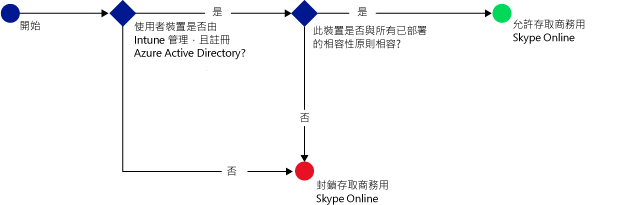
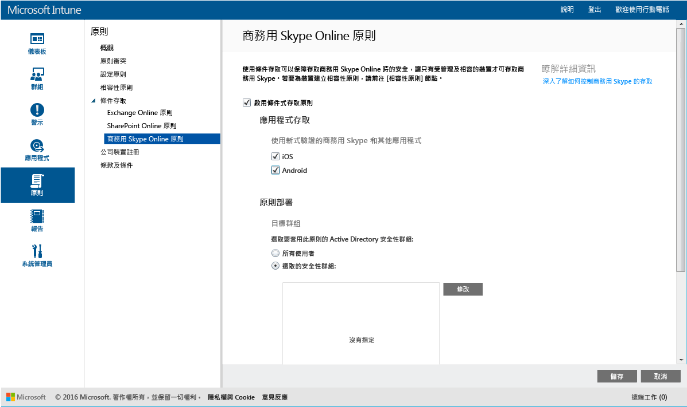

# 使用 Microsoft Intune 限制存取商務用 Skype Online
使用**商務用 Skype Online** 的條件式存取原則來控制對商務用 Skype Online 的存取。
條件式存取有兩個元件：
- 裝置相容性原則，裝置必須符合此原則才算相容。
- 條件式存取原則，其中指定裝置必須符合才能存取服務的條件。
若要深入了解條件式存取如何運作，請參閱[限制存取電子郵件和 O365 服務](restrict-access-to-email-and-o365-services-with-microsoft-intune.md)文件。

當目標使用者嘗試在其裝置上使用商務用 Skype Online 時，就會進行下列評估：

設定商務用 Skype Online 的條件式存取原則**之前**，您必須：
- 具有**商務用 Skype Online 訂用帳戶**，並將商務用 Skype Online 授權指派給使用者。
- 成為 **Enterprise Mobility Suite** 或 **Azure Active Directory Premium** 的訂用帳戶。
-   對商務用 Skype Online [啟用新式驗證](https://docs.microsoft.com/en-us/intune/deploy-use/restrict-access-to-skype-for-business-online-with-microsoft-intune)。
-  所有使用者都必須使用**商務用 Skype Online**。 如果您的部署同時有商務用 Skype Online 和商務用 Skype 內部部署，則條件式存取原則不會套用至使用者。

    需要存取商務用 Skype Online 的裝置必須：

-   是 **Android** 或 **iOS** 裝置。

-   請**註冊**至[!INCLUDE[wit_nextref](../includes/wit_nextref_md.md)]。

-   與所有已部署的 [!INCLUDE[wit_nextref](../includes/wit_nextref_md.md)] 相容性原則**相容**。

裝置狀態儲存在 Azure Active Directory 中，它會根據您指定的條件來授與或封鎖存取。

如不符合條件，使用者會在登入時看見下列訊息之一：

-   如果裝置未向 [!INCLUDE[wit_nextref](../includes/wit_nextref_md.md)] 註冊，或未在 Azure Active Directory 中註冊，就會顯示訊息，指示如何安裝公司入口網站應用程式並註冊。

-   如果裝置不相容，就會顯示訊息，將使用者引導至 [!INCLUDE[wit_nextref](../includes/wit_nextref_md.md)] 公司入口網站或公司入口網站應用程式，讓他們找到問題的相關資訊，以及如何修復問題的方法。

## 設定商務用 Skype Online 的條件式存取

### 步驟 1：設定 Active Directory 安全性群組
在開始之前，請先為條件式存取原則設定 Azure Active Directory 安全性群組。 您可以在 **Office 365 系統管理中心**設定這些群組。 這些群組將用於設定原則的目標使用者，或將使用者豁免於原則。 當使用者成為原則的目標時，他們使用的每個裝置都必須相容，才能存取資源。

您可以指定兩種群組類型來用於商務用 Skype 原則︰

-   **目標群組** - 包含套用原則的使用者群組。

-   **豁免群組** - 包含豁免於原則的使用者群組。

如果使用者隸屬於這兩個群組，他們將免套用原則。

### 步驟 2：設定及部署相容性原則
[建立](create-a-device-compliance-policy-in-microsoft-intune.md)相容性原則並[部署](deploy-and-monitor-a-device-compliance-policy-in-microsoft-intune.md)到將受此原則影響的所有裝置。 這些是**目標群組**中的使用者所使用的所有裝置。

> [!NOTE]
> 雖然相容性原則會部署到 [!INCLUDE[wit_nextref](../includes/wit_nextref_md.md)] 群組，但條件式存取原則以 Azure Active Directory 安全性群組為目標。

> [!IMPORTANT]
> 如果您尚未部署相容性原則，則會將裝置視為相容。

當您準備好時，請繼續執行 **步驟 3**。

### 步驟 3：設定商務用 Skype Online 原則
接著，設定原則來要求只有受管理和相容的裝置才可以存取商務用 Skype Online。 這項原則會儲存在 Azure Active Directory。

####
1.  在 [Microsoft Intune 管理主控台]中，按一下 [原則]  >  [條件式存取]  >  [商務用 Skype Online 原則]。

2.  選取 [啟用條件式存取原則]。

3.  在 [應用程存取] 下，您可以選擇將條件式存取原則套用至：

    -   **iOS**

    -   **Android**

4.  按一下 [目標群組] 下方的 [修改]  ，選取要套用原則的 Azure Active Directory 安全性群組。 您可以選擇以所有使用者或僅一群特定的使用者為目標。

5.  按一下 [豁免群組] 下方的 [修改]  ，選取豁免此原則的 Azure Active Directory 安全性群組。

6.  完成之後，請按一下 [儲存] 。

您現在已設定商務用 Skype Online 的條件式存取。 您不需部署條件式存取原則，它會立即生效。

## 監視相容性及條件式存取原則
在 [群組]  工作區中，您可以檢視裝置的條件式存取狀態。

選取任何行動裝置群組，然後在 [裝置]  索引標籤上，選取下列 [篩選器] 其中之一：

* **未向 AAD 註冊的裝置** - 禁止這些裝置存取商務用 Skype Online。

* **不相容的裝置** - 禁止這些裝置存取商務用 Skype Online。

* **已向 AAD 註冊且相容的裝置** - 這些裝置可以存取商務用 Skype Online。

<!--HONumber=Jul16_HO3-->

