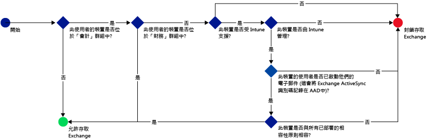
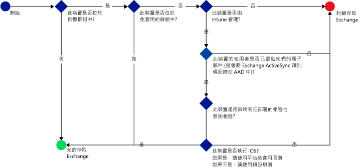

# 使用 Microsoft Intune 限制存取電子郵件：範例案例

## 禁止使用者使用不相容的裝置存取 Exchange Online。
### 案例需求
- 對於 **Accounting** Active Directory 安全性群組中的所有使用者，若其裝置與您部署的相容性原則不相容，則必須禁止存取 Exchange Online。
- 如果此群組中有任何使用者的裝置不受 [!INCLUDE[wit_nextref](../includes/wit_nextref_md.md)] 支援，則必須禁止他們在該裝置上存取 Exchange Online。
- 對於 **Finance** Active Directory 安全性群組中的使用者，即使同樣隸屬於 **Accounting** 安全性群組，也必須豁免於此原則。

若要達到此目的，請使用下列設定來設定 Exchange Online 的條件式存取原則：

-   選取 [啟用條件式存取原則]。

- 選取您想要允許從應用程式使用新式驗證來存取的平台。
- 對於 Exchange ActiveSync 應用程式，選取 [在 Microsoft Intune 支援的平台上封鎖不相容的裝置] 和 [在 Microsoft Intune 不支援的平台上封鎖其他所有裝置]。
-   在 [目標群組] 區段的 [已選取的安全性群組] 下，選擇 [Accounting] 使用者群組。

-   在 [豁免群組] 區段的 [已選取的安全性群組] 下，選擇 [Finance] 使用者群組。

下列流程用於決定可存取 Exchange Online 的裝置：

## 所有存取 Exchange 內部部署的 iOS 裝置都必須由 Intune 管理
### 案例需求
- 只有執行 iOS 的裝置才應該允許存取 Exchange 內部部署。
- 裝置也必須在 Intune 中註冊，並符合相容性原則規則，才能用於存取 Exchange。

若要達到此目的，請使用下列設定來設定 Exchange 內部部署的下列條件式存取原則：

-   選取 [封鎖不相容或未向 Microsoft Intune 註冊之裝置的電子郵件應用程式存取 Exchange 內部部署] 選項。 選取此選項會啟用條件式存取原則，要求所有裝置必須在 Microsoft Intune 中註冊且符合相容性原則規則，才能存取 Exchange。

-   在進階 Exchange Active Sync 設定中，請建立：

  -   允許執行 iOS 之裝置存取 Exchange 的平台例外。   

  -   預設規則，指定當平台例外規則未涵蓋裝置時，應該禁止此裝置存取 Exchange。 此規則可確保不是執行 iOS 的裝置無法存取 Exchange。

下列流程會用於可以存取 Exchange 的裝置：

## 沒有任何 Android 裝置能夠存取 Exchange 內部部署。
### 案例需求
- 應該禁止所有 Android 裝置存取 Exchange。
- 只要其他支援的裝置由 [!INCLUDE[wit_nextref](../includes/wit_nextref_md.md)] 管理，就可存取 Exchange 。

若要達到此目的，請使用下列設定來設定 Exchange 內部部署的條件式存取原則：

-   選取 [封鎖不相容或未向 Microsoft Intune 註冊之裝置的電子郵件應用程式存取 Exchange 內部部署] 選項。 選取此選項會要求任何裝置必須在 Intune 中註冊，且符合相容性原則規則。

- 在進階 Exchange Active Sync 設定中，請建立：
  -   平台例外，禁止執行 Android 的裝置存取 Exchange。 此規則可確保 Android 裝置不能用來存取 Exchange。

  -   預設規則，指定當其他規則未涵蓋裝置時，應該允許此裝置存取 Exchange。 此預設規則可確保執行 Android 以外平台，但 Microsoft Intune 支援的裝置，可以用來存取 Exchange。 不過，它們必須在 Intune 中註冊並符合相容性原則規則。

下列流程會用於可以存取 Exchange 的裝置：

<!--HONumber=Jun16_HO4-->

