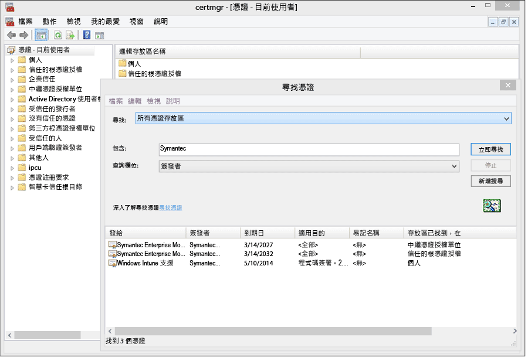

# 設定 Windows Phone 8.0 的裝置管理

Windows Phone 8.0 需要 Symantec 憑證，才能安裝 Intune 公司入口網站應用程式，並允許裝置管理。 簽署企業營運系統應用程式時也需要憑證。 下列主題僅適用於 Windows Phone 8.0。 若要管理 Windows Phone 8.1 或更新版本 (包括 Windows 10 行動裝置版)，請參閱[設定 Windows Phone 註冊](set-up-windows-phone-management-with-microsoft-intune.md)。

> [!IMPORTANT]
> 從 2016 年 9 月開始，Windows 8.0 和 Windows Phone 8.0 的公司入口網站應用程式將不再提供下載。

-   **Windows Phone 8** - 需要憑證
-   **Windows Phone 8.1 和 Windows 10 行動裝置版**只有在下列情況才需要憑證：

    -   您想要部署使用 Intune 部署公司入口網站應用程式

    -   您將會部署企業營運系統 (也稱為「側載」) 應用程式


  > [!IMPORTANT]
  > 用來管理特定 Windows 和 Windows Phone 行動裝置的 Symantec 憑證[必須定期更新](renew-a-symantec-code-signing-certificate.md)。

Window Phone 行動裝置管理的設定需求取決於您要如何管理裝置。  在公司的 DNS 登錄中設定兩個 CNAME 可更容易使用註冊。 如果您的使用者將從市集下載公司入口網站應用程式，則當您設定 DNS 設定之後，您只需要設定公司入口網站並通知使用者如何註冊。  針對您要在其中部署公司入口網站的 Windows Phone 8.0 或 Windows Phone 8.1，您需要有 Symantec 憑證，才能進行應用程式的程式碼簽署。

## 完成設定需求以啟用 Windows Phone 管理
1.  **設定 Intune**：如果尚未這麼做，請[設定行動裝置管理授權單位](prerequisites-for-enrollment.md#set-mobile-device-management-authority)為 **Microsoft Intune** 並設定 MDM，為行動裝置管理做好準備。

2.  **設定註冊伺服器位址的 DNS 別名** (選用)

    DNS 別名 (CNAME 記錄類型) 透過在註冊期間自動填入伺服器名稱，讓使用者能夠更輕鬆地註冊其裝置。

    1.  在 [Intune 管理主控台](http://manage.microsoft.com)中，按一下 **[管理]** &gt; **[行動裝置管理]** &gt; **[Windows Phone]**。

    2.  在 [指定驗證的網域名稱] 方塊中輸入公司網站中已驗證網域的 URL，然後按一下 [測試自動偵測]。

    3.  建立公司網域的 **CNAME** DNS 資源記錄。 CNAME 資源記錄必須包含下列資訊：

        |主機名稱|指向|TTL|
        |-------------|-------------|-------|
        |enterpriseenrollment.company_domain.com|enterpriseenrollment-s.manage.microsoft.com |1 小時|
        |enterpriseregistration.company_domain.com|enterpriseregistration.windows.net|1 小時|
        例如，假設公司網站為 contoso.com，您就必須在 DNS 中建立 CNAME，其會將 EnterpriseEnrollment.contoso.com 重新導向到 manage.microsoft.com。 如果已驗證的網域不止一個，請為每個網域建立一筆 CNAME 記錄。

        -   `enterpriseenrollment-s.manage.microsoft.com` – 支援從電子郵件的網域名稱辨識網域，重新導向至 Intune 服務

        -   `enterpriseregistration.windows.net` – 針對行動裝置支援加入工作場所的功能。 其也支援 Windows 8.1 的條件式存取

    

3.  **憑證管理以支援應用程式簽署**：不會存取 Windows Phone 市集和 (或) 需要企業營運系統應用程式的 Windows Phone 8.0 和 Windows Phone 8.1 的必要項。

    若要支援適用於 Windows Phone 8.0 的公司入口網站應用程式，並將公司應用程式部署到 Windows Phone 8.1，您必須取得 **Symantec 企業行動程式碼簽署憑證**。 您無法使用您自己的憑證授權單位所核發的憑證，因為只有 Symantec 憑證受 Windows Phone 裝置信任。 您必須擁有此憑證，才能執行下列動作：

    -   簽署公司入口網站應用程式，以部署到 [!INCLUDE[winphone8_client_1](../includes/winphone8_client_1_md.md)] 來進行註冊和電話管理

    -   簽署公司企業營運系統應用程式，讓 [!INCLUDE[wit_nextref](../includes/wit_nextref_md.md)] 可將其部署到 Windows Phone

    下列步驟可協助您取得所需的憑證來簽署公司入口網站應用程式。 您需要 Windows Phone 開發人員中心帳戶，還必須購買 Symantec 憑證。

    1.  **加入 Windows Phone 開發人員中心**：在登入以購買公司帳戶時，使用公司帳戶資訊加入 [Windows Phone 開發人員中心](http://go.microsoft.com/fwlink/?LinkId=268442)。 這項要求需要在您收到程式碼簽署憑證之前，由公司主管人員授權。

    2.  **取得公司 Symantec 憑證**：使用您的 Symantec 識別碼，從 [Symantec 網站](http://go.microsoft.com/fwlink/?LinkId=268441)購買憑證。 購買憑證後，您在 Windows Phone 開發人員中心帳戶中指定的公司核准者將收到一封請求核准憑證要求的電子郵件。 如需 Symantec 憑證需求的詳細資訊，請參閱[為什麼 Windows Phone 需要 Symantec 憑證？](https://technet.microsoft.com/en-us/library/dn764959.aspx#BKMK_Symantec) Windows 裝置註冊常見問題集。

    3.  **匯入憑證**：一旦核准要求後，您就會收到包含匯入憑證指示的電子郵件。 請遵循電子郵件中的指示，匯入憑證。

    4.  **確認憑證已匯入**：若要確認憑證已正確匯入，請移至 **[憑證]** 嵌入式管理單元，並以滑鼠右鍵按一下 **[憑證]**，然後選取 **[尋找憑證]**。 在 [包含]  欄位中輸入 “Symantec”，然後按一下 [立即尋找] 。 您匯入的憑證應該會出現在結果中。

        

    5.  **匯出簽署憑證**：確認憑證存在之後，您就可以匯出 .pfx 檔案來簽署公司入口網站。 選取 [使用目的] 為「程式碼簽署」的 Symantec 憑證。 以滑鼠右鍵按一下該程式碼簽署憑證，然後選取 [匯出]。

        

        在 **[憑證匯出精靈]**中，選取 [是，匯出私密金鑰]  ，然後按一下 [下一步] 。 **選取 [個人資訊交換 – PKCS #12 (.PFX)]**，然後選取 [如果可能的話，包含憑證路徑中的所有憑證]。 完成精靈。 如需詳細資訊，請參閱 [How to Export a Certificate with the Private Key (如何以私密金鑰匯出憑證)](http://go.microsoft.com/fwlink/?LinkID=203031)。

    6.  **下載並簽署公司入口網站應用程式**

        支援 Windows Phone 註冊要求必須簽署 Windows Phone 8.0 公司入口網站應用程式，並上傳至 Intune。

        1.  **下載公司入口網站**：從下載中心下載[適用於 Windows Phone 的 Intune 公司入口網站](http://go.microsoft.com/fwlink/?LinkId=268440)。 預設安裝位置是 `C:\Program Files (x86)\Microsoft Corporation\Windows Intune Company Portal for Windows Phone`。

        2.  **下載 Windows Phone 8.0 SDK**：下載 [Windows Phone SDK](http://go.microsoft.com/fwlink/?LinkId=615570)。

        3.  **進行公司入口網站應用程式的程式碼簽署**：使用和 SDK 一起下載的 XAPSignTool 應用程式，搭配您從 Symantec 憑證建立的 .pfx 檔案來簽署公司入口網站。 如需詳細資訊，請參閱 [如何使用 XapSignTool 簽署公司應用程式](http://go.microsoft.com/fwlink/?LinkID=280195)。

    7.  **將公司入口網站應用程式上傳至 Intune**：上傳已簽署的公司入口網站應用程式檔案和程式碼簽署憑證，以讓使用者使用應用程式。

        1.  在 [Intune 管理主控台](http://manage.microsoft.com)中，按一下 **[系統管理]** &gt; **[Windows Phone]**。

        2.  按一下 [上傳已簽署的應用程式檔案] ，並使用您的 Intune 系統管理員識別碼登入。

        3.  在 [指定軟體安裝檔的位置] 的 [軟體安裝程式] 頁面上，瀏覽至已進行程式碼簽署的公司入口網站應用程式位置 (針對 Windows Phone 8.0 為 .xap，針對 Windows Phone 8.1 則為 .appx)。

            如果您正在評估 Intune，並以 Intune 試用版帳戶來上傳程式碼簽署的應用程式檔案，請取消核取 [使用以範例 Symantec 程式碼簽署憑證簽署的公司入口網站應用程式檔案] 核取方塊。

        4.  將您匯出的憑證 (.pfx) 檔案新增至 [程式碼簽署憑證]，並建立憑證的密碼。

        5.  填寫 **[軟體描述]** 頁面上的欄位。請注意，當使用者在公司入口網站中檢視應用程式的詳細資料時，將會在他們的裝置上看到這些資訊。

        6.  完成精靈。 註冊 Windows Phone 8.0 裝置的使用者現在在註冊時，會在其裝置上安裝公司入口網站應用程式。 Windows Phone 8.1 使用者可以從市集版的公司入口網站安裝公司入口網站應用程式。  如果已從 Windows Phone 市集封鎖 Windows Phone 8.1 裝置，或者您想要使用 Intune 部署公司入口網站應用程式，您必須下載並簽署 Windows Phone 8.1 公司入口網站 (SSP.appx) 應用程式。

4.  **告訴使用者如何透過公司入口網站存取公司資源**：您的使用者必須知道如何註冊其裝置，以及開始管理之後會發生的情況。 [要告訴使用者之關於使用 Microsoft Intune 的事項](what-to-tell-your-end-users-about-using-microsoft-intune.md)

## 部署 Windows Phone 8.1 公司入口網站應用程式
您可以使用 Intune 將公司入口網站應用程式部署到 Windows Phone 8.1 裝置，而不是從 Windows Phone 市集進行安裝。 您仍然必須使用上述步驟，透過 Symantec 憑證來啟用 Windows Phone 裝置註冊。 然後您必須下載 Windows Phone 8.1 公司入口網站應用程式，並使用 Symantec 憑證進行簽署。  只有在您的使用者不會使用公司市集，並且您想要將公司入口網站部署到 Windows Phone 8.1 裝置時，才需要執行這項動作。


1.  **下載公司入口網站**

    從下載中心下載[適用於 Windows Phone 8.1 的 Microsoft Intune 公司入口網站應用程式](http://go.microsoft.com/fwlink/?LinkId=615799)，並執行自我解壓縮 (.exe) 檔案。 此檔案會包含兩個檔案：

    -   CompanyPortal.appx - 適用於 Windows Phone 8.1 的公司入口網站安裝應用程式

    -   WinPhoneCompanyPortal.ps1 - PowerShell 指令碼，您可用來簽署公司入口網站應用程式檔案，因此可將它部署到 Windows Phone 8.1 裝置

2.  **下載 Windows Phone SDK**：下載 [Windows Phone SDK 8.0](http://go.microsoft.com/fwlink/?LinkId=615570) (http://go.microsoft.com/fwlink/?LinkId=268439)，並將 SDK 安裝到您的電腦。 您需要有這個 SDK，才能產生應用程式註冊權杖。

3.  **產生 AETX 檔案**：使用 AETGenerator.exe，從 Symantec PFX 檔案產生應用程式註冊權杖 (.aetx) 檔案，其為 Windows Phone SDK 8.0 的一部分。 如需如何建立 AETX 檔案的相關指示，請參閱 [如何產生適用於 Windows Phone 的應用程式註冊權杖](https://msdn.microsoft.com/library/windows/apps/jj735576.aspx)

4.  **下載適用於 Windows 8.1 的 Windows SDK**：下載並安裝 [Windows Phone SDK](http://go.microsoft.com/fwlink/?LinkId=613525) (http://go.microsoft.com/fwlink/?LinkId=613525)。 請注意，公司入口網站應用程式隨附的 PowerShell 指令碼會使用預設安裝位置 `${env:ProgramFiles(x86)}\Windows Kits\8.1`。 如果您安裝在其他地方，就必須在 cmdlet 參數中包含位置。

5.  **使用 PowerShell 進行應用程式的程式碼簽署**：以系統管理員身分，在主機電腦上開啟與 Windows SDK 一併安裝的 **Windows PowerShell**、Symantec 企業行動程式碼簽署憑證，巡覽至 Sign-WinPhoneCompanyPortal.ps1 檔案，然後執行指令碼。

    **範例 1**

    ```
    .\Sign-WinPhoneCompanyPortal.ps1 -InputAppx 'C:\temp\CompanyPortal.appx' -OutputAppx 'C:\temp\CompanyPortalEnterpriseSigned.appx' -PfxFilePath 'C:\signing\cert.pfx' -PfxPassword '1234' -AetxPath 'C:\signing\cert.aetx'
    ```
    此範例會簽署 C:\temp\ 中的 CompanyPortal.appx，並產生 CompanyPortalEnterpriseSigned.appx。 它會使用 PFX 密碼 1234，並從 PFX 檔案中讀取發行者識別碼。 它也會從 cert.aetx 檔案讀取企業識別碼。

    **範例 2**

    ```
    .\Sign-WinPhoneCompanyPortal.ps1 -InputAppx 'C:\temp\CompanyPortal.appx' -OutputAppx 'C:\temp\CompanyPortalEnterpriseSigned.appx' -PfxFilePath 'C:\signing\cert.pfx' -PfxPassword '1234' -PublisherId 'OID.0.9.2342.19200300.100.1.1=1000000001, CN="Test, Inc.", OU=Test 1' -EnterpriseId 1000000001
    ```
    這個範例會簽署 C:\temp\ 中的 CompanyPortal.appx，並產生 CompanyPortalEnterpriseSigned.appx。 其會使用 PFX 密碼 1234，並使用指定的發行者識別碼。

    **參數：**

    -   `-InputAppx` - 以單引號括住的 CompanyPortal.appx 檔案的本機路徑。 例如 ' C:\temp\CompanyPortal.appx'

    -   `-OutputAppx` - 以單引號括住的已簽署公司入口網站應用程式的本機路徑和檔案名稱。 例如，' C:\temp\CompanyPortalEnterpriseSigned.appx'

    -   `-PfxFilePath` - Symantec 憑證的已匯出 PFX 檔案的本機路徑和檔案名稱。 例如，' C:\signing\cert.pfx'

    -   `-PfxPassword` - 以單引號括住、用來簽署 PFX 檔案的密碼。 例如，'1234'

    -   `-AetxPath` - 未定義 'EnterpriseId' 引數時，用來讀取企業識別碼的 .aetx 檔案的本機路徑。 您必須提供這個引數或 EnterpriseId。 例如，'C:\signing\cert.aetx'

    -   `-PublisherId` - 企業的發行者識別碼。 如果這個參數不存在，則會使用 Symantec 企業行動程式碼簽署憑證的 [主旨] 欄位。 例如 'OID.0.9.2342.19200300.100.1.1=1000000001, CN="Test, Inc.", OU=Test 1'

    -   `-SdkPath` - 適用於 Windows 8.1 之 Windows SDK 的根資料夾路徑。 這個引數是選擇性，且預設值為 ${env:ProgramFiles(x86)}\Windows Kits\8.1。

    -   `-EnterpriseId` - 企業識別碼。 您必須提供這個引數或 'AetxPath'。 如果未提供這個引數，則會從 AETX 檔案讀取企業識別碼。 例如，1000000001

6.  部署 Windows Phone 8.1 公司入口網站 (SSP.appx) 應用程式。

    > [!IMPORTANT]
    > 因為可能會同時安裝市集版的 ssp.xap 與公司入口網站，所以有可能會造成使用者混淆。 若要讓所有使用者使用 ssp.xap，請封鎖市集版的公司入口網站應用程式。 若要讓所有 Windows Phone 8.1 裝置只使用市集版的公司入口網站，可有三種選擇：
    >
    > -   若您不打算側載應用程式，而且無須支援 Windows Phone 8.0，請勿上傳簽署的 ssp.xap。
    > -   若必須直接裝應用程式，但沒有任何 Windows Phone 8 裝置註冊，可將自動建立的 ssp.xap 部署從「可用」變更為「解除安裝」。
    > -   若必須側載應用程式，而且 Windows Phone 8.0 裝置必須註冊才能接收 ssp.xap，可為 ssp.xap 建立新的軟體部署，然後再使用 **解除安裝** 動作加以部署。 Windows Phone 8.0 裝置不支援強制安裝或解除安裝應用程式，因此會略過部署。 Windows Phone 8.1 裝置支援解除安裝動作，所以會移除 ssp.xap。


<!--HONumber=Sep16_HO4-->


