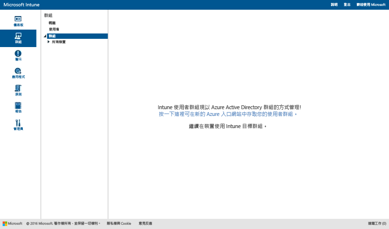
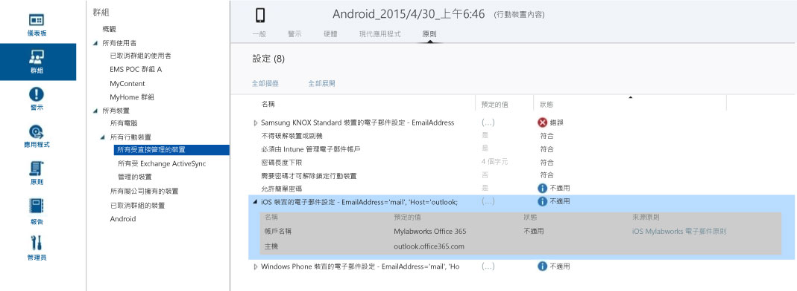

# 在 Microsoft Intune 中使用群組管理使用者和裝置

本主題說明如何在 Intune 中建立群組。 此外，也提供關於群組的管理在未來幾個月內將如何變更的資訊。 

>[!IMPORTANT]
>
>如果您在 Intune 入口網站中開啟 [群組] 工作區，並看到 Azure Active Directory (Azure AD) 入口網站的連結，則表示您已經在 Intune 中使用「新的」Azure AD 安全性群組方法進行群組管理，如[請注意即將進行改進的群組系統管理員體驗](#notice-of-upcoming-improvements-to-the-admin-experience-for-groups)中所述。 按一下 Azure AD 入口網站的連結，即可建立及管理您的群組。
>
> 
>
>如果您看不到 Azure AD 入口網站的連結，則表示您仍使用「目前的」方法進行群組管理，如本主題的[使用 Microsoft Intune 建立群組以管理使用者和裝置](#Create-groups-to-manage-users-and-devices-with-Microsoft-Intune)中所述。

## 請注意即將進行改進的群組系統管理員體驗

您之前提到，想要有一個跨 Enterprise Mobility + Security 的群組和目標鎖定體驗。 我們聽到了。 根據您的意見反應，我們很快就會將 Intune 群組轉換成以 Azure Active Directory 為基礎的安全性群組。 這項變更會整合 Intune 和 Azure Active Directory (Azure AD) 之間的群組管理。 此全新的體驗表示您不必在服務之間複製群組。 它也會透過使用 Windows PowerShell 和 Microsoft Graph 的選項來提供擴充性。

### 現在這項變更對我造成什麼影響？
如果您已經是 Intune 客戶，這項變更目前不會對您造成影響。 但以下是新內容：

-   新的帳戶將會使用 Azure AD 安全性群組，而不是 Intune「使用者」群組。   
-   從 2016 年 11 月開始，在每月服務版本之後佈建的新帳戶，將會在 Azure AD 入口網站中管理以使用者為基礎的群組和以裝置為基礎的群組。 這對現有的客戶不會造成影響。
-   從 2016 年 12 月開始，Intune 產品小組會將現有客戶遷移至以新 Azure AD 為基礎的群組管理體驗。 現在位於 Intune 中的所有使用者和裝置群組都將遷移至 Azure AD 安全性群組。 我們會等到對您的日常工作所造成的任何影響降到最低，並且預期對您的使用者不會造成任何影響，再開始進行移轉。 我們也將在遷移您的帳戶之前通知您。

### 移轉至新群組體驗的的方式和時間點為何？
我們將會花一段時間遷移目前的 Intune 客戶。 我們正在訂定移轉的排程，並將在幾週內更新本主題以提供更多詳細資訊。 我們將在遷移之前通知您。 如果您有任何移轉上的問題，請在 [intunegrps@microsoft.com](mailto:intunegrps@microsoft.com) 連絡我們的移轉小組。 如需如何移轉群組的詳細資訊，請參閱[將群組移轉至 Azure Active Directory](migrating-groups-to-azure-active-directory.md)。

### 現有的使用者和裝置群組會發生什麼事？
 您在 Intune 中建立的使用者群組和裝置群組將會遷移至 Azure AD 安全性群組。 預設的 Intune 群組，例如 [所有使用者] 群組等，只有在移轉期間於部署中使用它們時，其才會被遷移。 某些群組的移轉可能更複雜。 如果組織中的移轉需要額外的步驟，我們會通知您。

### 會有哪些新功能可供我使用呢？
以下是我們從 Intune 移轉至 Azure Active Directory 時所會引進的新功能：

-    Azure AD 安全性群組將在 Intune 中受到支援，可進行所有類型的部署。
-    Azure AD 安全性群組將支援裝置裝置和使用者群組。
-    Azure AD 安全性群組將支援具有 Intune 裝置屬性的動態群組。 例如，您將能夠根據平台來動態地將裝置分組，如 iOS。 在您的組織中註冊新 iOS 裝置時，它將會自動新增至 iOS 動態裝置群組。
-    您會有在 Azure AD 與 Intune 之間共用群組管理的系統管理員體驗。
- Intune 服務管理員角色將會新增至 Azure AD，因此 Intune 服務管理員可以在 Azure AD 中執行群組管理工作。

### 哪些 Intune 功能將無法使用？
當您的組織從 Intune 群組遷移至 Azure AD 安全性群組之後，雖然會改善群組體驗，但部分 Intune 功能將無法使用。

#### 群組管理功能

-   遷移後，您將無法在建立新群組時排除成員或群組。 不過，透過 Azure AD 動態群組，您就可以使用屬性來建立進階規則，以根據所設定的準則從群組中排除成員。
-   不支援 [已取消群組的使用者] 和 [已取消群組的裝置] 群組。 我們不會將這些群組從 Intune 遷移至 Azure AD。

#### 群組的相依功能

-   服務系統管理員角色並不會擁有**管理群組**權限。
-   您無法將 Exchange ActiveSync 裝置分組。 您的 [所有 EAS 管理的裝置] 群組會從群組轉換成報表檢視。
-  報表中的群組樞紐分析將無法使用。
-  通知規則的自訂群組目標將無法使用。

### 我該如何為這項變更進行準備？
 我們有一些建議，讓這項轉換能夠更輕鬆地進行︰

- 先清除任何不想要或不需要的 Intune 群組，再進行移轉。
- 評估您在群組中排除的使用，並考慮重新設計您的群組，使您不需要使用排除。
-  如果您是不具有在 Azure AD 中建立群組權限的系統管理員，請您的 Azure AD 系統管理員將其新增至 Intune 服務管理員 Azure AD 角色。

## 使用 Microsoft Intune 建立群組以管理使用者和裝置

本節描述如何在 Intune 管理主控台中建立 Intune 群組。

您可以在 Microsoft Intune 管理主控台的 [群組] 工作區中建立及管理群組。 [群組概觀] 頁面顯示狀態摘要，可協助您識別並優先處理需要注意的問題。 狀態摘要涵蓋下列區域：

-   警示
-   軟體更新
-   Endpoint Protection
-   原則
-   軟體管理

您的群組階層也會顯示狀態摘要，以協助您識別及解決所選群組之成員的問題。

## 建立群組

> [!TIP]
> 當您建立群組時，請考慮如何套用原則。 例如，您可能會有裝置作業系統特定的原則、您組織中不同角色特定的原則，或您已於 Active Directory 中定義之組織單位特定的原則。 具有適用於 iOS、Android 和 Windows 的個別裝置群組，以及適用於每個組織角色的使用者群組可能會很有用。
>
> 您可能也想要建立套用至所有群組和裝置的預設原則，以建立組織的基本相容性需求。 然後，您可以針對最廣泛的使用者和裝置類別建立更具體的原則。 例如，您可以針對每個裝置作業系統建立電子郵件原則。
>
> 請謹慎為原則命名，以便日後能夠輕鬆地找到它們。 例如，**適用於整家公司的 WP 電子郵件原則**就是一個很好的描述性原則名稱。
>
> 當您每次建立嚴格的原則時，會想要將它傳達給您的使用者。 在您建立更通用的群組和原則之後，就能留意如何建立較小的群組，使您能夠減少不必要的通訊。

### 若要建立裝置群組

1.  在 Intune 管理主控台中，選擇 [群組] &gt; [概觀] &gt; [建立群組]。

2.  輸入群組的名稱和描述 (選擇性)，然後選取一個裝置群組作為父群組。 選擇 **[下一步]**。

3.  在 [定義成員資格準則] 頁面上，選取要包含在群組中的裝置類型。 根據您選擇要包含的裝置類型，您會有其他群組組態選項：

    -   **電腦**： 選取是否要包含父群組的所有成員、要包含或排除的組織單位，以及要包含或排除的網域。 您可以透過清查取得電腦的組織單位和網域資訊。

    -   **行動裝置**： 選取要包含受 Intune 管理的行動裝置、受 Exchange ActiveSync 管理的行動裝置，還是兩者都包含。

    -   **所有裝置**： 這個選項會包含所有裝置，不會依據任何準則排除任何項目。

4.  在 [定義直接成員資格] 頁面上，選擇 [瀏覽] 以選取要包含或排除的個別裝置。 如果您選取的裝置不在指定的父群組中，Intune 會自動將這些裝置新增至父群組。

5.  在 [摘要] 頁面上檢閱您的選取，然後選擇 [完成]。

新建立的群組會顯示在 [群組] 工作區之父群組下的 [群組] 清單中。 這也是您可以編輯或刪除群組的位置。

### 若要建立使用者群組

1.  在 Intune 管理主控台中，選擇 [群組] &gt; [概觀] &gt; [建立群組]。

2.  輸入群組的名稱和描述 (選擇性)，然後選取一個使用者群組作為父群組。 選擇 **[下一步]**。

3.  在 [定義成員資格準則] 頁面上，選擇要包含父群組的所有成員，還是要從一個空群組開始。 您可以接著依據在 [Office 365 系統管理中心](http://go.microsoft.com/fwlink/?LinkId=698854)手動設定或從 Active Directory 同步處理的使用者安全性群組，包含或排除成員。 如果安全性群組的成員資格變更，以該安全性群組為依據的使用者群組成員資格可能也會變更。

    > [!IMPORTANT]
    > 目前，如果您的群組包含特定安全性群組或經理群組的成員，而且您排除某些群組的成員，則會移除您一開始所包含的成員。 若要建立同時具有包含成員和排除成員的群組，建議您先建立具有包含成員的父群組。 再建立該父群組的子群組。 在新的子群組中，列出排除的成員。 接著，使用該子群組來管理 Intune 原則、設定檔和應用程式發佈。

    > [!NOTE]
    > 在 Azure 入口網站中，您可以建立以使用者回報之經理為基礎的群組。 此類型的群組是動態的，並隨著 Azure Active Directory 中該經理的團隊新增或移除員工而改變。 [使用屬性來建立進階規則](https://azure.microsoft.com/en-us/documentation/articles/active-directory-accessmanagement-groups-with-advanced-rules/)的**設定群組為「經理」群組**一節將說明如何建立以經理名稱為基礎的 Azure 群組。

4.  在 [定義直接成員資格] 頁面上，選擇 [瀏覽] 以選取要包含或排除的個別使用者。 如果您選取的使用者不在指定的父群組中，這些裝置會自動新增至父群組。 手動新增使用者的選項位於 [選取成員] 對話方塊的底部。 如果您想要新增還沒有已註冊裝置的使用者，這會很有幫助。

5.  在 [摘要] 頁面上檢閱您的選取，然後選擇 [完成]。

新建立的群組會顯示在 [群組] 工作區之父群組下的 [群組] 清單中。 這也是您可以編輯或刪除群組的位置。

> [!TIP]
> 安全性群組是擴展使用者群組時可使用的良好資源。 由於安全性群組會定義誰可存取哪些資源，因此安全性群組可適當轉譯為 Intune 使用者群組。 從 Active Directory 同步處理至 Azure Active Directory 的安全性群組，或者透過 Office 365 系統管理中心或 Azure 入口網站直接在 Azure Active Directory 中建立的安全性群組，都可供您用來在 Intune 中建立使用者群組。

## 依角色篩選管理檢視
在已篩選的群組檢視中，您可以自訂 IT 系統管理員根據系統管理員角色所能看到的內容。 您也可以限制每位 IT 系統管理員可以管理哪些群組。 在下列情況時，這可能十分有用：

-   您想要讓 IT 系統管理員只能將項目部署到特定使用者和裝置
-   您想要讓 IT 系統管理員只能看到與該系統管理員相關的群組

您可以在 Intune 管理主控台中設定服務管理員的已篩選群組檢視。 如需詳細資訊，請參閱[設定啟動 Microsoft Intune 前的須知事項](/intune/get-started/what-to-know-before-you-start-microsoft-intune)。

在您為服務管理員設定已篩選的群組檢視之後，當系統管理員部署軟體或原則，或是執行報表時，系統管理員可以只檢視和選取您指定的群組。 系統管理員也不會在管理主控台的這些頁面上看到狀態資訊：

-   **系統概觀**
-   **群組概觀**
-   **Endpoint Protection 概觀**
-   **警示概觀**
-   **軟體概觀**
-   **原則概觀**

### 建立已篩選的群組檢視

1.  在 Intune 管理主控台中，選擇 [管理] &gt; [系統管理員管理] &gt; [服務管理員]。

2.  選取您想要為其建立已篩選群組檢視的服務管理員，然後選擇 [管理群組]。

3.  在 [選取要對此服務管理員顯示的群組] 對話方塊中，新增服務管理員能夠存取的群組，然後選擇 [確定]。

設定已篩選的群組檢視之後，IT 系統管理員只能檢視和選取您指定的群組。

## 管理群組
在您建立群組之後，您可以繼續根據組織需求來管理它們。

您可以編輯群組，來變更其名稱或描述，或是隸屬於該群組的成員。

您可以刪除不再符合組織需求的群組。 刪除群組不會刪除隸屬於該群組的使用者。

## 後續步驟
在您設定群組和原則之後，請檢閱 [預定的值] 和 [狀態] 來檢查設計的實際影響。

### 檢查您的設計

1. 從裝置群組中選取任何裝置，然後完整瀏覽頁面頂端的資訊類別。
2. 選擇 [原則]。 您會看到與下列螢幕擷取畫面類似的 Android 裝置原則設定。

每個原則都具有 [預定的值]  和 [狀態] 。 預定的值是您在指派原則時想要達到的值。 狀態則是您在一併考慮要套用到裝置的所有原則，以及硬體和作業系統的限制與需求時，所達成的情況。 在此螢幕擷取畫面中，您可以看到兩個明確的範例：

-   [允許簡單密碼] 已設為 [是 (如 [預定的值] 欄中所示)]，但其 [狀態] 為 [不適用]。 這是因為 Android 裝置不支援簡單的密碼。
-   同樣地，擴充的原則項目 [iOS 裝置的電子郵件設定] 不會套用到此裝置，因為它是 Android 裝置。

> [!NOTE]
> 請記住，當有兩項不同限制等級的原則套用至同一部裝置或使用者時，實際上會套用限制更嚴格的原則。

<!--HONumber=Oct16_HO2-->

