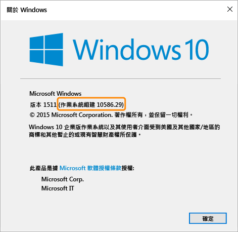

---
# required metadata

title: Windows 裝置的相容性原則設定| Microsoft Intune
description:
keywords:
author: karthikaraman
manager: jeffgilb
ms.date: 04/28/2016
ms.topic: article
ms.prod:
ms.service: microsoft-intune
ms.technology:
ms.assetid: f996842c-e9a4-4819-acb4-ee66e8fb35b8

# optional metadata

#ROBOTS:
#audience:
#ms.devlang:
ms.reviewer: jeffgilb
ms.suite: ems
#ms.tgt_pltfrm:
#ms.custom:

---

# Microsoft Intune 中 Windows 裝置的相容性原則設定

本主題中所述的原則設定適用於執行 Windows 作業系統的裝置。 受支援的特定 Windows 版本會在下列各節中介紹。

如果您正在尋找其他平台的相關資訊，請選取下列其中一項︰
> [!div class="op_single_selector"]
- [IOS 裝置的相容性原則設定](ios-compliance-policy-settings-in-microsoft-intune.md)
- [Android 裝置的相容性原則設定](android-compliance-policy-settings-in-microsoft-intune.md)

## Windows Phone 裝置的相容性原則設定
Windows Phone 8.1 及更新版本支援這一節所列的設定。

## 系統安全性設定
### 密碼
- 需要密碼來解除鎖定行動裝置︰    先將此選項設為 [是] 以要求使用者輸入密碼，

- 再允許使用者存取其裝置。

-  允許簡單密碼︰    先將此選項
- 設為 [是]，讓使用者建立簡單密碼，

  例如，‘1234’ 或 ‘1111’。

- 密碼長度下限： 指定使用者密碼中至少必須包含的
  -   數字位數或字元數下限。
  -   必要的密碼類型︰指定使用者必須建立
  -   英數字元還是數字密碼。
  -   對於執行 Windows 並使用 Microsoft 帳戶存取的裝置，若密碼長度下限超過八個字元，或字元集數目下限大於二，相容性原則將無法正確進行評估。

  字元集數目下限：如果所需的密碼類型設為 英數字元，此設定會指定密碼必須包含之
- 字元集數目下限。

- 四個字元集為：

- 小寫字母

- 大寫字母
- 符號 數字

  **若要將此設定設為較高的數目，使用者必須建立更複雜的密碼。**
### 對於執行 Windows 並使用 Microsoft 帳戶存取的裝置，若密碼長度下限超過八個字元，或字元集數目下限大於二，相容性原則將無法正確進行評估。
- 要求密碼前的閒置分鐘數：指定使用者必須重新輸入密碼之前的閒置時間。

## 密碼到期 (天數)︰選取使用者密碼到期，
- 且必須建立一個新密碼之前的天數。  記住密碼歷程記錄：共同使用此設定與 [不得重複使用以前用過的密碼] 可限制使用者
  -  建立先前使用過的密碼。 不得重複使用以前用過的密碼︰如果選取 [記住密碼歷程記錄]，請指定 不得重複使用的舊密碼數。 當裝置從閒置狀態返回時，需要密碼：這項設定應該與 [在非使用狀態幾分鐘後需要輸入密碼] 設定一起使用。 系統會提示使用者輸入密碼，來存取 [在非使用狀態幾分鐘後需要輸入密碼] 設定所指定時間未作用的裝置。
  -  這項設定只適用於 Windows 10 Mobile 裝置。 Encryption
  - 在行動裝置上要求加密：將此選項設為 [是]，要求先加密 裝置才能連接到資源。 裝置健全狀況設定 需要裝置回報為狀況良好：您可以設定規則，要求在新的或現有的相容性原則中，Windows 10 Mobile 裝置必須回報為狀況良好。

  如果啟用這項設定，則會針對下列資料點，透過健全情況證明服務 (HAS) 評估 Windows 10 裝置︰
##  啟用 BitLocker：如果開啟 BitLocker，則系統已關閉或進入休眠時，裝置可以保護磁碟機上所儲存的資料不受未經授權地存取。
- Windows BitLocker 磁碟機加密會加密儲存在 Windows 作業系統磁碟區上的所有資料。
    BitLocker 使用 TPM 來協助保護 Windows 作業系統和使用者資料，以及協助確保電腦未遭到竄改，即使電腦無人看管、遺失或遭竊也是一樣。 如果電腦配備相容的 TPM，BitLocker 會使用 TPM 來鎖定可保護資料的加密金鑰。

- 因此，除非 TPM 驗證電腦的狀態，否則無法存取金鑰 啟用程式碼完整性：程式碼完整性是一種功能，可在每次將驅動程式或系統檔案載入記憶體時驗證其完整性。

## 程式碼完整性會偵測是否將未簽署的驅動程式或系統檔案載入到核心；或者，以具有系統管理員權限的使用者帳戶所執行的惡意軟體是否已修改系統檔案。
啟用安全開機：啟用安全開機時，強迫系統開機到原廠信任狀態。
## 此外，啟用安全開機時，用來啟動電腦的核心元件必須具有製造裝置之組織所信任的正確密碼編譯簽章。
### UEFI 韌體會先驗證這項作業，再啟動電腦。
- 如果有任何檔案已遭竄改 (即中斷其簽章)，則無法啟動系統。

  如需 HAS 服務運作方式的資訊，請參閱 [Health Attestation CSP (健全情況證明 CSP)](https://msdn.microsoft.com/library/dn934876.aspx)

  裝置屬性設定

- 所需要最低 OS：當裝置不符合最低的 OS

  版本需求時，它會回報為不相容。

- 會顯示如何升級的資訊連結。 終端使用者可以選擇升級其裝置，之後便可以存取公司資源。 允許的最高 OS 版本︰當裝置使用的
  -   OS 版本晚於規則中所指定的版本時，系統便會封鎖對公司資源的存取權，並要求使用者連絡其 IT 系統管理員。
  -   在將規則變更為允許該 OS 版本之前，此裝置無法用來存取公司資源。
  -   Windows 電腦的相容性原則設定
  -   Windows 電腦支援這一節所列的設定。

  系統安全性設定
- 密碼

  密碼長度下限︰ - Windows 8.1 上支援。

- 指定使用者密碼中至少必須包含的數字位數或字元數。

  對於使用 Microsoft 帳戶存取的裝置，若 [密碼長度下限] 超過 8 個字元，或 [字元集數目下限] 大於兩個字元，相容性原則將無法正確進行評估。

- 所需的密碼類型︰ - Windows RT、Windows RT 8.1 和 Windows 8.1 上支援

  指定使用者必須建立英數字元或數字密碼。
- 字元集數目下限︰  - Windows RT、Windows RT 8.1 和 Windows 8.1 上支援。

  若將 [必要的密碼類型] 設為 [英數字元]，此設定即會指定密碼至少須包含的字元集數下限。

## 四個字元集為：
- 小寫字母
大寫字母  符號
  -  數目：     若要將此設定設為較高的數目，使用者必須建立更複雜的密碼。 對於使用 Microsoft 帳戶存取的裝置，若 [密碼長度下限] 超過 8 個字元，或 [字元集數目下限] 大於 2 個字元，相容性原則將無法正確進行評估。 要求密碼前的閒置分鐘數︰ - Windows RT、Windows RT 8.1 和 Windows 8.1 上支援 指定使用者必須重新輸入密碼之前的閒置時間。 所需的到期 (天數)︰ - Windows RT、Windows RT 8.1 和 Windows 8.1 上支援。
  -  選取使用者密碼到期，必須建立新密碼的天數。 所需的密碼歷程記錄︰ - Windows RT、Windows RT 和 Windows 8.1 上支援。
  - 共同使用此設定與 [不得重複使用以前用過的密碼] 可限制建立先前使用過的密碼。 不得重複使用以前用過的密碼︰ - Windows RT、Windows RT 8.1 和 Windows 8.1 上支援 若選取 [記住密碼歷程記錄]，必須指定不得重複使用的舊密碼數。 裝置健全狀況設定
  - 需要裝置回報為狀況良好︰ - Windows 10 裝置上支援。

  您可以設定規則，要求在新的或現有的相容性原則中，Windows 10 裝置必須回報為狀況良好。

## 如果啟用這項設定，則會針對下列資料點，透過健全情況證明服務 (HAS) 評估 Windows 10 裝置︰
- 啟用 BitLocker：如果開啟 BitLocker，則系統已關閉或進入休眠時，裝置可以保護磁碟機上所儲存的資料不受未經授權地存取。

  Windows BitLocker 磁碟機加密會加密儲存在 Windows 作業系統磁碟區上的所有資料。 BitLocker 使用 TPM 來協助保護 Windows 作業系統和使用者資料，以及協助確保電腦未遭到竄改，即使電腦無人看管、遺失或遭竊也是一樣。

  如果電腦配備相容的 TPM，BitLocker 會使用 TPM 來鎖定可保護資料的加密金鑰。 因此，除非 TPM 驗證電腦的狀態，否則無法存取金鑰 啟用程式碼完整性：程式碼完整性是一種功能，可在每次將驅動程式或系統檔案載入記憶體時驗證其完整性。

- 程式碼完整性會偵測是否將未簽署的驅動程式或系統檔案載入到核心；或者，以具有系統管理員權限的使用者帳戶所執行的惡意軟體是否已修改系統檔案。

  啟用安全開機：啟用安全開機時，強迫系統開機到原廠信任狀態。 此外，啟用安全開機時，用來啟動電腦的核心元件必須具有製造裝置之組織所信任的正確密碼編譯簽章。

UEFI 韌體會先驗證這項作業，再啟動電腦。 如果有任何檔案已遭竄改 (即中斷其簽章)，則無法啟動系統。
- 啟用早期啟動反惡意程式碼：早期啟動反惡意程式碼 (ELAM) 可在啟動電腦時，以及協力廠商驅動程式初始化之前，保護網路中的電腦。    如需 HAS 服務運作方式的資訊，請參閱 [Health Attestation CSP (健全情況證明 CSP)](https://msdn.microsoft.com/library/dn934876.aspx)
- 裝置屬性設定 所需的 OS 下限︰ - Windows 8.1 和 Windows 10 上支援。
> 

<!--HONumber=May16_HO2-->

