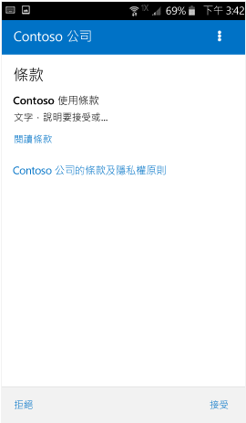
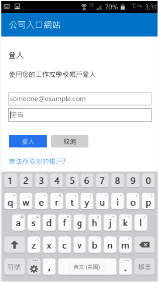

# 在 Intune 註冊 Android 裝置

如果您的公司或學校使用 Microsoft Intune，您可以註冊 Android 裝置來存取公司電子郵件、檔案和其他資源。 當您註冊裝置時，您的 IT 部門可以管理這些公司或學校資源、保護它們的安全，並讓您能夠自由地使用慣用的裝置來完成工作。 若要深入了解註冊，請參閱[當我安裝公司入口網站應用程式並註冊我的裝置時，會發生什麼情況？](what-happens-if-you-install-the-Company-Portal-app-and-enroll-your-device-in-intune-android.md)。

這些註冊指示適用於 Samsung KNOX Android 裝置和「原生」(非 Samsung Knox) Android 裝置。 若要確認您是否擁有 Samsung KNOX 裝置，請移至 [設定] &gt; [關於裝置]。 若該處未列出「Knox 版本」，則您擁有原生 Android 裝置。

註冊之前或之後，系統可能會要求您選擇最能描述您裝置使用方式的類別。 IT 系統管理員會使用此類別來協助您查看可存取的應用程式。

如果在 Intune 嘗試註冊裝置時出現錯誤，您可以[將註冊錯誤傳送給 IT 系統管理員](send-enrollment-errors-to-your-it-administrator-android.md)。

**註冊 Android 裝置：**

1.  從 [Google Play](http://play.google.com/store/apps/details?id=com.microsoft.windowsintune.companyportal) 安裝免費 Intune 公司入口網站應用程式。

2.  開啟 Microsoft Intune 公司入口網站應用程式。

3.  在公司入口網站的 [歡迎使用] 畫面上，點選 [登入]，然後使用您的公司或學校帳戶進行登入。

       

4.  若您的 IT 系統管理員已設定公司條款及條件，請點選 **[接受]** 以接受條款。

    

5.  使用您的公司或學校帳戶和密碼登入公司入口網站應用程式，然後點選 [登入]。

    

6.  在 [公司存取設定] 畫面上，點選 [開始]。

    

7.  在 [為什麼要註冊您的裝置?] 畫面上，閱讀有關註冊您的裝置時可執行的作業，然後點選 [繼續]。

    

8.  檢閱 IT 系統管理員在您的裝置上可看到和不可看到的項目清單，然後點選 [繼續]。

    

9.  在 [接下來要做什麼] 畫面上，閱讀有關註冊期間所發生的事況，然後點選 [註冊]。

    

10.  如果您是使用 Android 6.0 或更新版本，請執行此步驟。 否則請移到下一個步驟。

    如果您的 IT 系統管理員已設定特定原則，您可能會看到下列訊息：
    -   **是否允許公司入口網站進行和管理通話？**

        

    如果您看到此訊息，請點選 [允許]。 您可以放心地點選 [允許]，因為 **Microsoft 絕不會撥打或管理您的電話**！ Google 控制訊息文字，而且 Microsoft 無法變更它。 當您允許存取時，其實是允許您的裝置將裝置的國際移動站設備識別 (IMEI) 編號傳送至 Intune。 IMEI 編號類似於序號，可唯一識別行動裝置。

    如果您拒絕存取，則下次登入公司入口網站時會再次出現此訊息，但點選 [不要再詢問] 方塊，即可關閉未來訊息。 如果您稍後決定允許存取，請移至 [設定] &gt; [應用程式] &gt; [公司入口網站] &gt; [權限] &gt; [電話]，然後開啟權限。

    -   **是否允許公司入口網站存取您的連絡人？**

        

    如果您看到此訊息，請點選 [允許]。 您可以放心地點選 [允許]，因為 **Microsoft 絕不會存取您的連絡人！** Google 控制訊息文字，而且 Microsoft 無法變更它。 當您允許存取時，其只可讓公司入口網站應用程式建立、使用和管理您的工作帳戶。

    如果您拒絕存取，則下次登入公司入口網站時會再次出現此訊息，但點選 [不要再詢問] 方塊，即可關閉未來訊息。 如果您稍後決定允許存取，請移至 [設定] &gt; [應用程式] &gt; [公司入口網站] &gt; [權限] &gt; [電話]，然後開啟權限。

11.  在 [啟用裝置管理員] 畫面上，點選 [啟用]。

    

12.  遵循提示以輸入 PIN 或密碼。 如果您在這部裝置上已設定 PIN 或密碼，您將不會看到這個畫面，或需要輸入新的 PIN 或密碼。

    

13.  如果您使用 Samsung Knox 裝置，請點選 **[確認]**，然後您會看到一個訊息，指出您的裝置已註冊。 如果您使用原生 Android 裝置，則請注意下方畫面，該畫面顯示您的裝置已註冊。

    

    此畫面會顯示您的裝置已註冊。

    

14. 出現 [公司存取設定] 畫面時，點選 [繼續]。 如果訊息指出您的裝置不相容，請遵循指示來修正問題，然後點選 [繼續]。

      

11. 在 [公司存取設定完成] 畫面上，點選 [完成]。 您的裝置現在已經註冊。

    

嘗試安裝公司應用程式之前，請移至 [設定] &gt; [安全性]，然後開啟 [未知來源]。 如果您未在嘗試安裝應用程式之前開啟此選項，則會看到下列訊息：「已封鎖安裝。 基於安全性理由，您的裝置設定成封鎖安裝從未知來源取得的應用程式。」 您可以點選錯誤對話方塊上的 [設定]，移至 [未知來源] 選項。

是否仍需要協助？ 請連絡您的 IT 系統管理員 (請查看[公司入口網站](http://portal.manage.microsoft.com)以取得連絡資訊)，或是傳送電子郵件給 wintunedroidfbk@microsoft.com.

<!--HONumber=Nov16_HO1-->

