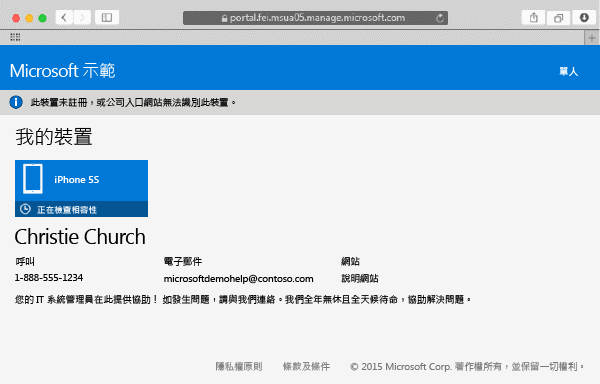

# 在 Intune 註冊 Mac OS X 裝置

在 Intune 註冊 Mac OS X 裝置可讓您存取公司的網路、您的公司電子郵件和工作檔案，並讓您取得公司應用程式。 如需註冊裝置時所發生情況的詳細資訊，請參閱[如果您安裝公司入口網站應用程式並在 Intune 註冊裝置時，會發生什麼情況？](what-happens-if-you-install-the-company-portal-app-and-enroll-your-device-in-intune-ios.md)。

如果您嘗試註冊 iOS 裝置，請參閱[在 Intune 註冊 iOS 裝置](enroll-your-device-in-intune-ios.md)。

註冊 Mac OS X 裝置：

1.  使用 Safari 瀏覽器，開啟 [公司入口網站](https://portal.manage.microsoft.com)，然後點選通知列。

2.  點選 [This device is either not enrolled or the Company Portal can't identify it] (未註冊此裝置，或公司入口網站無法識別此裝置)。

    

3.  點選 [安裝] 開始註冊您的裝置。

    

4.  在 [安裝管理設定檔] 對話方塊上，點選 [安裝]。 如果出現對話方塊要求您輸入認證，請輸入您的使用者名稱和密碼，然後點選 [繼續] &gt; [安裝]。

    

    當您完成註冊時，會看到顯示已驗證您的設定檔的 [管理設定檔] 頁面。

    

是否仍需要協助？ 請連絡 IT 系統管理員。 如需其連絡資訊，請查看[公司入口網站](http://portal.manage.microsoft.com)。

### 請參閱
[Using your iOS or Mac OS X device with Intune](using-your-ios-or-mac-os-x-device-with-intune.md)

<!--HONumber=Jul16_HO4-->

