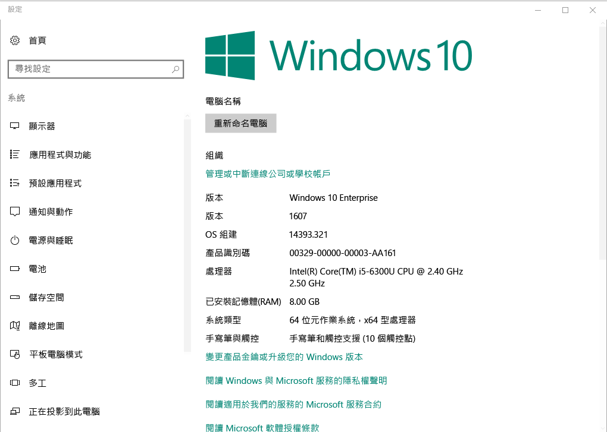

# 在 Intune 註冊 Windows 10 裝置

在 Microsoft Intune 中註冊您的裝置，可讓您的 Windows 10 裝置存取您組織的安全資料，包括電子郵件、檔案和其他資源。 這適用於 Windows 10 Desktop 和 Windows 10 Mobile 裝置。 註冊您的裝置能夠協助保護您和您的組織，並且協助保持區隔您的工作資料與個人資料。

想要深入了解嗎？ 了解當您[在 Intune 中註冊裝置](what-happens-if-you-install-the-company-portal-app-and-enroll-your-device-in-intune-windows.md)時會發生什麼事，以及那對[裝置上的資訊](what-can-your-it-administrator-see-when-you-enroll-your-device-in-intune-windows.md)有何意義。

## Windows 10 Desktop 裝置
1.  移至 [開始]。

 ![Windows [開始] 功能表](../media/windows-start-menu.png)。

2. 在搜尋列輸入「關於您的電腦」一詞，然後選取 [關於您的電腦]。

 

2.  在您的 [設定] 中，會看到一份電腦上已安裝的 Windows 10 版本的資訊清單。 在此清單中，找出 [版本]。

 

3.  如果您的版本是 __1607__，請繼續進行[這些步驟](enroll-your-w10-device-access-work-or-school.md)。 如果您的版本是 __1511__，請繼續進行[這些步驟](enroll-your-w10-device-your-account.md)。

## Windows 10 Mobile 裝置

1.  在 [開始] 上，撥動到 [所有應用程式] 清單，然後選取 [設定] 應用程式。
2.  依序點選 [系統]、[關於]。
3.  在 [裝置資訊] 下，點選 [其他資訊]。 您會看到裝置的資訊清單。 在此清單中，找出 [版本]。
4.  如果您的版本是 __1607__，請繼續進行[這些步驟](enroll-your-w10-device-access-work-or-school.md)。 如果您的版本是 __1511__，請繼續進行[這些步驟](enroll-your-w10-device-your-account.md)。

是否仍需要協助？ 請連絡 IT 系統管理員。 如需其連絡資訊，請查看[公司入口網站](http://portal.manage.microsoft.com)。

<!--HONumber=Dec16_HO2-->

