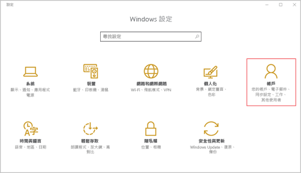
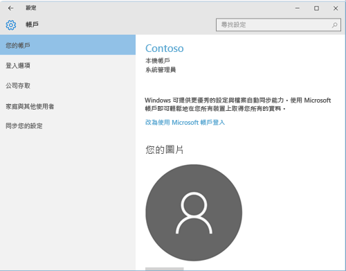

# 在 Intune 註冊 Windows 10 Mobile 或 Windows 10 Desktop 裝置

如果您的公司或學校使用 Microsoft Intune，您可以註冊裝置來存取公司電子郵件、檔案和其他資源。 註冊您的裝置，可讓您的組織保護公司資料的安全。 若要深入了解註冊，請參閱[如果您安裝公司入口網站應用程式並在 Intune 註冊裝置時，會發生什麼情況？](what-happens-if-you-install-the-company-portal-app-and-enroll-your-device-in-intune-windows.md)和 [IT 系統管理員在您的裝置上可看到和不可看到的項目](what-can-your-it-administrator-see-when-you-enroll-your-device-in-intune-windows.md)。

註冊 Windows 10 Mobile 或 Windows 10 Desktop 裝置：

1.  前往 Windows [設定]，然後點選 [帳戶]。

    

2.  查看接下來的兩個畫面，並找出其中看起來像在您裝置上所看到的畫面。 遵循您在裝置上看見的畫面中所顯示的步驟。

    如果您看到這個畫面，請遵循[如果看見 [存取公司或學校資源] 時需遵循的步驟](#steps-to-follow-if-you-see-access-work-or-school)中的指示。

    

    如果您看到這個畫面，請遵循[如果看見 [您的帳戶] 時需遵循的步驟](#steps-to-follow-if-you-see-your-account)中的步驟。

    

## 如果看見 [存取公司或學校資源] 時需遵循的步驟

1.  點選 [存取公司或學校資源]。

    ![點選 [存取工作學校帳戶]](./media/w10-enroll-rs1-connect-to-work-or-school.png)

2.  輸入您的工作或學校電子郵件地址，然後點選 [下一步]。

    

3. 使用您的工作或學校帳戶登入 Intune。

    

    您會看到一則訊息，指出您的公司或學校正在註冊您的裝置。

4. 當您看到 [已全部完成] 時 畫面，點選 [關閉]。 大功告成。

  ![在「已全部完成!」畫面上 點選 [關閉]](./media/w10-enroll-rs1-youre-all-set.png)

5. 如果想要再次檢查您的連線是否正確，請回到 [設定]，現在您應該會看到這裡已列出您的工作或學校帳戶。

    

如果您已遵循前述步驟，但仍無法存取自己的工作或學校電子郵件帳戶和檔案，請遵循[針對如果看見 [存取公司或學校資源] 時需遵循的步驟進行疑難排解](troubleshoot-your-windows-10-device-windows.md#troubleshooting-steps-to-follow-if-you-see-access-work-or-school)中的步驟。

## 如果看見 [您的帳戶] 時需遵循的步驟

1.  前往 Windows [設定]，然後點選 [帳戶]。

    ![前往 [設定] 與 [帳戶]](./media/W10-enroll-1-settings-accounts.png)

2.  點選 [您的帳戶]。

    

3.  點選 [新增公司或學校帳戶]。

    ![點選 [新增工作或學校帳戶]](./media/w10-enroll-3-add-work-school-acct.png)

4.  使用工作或學校認證登入。

    

如果您已遵循前述步驟，但仍無法存取自己的工作或學校電子郵件地址、檔案或其他資料，請嘗試[針對如果看見 [您的帳戶] 時需遵循的步驟進行疑難排解](troubleshoot-your-windows-10-device-windows.md#troubleshooting-steps-to-follow-if-you-see-your-account)中的指示。

我們也建議您安裝公司入口網站應用程式，它可讓您輕鬆識別並取得與您本身及角色有關的公司應用程式。 公司入口網站應用程式可能已當作註冊程序的一部分加以安裝，這取決於公司設定 Intune 的方式。

若要驗證是否有該應用程式，請在應用程式清單中尋找**公司入口網站**。 如果應用程式清單中找不到 [公司入口網站]，請遵循下列步驟安裝它。

1.  點選 [開始] &gt; [存放區]。

2.  點選 [搜尋]，然後鍵入**公司入口網站**。

3.  在結果清單中，點選 [公司入口網站] &gt; [安裝]。

4.  點選 [安裝] 或 [免費]。 顯示的選項取決於貴公司設定應用程式的方式。

是否仍需要協助？ 請連絡 IT 系統管理員。 如需其連絡資訊，請查看[公司入口網站](http://portal.manage.microsoft.com)。

<!--HONumber=Aug16_HO5-->

