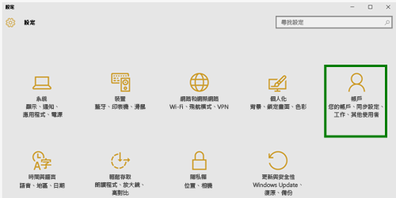
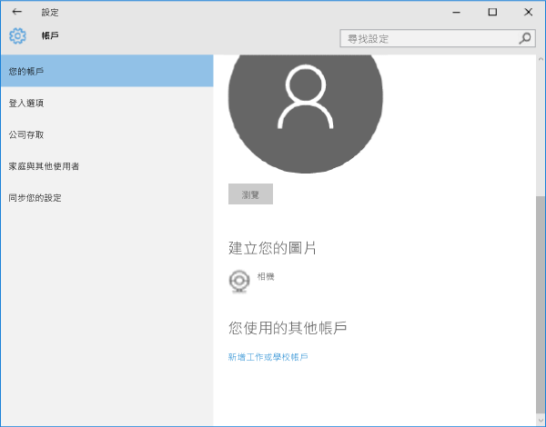

# 在 Intune 註冊 Windows 10 Mobile 或 Windows 10 Desktop 裝置

如果您的公司或學校使用 Microsoft Intune，您可以註冊裝置來存取公司電子郵件、檔案和其他資源。 註冊您的裝置，可讓您的組織保護公司資料的安全。 若要深入了解註冊，請參閱[如果您安裝公司入口網站應用程式並在 Intune 註冊裝置時，會發生什麼情況？](what-happens-if-you-install-the-company-portal-app-and-enroll-your-device-in-intune-windows.md)和 [IT 系統管理員在您的裝置上可看到和不可看到的項目](what-can-your-it-administrator-see-when-you-enroll-your-device-in-intune-windows.md)。

註冊 Windows 10 Mobile 或 Windows 10 Desktop 裝置：

1.  移至 Windows [設定] 並點選 [帳戶]。

    

2.  點選 [您的帳戶]。

    

3.  點選 [新增公司或學校帳戶]。

    

4.  使用工作或學校認證登入。

    

如果您遵循上述步驟，但仍然無法存取自己的公司或學校電子郵件、檔案和其他資料，請回到 [帳戶] 並點選 [公司存取]。

-   如果您看到自己的公司或學校帳戶，恭喜您 已連線。

-   如果看不到自己的公司或學校帳戶，請點選 [連線]，然後以公司或學校認證登入。

我們也建議您安裝公司入口網站應用程式，它可讓您輕鬆識別並取得與您本身及角色有關的公司應用程式。 公司入口網站應用程式可能已當做註冊程序的一部分加以安裝，這取決於公司設定 Intune 的方式。 如要確認是否有該應用程式，請在應用程式清單中尋找 [公司入口網站]。 如果應用程式清單中找不到 [公司入口網站]，請遵循下列步驟安裝它。

1.  點選 [開始] &gt; [存放區]。

2.  點選 [搜尋]，然後輸入 [公司入口網站]。

3.  在結果清單中，點選 [公司入口網站] &gt; [安裝]。

4.  點選 [安裝] 或 [免費]。 顯示的選項取決於貴公司設定應用程式的方式。

是否仍需要協助？ 請連絡 IT 系統管理員。 如需其連絡資訊，請查看[公司入口網站](http://portal.manage.microsoft.com)。

### 請參閱
[在 Intune 註冊 Windows 裝置](enroll-your-device-in-intune-windows.md) 
[使用具有 Intune 的 Windows 裝置](using-your-windows-device-with-intune.md)

<!--HONumber=Aug16_HO1-->

