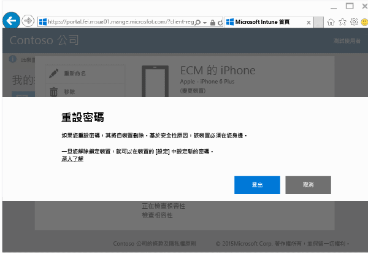

# 如何從公司入口網站重設裝置密碼

如果您在 Intune 中註冊的裝置遺失裝置 PIN 或密碼，您可以使用[公司入口網站](http://portal.manage.microsoft.com)重設密碼。 您可以使用公司入口網站來管理已在 Intune 註冊的電腦和裝置，而且就像使用公司入口網站應用程式一樣，可讓您執行大部分同樣的工作。

> [!NOTE]
> 您在公司入口網站上可能不會看到 [重設密碼] 按鈕。 如果沒看到此按鈕，您需要透過公司入口網站連絡 IT 管理員以尋求支援。

若要重設密碼：

1.  開啟 [公司入口網站](http://portal.manage.microsoft.com)，然後選擇您想要重設密碼的裝置。

2.  選擇 [重設密碼]。

    ![裝置詳細資料與 [重設密碼] 按鈕](./media/iwp-screen-with-all-options.png)

3.  選擇 [登出]，然後以工作或學校認證登入。 您必須在五分鐘內登入。

    ![重設訊息與 [登出] 按鈕](./media/iwp-2-sign-out.png)

4.  選擇 [重設密碼]。

    

    檢查資料表查看 [重設密碼] 在您裝置上的運作方式。

    |裝置類型|重設時會發生什麼事|
    |------------|-----------|
    |Android|移除現有的密碼並使用字母和數字建立暫時密碼|
    |iOS|移除現有的密碼，但不建立暫時密碼。 如果您使用 Touch ID 指紋掃描器來開啟裝置或進行購物，您需要再設定一次。|
    |Windows 10 Mobile|移除現有的密碼，並使用字母和數字建立暫時密碼。 如果您使用 Windows Hello 臉部辨識登入，其仍受支援。|
    |Windows Phone 8.1|移除現有的密碼，並使用數字建立暫時密碼。|

    5.  解除鎖定裝置並設定新密碼，或移至裝置的 [設定] 變更暫時密碼。

    若要查看密碼重設成功的確認通知，請按一下公司入口網站右上方的的通知旗標。

是否仍需要協助？ 請連絡 IT 系統管理員。 如需連絡資訊，請查看[公司入口網站](http://portal.manage.microsoft.com)。

<!--HONumber=Jan17_HO4-->

