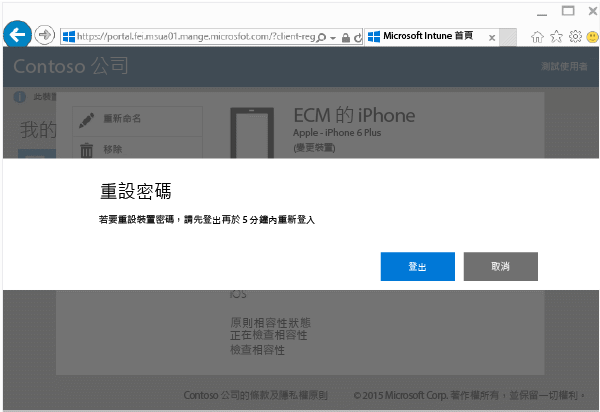

# 從公司入口網站重設裝置密碼

如果您在 Intune 中註冊的裝置遺失裝置 PIN 或密碼，您可以使用[公司入口網站](http://portal.manage.microsoft.com)重設密碼。 公司入口網站是可讓您管理已在 Intune 註冊之電腦和裝置的網頁，而且就像使用公司入口網站應用程式一樣，可讓您執行大部分同樣的作業。

> [!NOTE] 
> 公司入口網站上可能不會顯示 [重設密碼] 按鈕，這是由 IT 系統管理員設定 Intune 的方式決定。 Windows 8.1 和 Windows RT 裝置不支援重設密碼。

若要重設密碼：

1.  開啟 [公司入口網站](http://portal.manage.microsoft.com)，然後點選您想要重設密碼的裝置。

2.  點選 [重設密碼]。

    

3.  點選 [登出]，然後以公司或學校認證登入。 您必須在五分鐘內登入。

    

4.  點選 [重設密碼]。

    

    檢查資料表查看重設密碼在您裝置上的運作方式。

    |平台|支援|
    |------------|-----------|
    |Android|建立新的暫時性英數字元密碼。|
    |iOS|從裝置移除密碼，但不建立新的暫時密碼。 如果使用 Touch ID，裝置上就必須再設定一次，因為當您重設密碼時就會移除它。|
    |Windows 10 (僅限行動裝置)|建立新的暫時性英數字元密碼。 支援 Windows Hello。|
    |Windows Phone 8.1|建立新的、暫時的、數值密碼。|
    解除鎖定裝置後，您可以移至裝置的 [設定] 設定新密碼。

5.  解除鎖定裝置，然後移至裝置的 **[設定]** 設定新密碼或變更暫時密碼。

    若要查看密碼重設成功的確認通知，請按一下公司入口網站右上方的的通知旗標。

是否仍需要協助？ 請連絡 IT 系統管理員。 如需其連絡資訊，請查看[公司入口網站](http://portal.manage.microsoft.com)。

### 請參閱
[使用 Intune 公司入口網站](using-the-intune-company-portal-website.md)

<!--HONumber=Jul16_HO3-->

