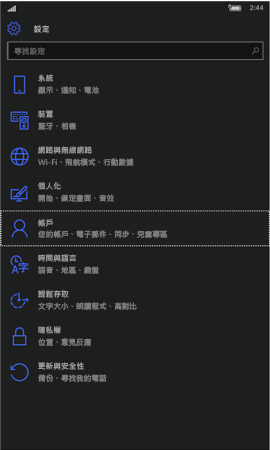
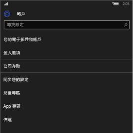
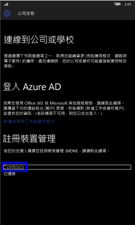
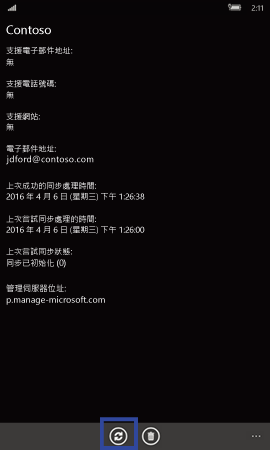
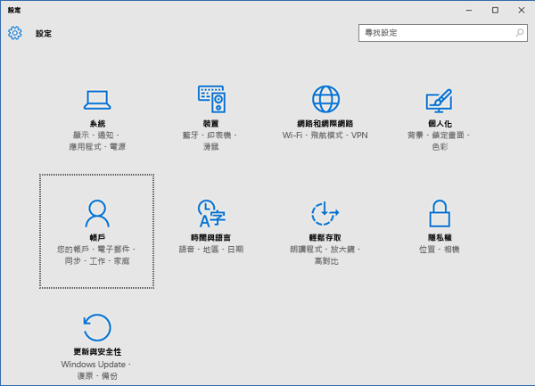
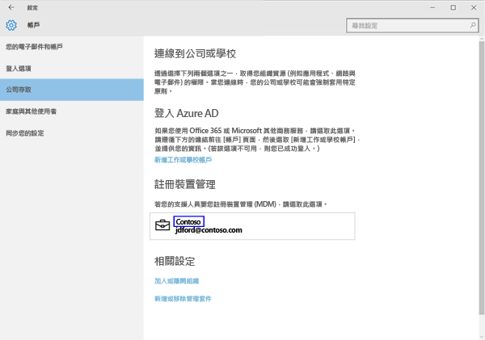
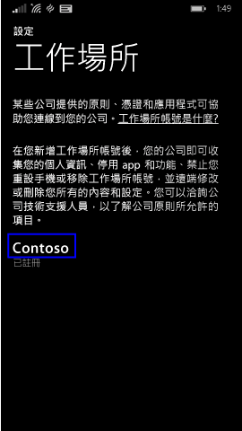
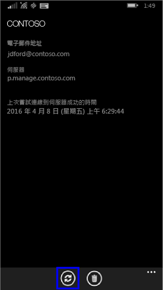

# 手動同步處理您的 Windows 裝置
如果您的應用程式安裝花費太長的時間，請使用下列指示手動同步處理您的 Windows 裝置，這樣可能有助於加速安裝。 唯一支援的版本如下所列。 請使用符合您所擁有之裝置類型的連結 (如上述＜在本文中＞一節所示)：

* [Windows 10 Mobile](#windows-10-mobile)
* [Windows 10 Desktop](#windows-10-desktop)
* [Windows Phone 8.1](#windows-phone-8-1)

## Windows 10 Mobile
手動同步處理您的 Windows 10 Mobile 裝置來加速緩慢的應用程式安裝：

1. 移至 [所有應用程式] > [設定] > [帳戶]。

    
    
2. 點選 [工作存取]。

    
    
3. 在 [在裝置管理中註冊] 下，點選您公司名稱，如下所示。

    
    
4. 點選 [同步處理] 圖示。

    
    
    「我們正在同步處理您的帳戶」訊息會顯示在畫面頂端。 [同步處理] 按鈕呈現灰色，直到您的裝置完成同步處理。

## Windows 10 Desktop
手動同步處理您的 Windows 10 Desktop裝置，以加速緩慢的應用程式安裝︰

1. 選取 [啟動] 按鈕，如下所示，然後選取 [設定]。

    
    
2. 在 [設定] 頁面上，選取 [帳戶]。
 
    
    
3. 在 [帳戶] 頁面上，選取 [工作存取]。
    
    
    
4. 在 [在裝置管理中註冊] 下，按一下您的公司名稱，如同下方藍色醒目提示所示。
    
    
   
5. 選取 [同步處理] 按鈕。
    
    
   
   按鈕會變成灰色，直到同步處理完成為止。

## Windows Phone 8.1
手動同步處理您的 Windows Phone 8.1 裝置來加速緩慢的應用程式安裝：

1. 移至 [所有應用程式] > [設定] > [工作場所]。

    
    
2. 點選您的公司名稱，如同下方藍色醒目提示所示。

    
   
3. 點選 [同步處理] 圖示。

    
    
   「我們正在同步處理您的帳戶」訊息會顯示在畫面頂端，直到您的裝置完成同步處理。

是否仍需要協助？ 請連絡 IT 系統管理員。 如需其連絡資訊，請查看[公司入口網站](http://portal.manage.microsoft.com)。

### 請參閱
[使用具有 Intune 的 Windows 裝置](using-your-windows-device-with-intune.md)

<!--HONumber=Jul16_HO3-->

