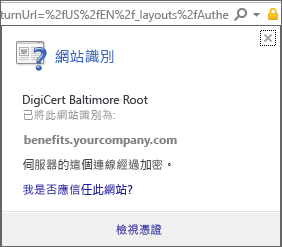

# 您的裝置遺漏必要的憑證

## 您的裝置遺失通常已預先安裝於手機上的憑證
如果您的 Android 裝置未在 Intune 中註冊，且遺漏通常在電話中安裝的憑證，您將無法登入 Android 公司入口網站應用程式。 當您嘗試登入時，您會看到下列訊息︰

解決此問題並取得所需的憑證︰

1.  在瀏覽器中，瀏覽至這個 [Digicert 憑證頁面](https://www.digicert.com/digicert-root-certificates.htm)。

2.  尋找並下載 Baltimore CyberTrust 根憑證 (https://www.digicert.com/CACerts/BaltimoreCyberTrustRoot.crt)。

3.  若要開啟您的通知，請從頂端向下拖曳，然後點選通知清單中的 [BaltimoreCyberTrustRoot.crt]。

4.  在 [命名憑證] 對話方塊中，接受預設憑證名稱。

5. 請確認 [認證使用] 設為 [用於 VPN 和應用程式]，然後點選 [確定]。

    

6. 關閉網頁瀏覽器和公司入口網站應用程式。

7. 重新開啟公司入口網站應用程式。 您現在應該能夠登入公司入口網站應用程式。 如果您需要協助，請連絡您的 IT 系統管理員。

## 您的裝置遺失您的 IT 系統管理員所需的憑證
如果您的 Android 裝置未在 Intune 註冊，且遺失 IT 系統管理員所需的特定憑證，您將無法登入 Android 公司入口網站應用程式。 當您嘗試登入時，您會看到下列訊息：

>[!NOTE]
> 如果您已經看到一則「遺失憑證」訊息，並已遵循[您的裝置遺失通常已預先安裝於手機上的憑證](#your-device-is-missing-a-certificate-that-usually-comes-installed-on-your-phone)中的步驟，請不用擔心。 那是與此不同的訊息與憑證，因此請繼續並遵循這一節中的步驟，以取得遺失的憑證。

若要解決此問題，並取得所需的憑證，有兩個您必須要做的主要步驟：

- 透過公司或學校電腦上尋找以識別遺失的憑證。
- 使用您的裝置從網際網路下載遺失的憑證。

### 透過公司或學校電腦上尋找以識別遺失的憑證

1. 在電腦上開啟 Internet Explorer。 如果您沒有可針對此用途使用的電腦，請連絡您的 IT 系統管理員。 如需您 IT 系統管理員的連絡資訊，請查看[公司入口網站](http://portal.manage.microsoft.com)。

2. 請移至[公司入口網站](http://portal.manage.microsoft.com)，並使用您的公司或學校認證登入。

3. 在瀏覽器的網址列最右側，按一下像是鎖頭的符號，如下所示。 如果您沒有看見鎖頭符號，請停止並連絡您的 IT 系統管理員。 鎖頭符號表示您已經安全地登入，因此除非您看到該符號，否則不應該繼續。

    

4. 按一下 [檢視憑證]。

    

5. 在 [憑證] 對話方塊中，按一下 [憑證路徑] 索引標籤，然後識別您需要從網際網路取得的憑證。 您所需憑證之名稱的所在位置，將會與上述範例螢幕擷取畫面中反白顯示的憑證相同。

### 在您的 Android 行動裝置上下載並安裝遺失的憑證

1. 使用搜尋引擎 (例如 Bing 或 Google) 搜尋您在上一節中識別的遺失憑證名稱。 憑證可能會以不同的副檔名結束，例如 ".crt" 或 ".pem" 等。

2. 從網站下載根憑證。

3. 下載憑證之後，從您的裝置頂端下拉以開啟通知，然後點選通知清單中的憑證名稱。

4. 在下面顯示的 [命名憑證] 對話方塊中，接受預設憑證名稱。

5. 請確認 [認證使用] 設為 [用於 VPN 和應用程式]，然後點選 [確定]。

    

6. 關閉公司入口網站應用程式。

7. 重新開啟公司入口網站應用程式。 您現在應該能夠登入公司入口網站應用程式。 如果您需要協助，請連絡您的 IT 系統管理員。

如果您看見如上所述的相同「遺失憑證」訊息，且您已經遵循上述步驟，這可能表示還有另一個您的 IT 系統管理員需協助您安裝的憑證。 請連絡 IT 系統管理員，並提供該人員此[連結](/intune/troubleshoot/troubleshoot-device-enrollment-in-intune#android-certificate-issues)，其中包含協助您解決問題的步驟。

### 請參閱
[使用具有 Intune 的 Windows 裝置](using-your-windows-device-with-intune.md)

<!--HONumber=Aug16_HO4-->

