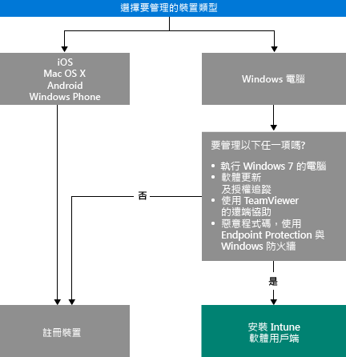

# 選擇如何管理裝置

若要利用 Intune 提供的眾多功能 (例如應用程式部署) 以及控制裝置設定，您的裝置必須「受管理」。 您管理裝置的方式取決於要使用的 Intune 功能。
本主題將協助您選擇哪種方法符合您的需求。

若要管理執行 iOS、Mac OS X、Android 的裝置或 Windows Phone，您必須加以「註冊」。

若要管理 Windows 電腦，您有兩種選擇：

1. 註冊裝置**或**
2. 安裝「Intune 軟體用戶端」。

## 決定要使用的方法
使用此決策流程來決定如何讓您的裝置受管理。

註冊 Windows 電腦可取得大部分功能。 但在下列情況下，Intune 軟體用戶端可能會更適合您的需求：

- 電腦執行 Windows 7
- 您想要管理 Windows 軟體更新與授權使用方式
- 您想要使用 Endpoint Protection 與 Windows 防火牆管理惡意程式碼
- 您想要使用 TeamViewer 軟體為使用者提供遠端協助

如需您透過各方法可取得的管理功能詳細清單，請參閱[行動裝置管理功能](mobile-device-management-capabilities-in-microsoft-intune.md)與 [Intune 電腦軟體用戶端功能](windows-pc-management-capabilities-in-microsoft-intune.md)。
如需 Intune 支援的裝置與電腦相關資訊，請參閱[支援的行動裝置與電腦](/intune/get-started/supported-mobile-devices-and-computers)

## Exchange ActiveSync 管理
除了註冊裝置或安裝 Intune 軟體用戶端以外，您還可以[使用 Exchange ActiveSync](/intune/deploy-use/mobile-device-management-with-exchange-activesync-and-microsoft-intune) 來管理裝置。 這個方法需要您安裝 On-Premises Connector 或使用內建的 Service to Service Connector 連線到您的 Exchange Server。
雖然這是管理裝置的第三個選項，但其提供的管理功能與其他方法相對有限。

## 後續步驟

- [選擇如何註冊行動裝置](/intune/get-started/choose-how-to-enroll-devices1)
- [使用 Intune 電腦用戶端軟體管理 Windows 電腦](/intune/deploy-use/manage-windows-pcs-with-microsoft-intune)

- [搭配 Microsoft Intune 的 Exchange ActiveSync 行動裝置管理](/intune/deploy-use/mobile-device-management-with-exchange-activesync-and-microsoft-intune)。

<!--HONumber=Aug16_HO5-->

