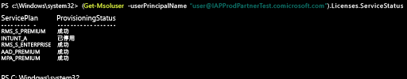

# 管理 Intune 授權
您必須先使用 [Office 365 入口網站](http://go.microsoft.com/fwlink/p/?LinkId=698854)，指派您 Intune 訂閱的授權給每位使用者，使用者才能登入使用 Intune 服務，或是註冊其裝置接受管理。

使用 Microsoft Enterprise Mobility + Security (EMS) 的組織可能會有一些使用者只需要使用 EMS 套件中的 Azure Active Directory Premium 或 Intune 服務。 您可以使用 [Azure Active Directory PowerShell Cmdlet](https://msdn.microsoft.com/library/jj151815.aspx) 指派一項服務或其中一部分的服務。 如需詳細資訊，請參閱[使用 PowerShell 管理 Intune 授權](start-with-a-paid-subscription-to-microsoft-intune-step-4-posh.md)。

## 如何指派 Intune 授權
當使用者帳戶從您的內部部署 Active Directory 同步處理或透過 [Office 365 入口網站](http://go.microsoft.com/fwlink/p/?LinkId=698854)手動新增至您的雲端服務訂用帳戶時，不會自動將 Intune 授權指派給他們。 而是在稍後，Intune 租用戶系統管理員必須編輯使用者帳戶，以從 Office 365 入口網站將授權指派給使用者。

當您的訂用帳戶與相關聯的其他雲端服務共用 Azure AD 時，您也可以存取已新增至這些服務的使用者。 在您將授權指派給這些使用者前，他們沒有使用 [!INCLUDE[wit_nextref](../includes/wit_nextref_md.md)] 的授權。

> [!TIP]
> 若指派或撤銷 [!INCLUDE[wit_nextref](../includes/wit_nextref_md.md)] 授權的選項已停用，表示您的訂用帳戶可能包含大量授權選項，例如在使用 [Enterprise Mobility Suite + 安全性](https://www.microsoft.com/en-us/server-cloud/enterprise-mobility/overview.aspx)時可用的選項。 如需如何指派或撤銷授權的詳細資訊，請參閱授權選項的文件。

## 指派 Intune 使用者授權

您可以使用 [Office 365 入口網站](http://go.microsoft.com/fwlink/p/?LinkId=698854)手動新增雲端式使用者，並將授權指派給雲端式使用者帳戶，以及從您的內部部署 Active Directory 同步處理至 Azure AD 的帳戶。

1.  登入 [Office 365 入口網站](http://go.microsoft.com/fwlink/p/?LinkId=698854)使用租用戶系統管理員認證，再選取 [人員]  >  [所有使用者]。

2.  選取您要指派以 Intune 使用者授權的使用者帳戶，然後選取 [Microsoft Intune (獨立)] 或 [Enterprise Mobility Suite]。

3.  使用者帳戶現在具有必要權限，可使用服務並將裝置註冊接受管理。

> [!NOTE]
> 使用者註冊裝置之後，即顯示在主控台中。

### 使用 PowerShell 來選擇性地管理 EMS 使用者授權
使用 Microsoft Enterprise Mobility + Security (原稱為 Enterprise Mobility Suite) 的組織可能會有一些使用者只需要使用 EMS 套件中的 Azure Active Directory Premium 或 Intune 服務。 您可以使用 [Azure Active Directory PowerShell Cmdlet](https://msdn.microsoft.com/library/jj151815.aspx) 指派一項服務或其中一部分的服務。

若要選擇性地指派 EMS 服務的使用者授權，請在已安裝[適用於 Windows PowerShell 的 Windows Azure Active Directory 模組](https://msdn.microsoft.com/library/jj151815.aspx#bkmk_installmodule)的電腦上，以系統管理員身分開啟 PowerShell。 您可以在本機電腦或 ADFS 伺服器上安裝 PowerShell。

您必須建立只適用於所需服務方案的新授權 SKU 定義。 若要這樣做，請停用您不想要套用的方案。 例如，您可能建立不指派 Intune 授權的授權 SKU 定義。 若要查看可用的服務清單，請輸入︰

    (Get-MsolAccountSku | Where {$_.SkuPartNumber -eq "EMS"}).ServiceStatus

您可以執行下列命令，以排除 Intune 服務方案。 您可以使用相同的方法以擴充到整個安全性群組，也可以使用更細微的篩選器。

**範例 1** 在命令列上建立新使用者並在不啟用授權中 Intune 部分的情形下指派 EMS 授權：

    Connect-MsolService

    New-MsolUser -DisplayName “Test User” -FirstName FName -LastName LName -UserPrincipalName user@<TenantName>.onmicrosoft.com –Department DName -UsageLocation US

    $CustomEMS = New-MsolLicenseOptions -AccountSkuId "<TenantName>:EMS" -DisabledPlans INTUNE_A
    Set-MsolUserLicense -UserPrincipalName user@<TenantName>.onmicrosoft.com -AddLicenses <TenantName>:EMS -LicenseOptions $CustomEMS

驗證：

    (Get-MsolUser -UserPrincipalName "user@<TenantName>.onmicrosoft.com").Licenses.ServiceStatus

**範例 2**：為已獲指派授權的使用者，停用 EMS 授權中的 Intune 部分：

    Connect-MsolService

    Set-MsolUserLicense -UserPrincipalName user@<TenantName>.onmicrosoft.com -RemoveLicenses IAPProdPartnerTest:EMS

    $CustomEMS = New-MsolLicenseOptions -AccountSkuId "<TenantName>:EMS" -DisabledPlans INTUNE_A
    Set-MsolUserLicense -UserPrincipalName user@<TenantName>.onmicrosoft.com -AddLicenses <TenantName>:EMS -LicenseOptions $CustomEMS

驗證：

    (Get-MsolUser -UserPrincipalName "user@<TenantName>.onmicrosoft.com" .Licenses.ServiceStatus

### 後續步驟
恭喜！ 您剛完成 *Intune 快速入門指南*的步驟 4。
>[!div class="step-by-step"]

>[&larr;**將使用者同步到 Intune**](.\start-with-a-paid-subscription-to-microsoft-intune-step-2.md)     [**組織使用者與裝置**&rarr;](.\start-with-a-paid-subscription-to-microsoft-intune-step-5.md)  

<!--HONumber=Nov16_HO4-->

