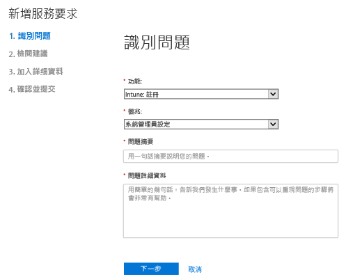
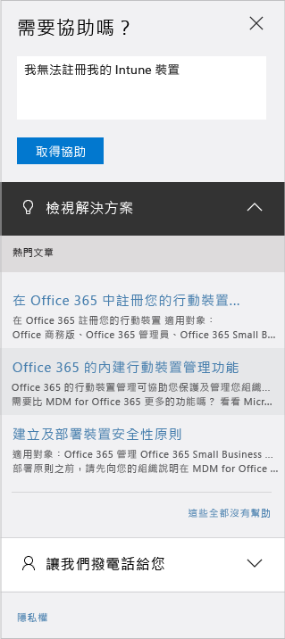

# 系統管理員如何取得 Microsoft Intune 支援

[!INCLUDE[classic-portal](../includes/classic-portal.md)]

Microsoft 為 Microsoft Intune 提供全球的技術、售前、帳單及訂閱支援。 付費及試用訂閱可透過網路和電話兩種途徑取得支援服務。 線上技術支援提供英文與日文。 電話支援與線上帳單支援另提供其他語言。

Intune 支援與 Intune 搭配 Configuration Manager 的支援為免費。 頂級支援客戶必須支付程序問題 (例如如何設定 Intune 功能) 的費用。

## 在不開啟支援票證的情況下尋求協助

建立支援票證之前，請查看下列資源以取得解答與資訊。 另也請您檢閱 [Microsoft Intune 的一般疑難排解提示](https://docs.microsoft.com/intune/troubleshoot/general-troubleshooting-tips-for-microsoft-intune)。

### Microsoft Intune TechNet 論壇

提出問題或開始與 Microsoft 技術專家討論！ 我們在可搜尋的 [Microsoft Intune TechNet 論壇](https://social.technet.microsoft.com/Forums/home)上提供解答和深入解析。

### Microsoft Intune UserVoice 產品意見反應網站

您是否有 Microsoft 如何適當地改善 Intune 的意見反應？ 請在 Microsoft Intune [UserVoice](https://microsoftintune.uservoice.com/forums/291681-ideas) 意見反應網站上新增您的想法，讓我們知道。 您也可以對新增至 UserVoice 的他人想法進行投票。

## 建立支援票證

如果您用自助資源找不到解答，可以建立線上支援票證。 **請在每份支援票證提出最多一個問題**，以協助我們以更好的品質為您服務。 以下說明原因：

- 提供協助的支援工程師很可能專精於特定領域，而這樣做能夠更容易找到適合的主題相關專家來協助您解決問題。
- 程式設計團隊會優先處理產生最多事件的產品領域。
- 向正確的資源呈報具有挑戰性的問題，會比較容易。

建立支援票證前，請先檢閱[支援事件的定義](#definition-of-a-support-incident)。

### 建立線上支援票證的步驟

1.  使用 Intune 認證登入 [Office 365 系統管理中心](https://portal.office.com)。

    如果您是頂級支援客戶，您應該改為在[頂級支援頁面](https://support.microsoft.com/en-us/premier/contacts)開立 Intune 支援票證。

    >[!NOTE]
    >
    >頂級支援客戶應該在[頂級支援頁面](https://support.microsoft.com/en-us/premier/contacts)中開立 Intune 支援票證。

2.  選擇 [管理] 磚。
3.  在左側的 [支援] 下方，選擇 [支援] 以開立票證。

    

    >[!NOTE]
    >  擁有、曾經擁有 O365 帳戶且含有低於 100 個授權的客戶會看到此訊息。 如果您看到此訊息，請參閱[以替代方法建立支援票證](#create-a-support-ticket-with-alternate-methods)。

    > 

    -   針對計費、授權以及帳戶問題，請選取 [計費和產品資訊]。

    -   針對所有其他 Intune 問題，請選取 [行動裝置管理]。

    > [!NOTE]
    > 您可能必須選擇清單底部的 [更多]，以查看所有類別。

3.  請依照下列指示，開立您的要求。

### 以替代方法建立支援票證的步驟

如果您在 Office 365 系統管理中心的支援頁面外觀類似下列所示，請遵循此程序︰

1. 選擇 [需要協助]。
2. 在文字方塊中，提供問題的描述，然後選擇 [取得說明]。

    

3. 檢閱建議的線上資源，或選擇 [讓我們撥電話給您]，由 Microsoft 支援服務主動撥電話給您。

## 取得電話支援
如需依國家和地區的支援電話號碼清單，或是需要知道支援時數和各地區支援的語言清單，請參閱[連絡 Microsoft Intune 的電話協助支援](contact-assisted-phone-support-for-microsoft-intune.md)。

## 追蹤支援要求
1.  使用 Intune 系統管理員認證登入 [Office 365 系統管理中心](https://portal.office.com)。
2.  選擇 [管理] 磚。
3.  在左側的 [支援] 下方，選擇 [服務要求]。 接著您可以檢閱您的要求。

初步回應支援要求的時間，取決於問題的嚴重性。 對於最嚴重的問題，我們會在兩小時內對專業客戶進行第一次回應。 頂級支援客戶的回應時間取決於支援合約的規定。 「最嚴重」的案例是當：

- 有一項或多項服務無法存取或無法使用。
- 生產、作業或部署期限受到嚴重影響，或是將嚴重影響生產或獲利能力。
- 多個使用者或服務受到影響。

對於中度嚴重的問題，我們會在四小時內對專業客戶進行第一次回應。 頂級支援客戶的回應時間取決於支援合約的規定。 「中度嚴重」的案例是當：

- 服務可供使用，但運作不如以往良好。
- 此情形的業務衝擊屬於中等，且可在上班時間處理。
- 單一使用者、客戶或服務受到部分影響。

對於其他問題，我們會在八小時內對專業客戶進行第一次回應。 頂級支援客戶的回應時間取決於支援合約的規定。 最不嚴重的案例是當：

- 此情形的業務衝擊非常輕微。
- 發生的問題雖然重要，但不會對客戶的服務或生產力造成立即、顯著的影響。
- 單一使用者正經歷部分中斷狀況，但有可接受的因應措施。

> [!NOTE]
> **如果您使用 Microsoft System Center Configuration Manager** 或 **Microsoft System Center Endpoint Protection：**如需 Configuration Manager 或 Endpoint Protection 的技術支援，請連絡您的合作夥伴，或瀏覽 [Microsoft System Center Configuration Manager](https://docs.microsoft.com/sccm/) 和 [Endpoint Protection](https://technet.microsoft.com/en-us/library/hh508836.aspx) 文件，以尋找豐富的自助資料。 它也提供透過線上或是電話開立支援要求的選項。
>
> System Center Configuration Manager 或 System Center Endpoint Protection 的技術支援需要付費，或從您現有的授權或頂級支援協議中扣減。

## 尋找大量授權的支援
如果您已透過大量授權方案向 Microsoft 購買授權，請利用下列資源尋求支援：

-   如需有關授權與尋找金鑰的支援，請參閱[大量授權服務中心](http://go.microsoft.com/fwlink/p/?LinkID=282016)。

-   如有帳單問題，請參閱[帳單和訂閱管理支援](http://support.microsoft.com/oas/default.aspx?prid=15371)。

-   如需大量授權的一般資訊，請參閱[大量授權](http://go.microsoft.com/fwlink/p/?LinkID=282015)。

## 支援事件的定義

支援事件的定義為單一支援問題及其解決過程。 單一支援問題無法細分為附屬問題。 如果您可以辨別附屬問題，各個附屬問題即視為個別事件。 要解決問題，可能需要多次聯繫及離線研究。 花在傳遞這些解決方案的時間與向您收取的費用無關。

Microsoft Intune 及 Office 365 行動裝置管理的訂閱內含「協助修正」支援，因此開啟額外支援事件永遠不會產生額外費用。

如果支援工程師要求您為額外問題開啟額外的支援事件，希望您了解這是為了各方最佳利益著想。 感謝您的理解與合作，讓我們得以提供世界級的支援體驗！

若要了解各事件單價及嚴重性等級，請參閱[專業支援選項](https://support.microsoft.com/gp/offerprophone)。

