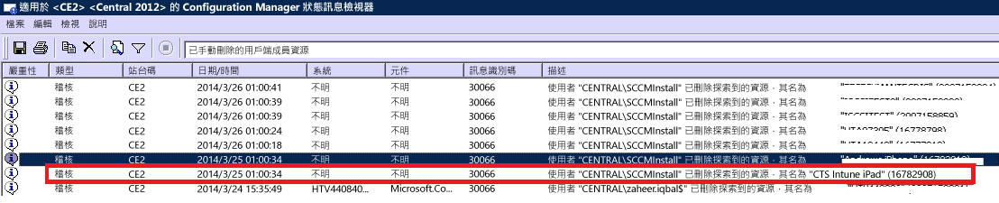

# Intune 的裝置註冊疑難排解

本主題提供裝置註冊問題的疑難排解建議。 如果此資訊無法解決您的問題，請參閱[如何取得 Microsoft Intune 支援](how-to-get-support-for-microsoft-intune.md)，以尋找更多方法來取得協助。

## 初始疑難排解步驟

在您開始進行疑難排解之前，請先確定您已正確設定 Intune，以便啟用註冊。 您可以閱讀有關那些設定需求︰

-   [準備在 Microsoft Intune 中註冊裝置](/intune/deploy-use/gprerequisites-for-enrollment.md)
-   [設定 iOS 和 Mac 裝置管理](/intune/deploy-use/set-up-ios-and-mac-management-with-microsoft-intune)
-   [使用 Microsoft Intune 設定 Windows Phone 和 Windows 10 行動裝置版管理](/intune/deploy-use/set-up-windows-phone-management-with-microsoft-intune)
-   [設定 Windows 裝置管理](/intune/deploy-use/set-up-windows-device-management-with-microsoft-intune)

您所管理的裝置使用者可以收集註冊與診斷記錄檔，以供您檢閱。 提供有關收集記錄檔使用者指示之處如下：

- [使用 USB 纜線將 Android 診斷資料記錄檔傳送給 IT 系統管理員](/intune/enduser/send-diagnostic-data-logs-to-your-it-administrator-using-a-usb-cable-android)
- [使用電子郵件將 Android 診斷資料記錄檔傳送給 IT 系統管理員](/intune/enduser/send-diagnostic-data-logs-to-your-it-administrator-using-email-android)
- [將 Android 註冊錯誤傳送給 IT 系統管理員](/intune/enduser/send-enrollment-errors-to-your-it-administrator-android)
- [將 iOS 註冊錯誤傳送給 IT 系統管理員](/intune/enduser/send-errors-to-your-it-admin-ios)

## 一般註冊問題
所有的裝置平台都可能發生這些問題。

### 已到達裝置上限
**問題**：使用者於註冊期間在其裝置上收到錯誤 (例如 iOS 裝置上的 [公司入口網站暫時無法使用] 錯誤)，而且 Configuration Manager 上的 DMPdownloader.log 包含錯誤 **DeviceCapReached**。

**解決方式：** 根據設計，使用者只能註冊 5 個 (含) 以下的裝置。

#### 檢查已註冊及允許的裝置數目

1.  在 Intune 管理入口網站中，驗證指派給使用者的裝置未超過 5 部

2.  在 Intune 管理入口網站的 [系統管理]\[行動裝置管理]\[註冊規則] 下，確認裝置註冊限制設定為 5

行動裝置使用者可以刪除下列 URL 的裝置： [https://byodtestservice.azurewebsites.net/](https://byodtestservice.azurewebsites.net/)。

系統管理員可以在 Azure Active Directory 入口網站中刪除裝置。

#### 若要在 Azure Active Directory 入口網站中刪除裝置：

1.  瀏覽至 [http://aka.ms/accessaad](http://aka.ms/accessaad)，或從 [https://portal.office.com](https://portal.office.com) 中選擇 [系統管理] &gt; [Azure AD]。

2.  利用頁面左側連結，以您的組織識別碼登入。

3.  如果您沒有 Azure 訂用帳戶，請建立帳戶。 如果您有付費帳戶，應該不需要信用卡或付款 (請選擇 [Register your free Azure Active Directory (註冊免費的 Azure Active Directory)] 訂閱連結)。

4.  選取 [Active Directory]  ，然後選取您的組織。

5.  選取 [使用者]  索引標籤。

6.  選取您要刪除裝置的使用者。

7.  選擇 [裝置]。

8.  視需要移除裝置，例如不再使用的裝置，或具有不正確定義的裝置。

> [!NOTE]

> 您可以如[使用 Microsoft Intune 中的裝置註冊管理員註冊屬公司擁有的裝置](/intune/deploy-use/enroll-corporate-owned-devices-with-the-device-enrollment-manager-in-microsoft-intune)中所述，使用裝置註冊管理員來避免達到裝置註冊上限。
>
> 當強制執行條件式存取原則讓特定使用者登入時，新增至「裝置註冊管理員」群組的使用者帳戶將無法完成註冊。

### 公司入口網站暫時無法使用
**問題**：使用者在裝置上收到 [公司入口網站暫時無法使用] 錯誤。

#### 公司入口網站暫時無法使用錯誤疑難排解

1.  從裝置移除 Intune 公司入口網站應用程式。

2.  在裝置上開啟瀏覽器，瀏覽至 [https://portal.manage.microsoft.com](https://portal.manage.microsoft.com)，然後嘗試使用者登入。

3.  如果使用者無法登入，請他們嘗試其他網路。

4.  如果失敗，請驗證使用者的認證已正確地與 Azure Active Directory 同步處理。

5.  如果使用者成功登入，iOS 裝置會提示您安裝並註冊 Intune 公司入口網站應用程式。 在 Android 裝置上，您必須手動安裝 Intune 公司入口網站應用程式，才能重試註冊。

### MDM 授權單位未定義
**問題**：使用者收到 [MDM 授權單位未定義] 錯誤。

#### MDM 授權單位未定義錯誤疑難排解

1.  確認所設定的 MDM 授權單位適用於您使用的 Intune 服務版本，這些服務包括 Intune、O365 MDM 或 System Center Configuration Manager (含 Intune)。 若是 Intune，MDM 授權單位會在 [系統管理] &gt; [行動裝置管理] 中設定。 若是具備 Intune 的 Configuration Manager，您會在設定 Intune 連接器時進行設定；至於 O365，則為 行動裝置]**[** 設定。

    > [!NOTE]
    > 設定 MDM 授權單位之後，您只能依照[如何取得 Microsoft Intune 支援](how-to-get-support-for-microsoft-intune.md)中所述來連絡支援人員以進行變更。

2.  確認使用者的認證已正確地與 Azure Active Directory 同步處理，方式是檢查其 UPN 是否符合帳戶入口網站中的 Active Directory 資訊。
    如果 UPN 與 Active Directory 資訊不符：

    1.  關閉本機伺服器上的 DirSync。

    2.  從 **Intune 帳戶入口網站** 使用者清單刪除不相符的使用者。

    3.  等候約一小時，讓 Azure 服務移除不正確的資料。

    4.  重新開啟 DirSync，然後檢查使用者現在是否已正確地同步處理。

3.  如果您使用 System Center Configuration Manager (含 Intune)，請確認使用者具有有效的雲端使用者識別碼：

    1.  開啟 SQL Management Studio。

    2.  連線到適當的 DB。

    3.  開啟資料庫資料夾，然後尋找並開啟 **CM_DBName** 資料夾，其中 DBName 是客戶資料庫的名稱。

    4.  選擇頂端的 [新增查詢] 並執行下列查詢：

        -   查看所有使用者：`select * from [CM_ DBName].[dbo].[User_DISC]`

        -   若要查看特定使用者，請使用下列查詢，其中 %testuser1% 代表您要查閱之使用者的 username@domain.com：`select * from [CM_ DBName].[dbo].[User_DISC] where User_Principal_Name0 like '%testuser1%'`

        撰寫查詢之後，請選擇 [!Execute]。
        傳回結果之後，請尋找雲端使用者識別碼。  如果找不到任何識別碼，則不會授權使用者使用 Intune。

### 如果公司名稱包含特殊字元，就無法建立原則或註冊裝置
**問題︰**您無法建立原則或註冊裝置。

**解決方式︰**在 [Office 365 系統管理中心](https://portal.office.com/)中，移除公司名稱的特殊字元並儲存公司資訊。

### 如果您有多個以驗證的網域，您無法登入或註冊裝置
**問題**︰當您將第二個已驗證的網域新增至您的 ADFS，擁有第二個網域之使用者主要名稱 (UPN) 尾碼的使用者可能無法登入入口網站或註冊裝置。

**解決方式︰**透過 AD FS 2.0 利用單一登入 (SSO)，而且在其組織中有多個使用者 UPN 尾碼 (例如，@contoso.com 或 @fabrikam.com) 的最上層網域的 Microsoft Office 365 客戶，必須為每個尾碼部署個別的 AD FS 2.0 同盟服務。  現在有 [AD FS 2.0 的彙總套件](http://support.microsoft.com/kb/2607496)可搭配 **SupportMultipleDomain** 切換運作來啟用 AD FS 伺服器，以支援這個案例，而不需要額外的 AD FS 2.0 伺服器。 如需詳細資訊，請參閱[這個部落格](https://blogs.technet.microsoft.com/abizerh/2013/02/05/supportmultipledomain-switch-when-managing-sso-to-office-365/)。

## Android 的問題
### 設定檔安裝失敗
**問題**：使用者的 Android 裝置收到「設定檔安裝失敗」錯誤。

### 設定檔安裝失敗的疑難排解步驟

1.  確認已將您使用之 Intune 服務版本的適當授權指派給使用者。

2.  確認未向其他 MDM 提供者註冊裝置，而且裝置尚未安裝管理設定檔。

4.  確認 Chrome (適用於 Android) 是預設瀏覽器，而且已啟用 Cookie。

### Android 憑證問題

**問題**：使用者在裝置上收到下列訊息：「您無法登入，因為您的裝置缺少必要的憑證」。

**解決方案**：

- 使用者透過遵循[這些指示](/intune/enduser/your-device-is-missing-a-required-certificate-android#your-device-is-missing-a-certificate-required-by-your-it-administrator)，可能可以擷取遺失的憑證。
- 若使用者無法擷取憑證，您的 ADFS 伺服器上可能遺失中繼憑證。 Android 需要中繼憑證以信任伺服器。

您可以將憑證匯入 ADFS 伺服器或 Proxy 上的中繼存放區，如下所示：

1.  在 ADFS 伺服器上，啟動 **Microsoft Management Console**，並新增「電腦帳戶」的憑證嵌入式管理單元。
5.  尋找您的 ADFS 服務所使用的憑證，並檢視它的父憑證。
6.  複製父憑證，並將它貼在 **Computer\Intermediate Certification Authorities\Certificates** 之下。
7.  複製您的 ADFS、ADFS 解密及 ADFS 簽署憑證，並將它們貼在 ADFS 服務的個人存放區中。
8.  重新啟動 ADFS 伺服器。

使用者現在應該能夠在 Android 裝置上登入公司入口網站。

## iOS 問題
### 設定檔安裝失敗
**問題**：使用者的 iOS 裝置收到「設定檔安裝失敗」錯誤。

### 設定檔安裝失敗的疑難排解步驟

1.  確認已將您使用之 Intune 服務版本的適當授權指派給使用者。

2.  確認未向其他 MDM 提供者註冊裝置，而且裝置尚未安裝管理設定檔。

3.  請瀏覽至 [https://portal.manage.microsoft.com](https://portal.manage.microsoft.com)，並在出現提示時嘗試安裝設定檔。

4.  確認適用於 iOS 的 Safari 是預設瀏覽器，而且已啟用 Cookie。

### 使用 System Center Configuration Manager (含 Intune) 時，已註冊的 iOS 裝置不會出現在主控台
**問題︰**使用者會註冊 iOS 裝置，但它不會出現在 Configuration Manager 管理員主控台。 裝置並未指出它已註冊。 可能的原因：

- 您可能已將 Intune 連接器註冊到一個帳戶，然後將它註冊到另一個帳戶。
- 您可能已從一個帳戶下載 MDM 憑證，然後將其用於另一個帳戶。

**解決方式：**執行下列步驟：

1. 在 Windows Intune 連接器內部停用 iOS。
    1. 以滑鼠右鍵按一下 Intune 訂閱，然後選取 [內容]。
    1. 在 [iOS] 索引標籤，取消核取 [啟用 iOS 註冊]。

1. 在 SQL 中，在 CAS DB 上執行下列步驟

    1. 更新 SC_ClientComponent_Property set Value2 = '' where Name like '%APNS%'
    1. 從 MDMPolicy where PolicyType = 7 刪除
    1. 從 MDMPolicyAssignment where PolicyType = 7 刪除
    1. 更新 SC_ClientComponent_Property set Value2 = '' where Name like '%APNS%'
    1. 從 MDMPolicy where PolicyType = 11 刪除
    1. 從 MDMPolicyAssignment where PolicyType = 11 刪除
    1. 刪除 Drs_Signals
1. 重新啟動 SMS Executive 服務或重新啟動 CM 伺服器

1. 取得新的 APN 憑證並將它上傳︰以滑鼠右鍵按一下 Configuration Manager 左側窗格中的 Intune 訂閱。 選取 [建立 APN 憑證要求] 並遵循指示。
## 使用具有 Intune 的 System Center Configuration Manager 時發生問題
### 行動裝置消失
**問題：** 成功向 Configuration Manager 註冊行動裝置之後，該裝置會從行動裝置集合中消失，但仍有管理設定檔並列於 CSS 閘道中。

**解決方式**：發生這個問題的原因可能是您具有移除非加入網域裝置的自訂處理序，或使用者嘗試從訂用帳戶移除裝置。 若要驗證及查看哪個處理序或使用者帳戶從 Configuration Manager 主控台移除裝置，請執行下列步驟。

#### 檢查裝置的移除方式

1.  在 Configuration Manager 管理主控台中，選取 [監視] &gt; [系統狀態] &gt; [狀態訊息查詢]。

2.  以滑鼠右鍵按一下 [手動刪除的集合成員資源]，然後選取 [顯示訊息]。

3.  選擇適當的時間/日期或 [過去 12 小時]。

4.  尋找有問題的裝置並檢閱裝置的移除方式。 下列範例顯示帳戶 SCCMInstall 已透過未知的應用程式刪除裝置。

    

5.  檢查 Configuration Manager 未排定任何可能會自動清除非網域、行動或相關裝置的工作、指令碼或其他處理序。

### 其他 iOS 註冊錯誤
在[您在 Intune 嘗試註冊裝置時看到錯誤](/intune/enduser/using-your-ios-or-mac-os-x-device-with-intune)的裝置使用者文件中提供 iOS 註冊錯誤清單。

## 電腦問題

### 電腦已註冊 - 錯誤 hr 0x8007064c
**問題 ︰**註冊失敗，並顯示**電腦已註冊**錯誤。 註冊記錄檔會顯示錯誤 **hr 0x8007064c**。

這可能是因為電腦先前已註冊，或具有已註冊之電腦的複製映像。 上一個帳戶的帳戶憑證仍存在於電腦上。

**解決方案：**

1. 從 [開始] 功能表中，選擇 [執行] -> [MMC]。
1. [檔案] -> [Add/ Remove Snap-ins (新增/移除嵌入式管理單元)]。
1. 按兩下 [憑證]，並依序選擇 [電腦帳戶] 和 [下一步]，然後選取 [本機電腦]。
1. 按兩下 [憑證 (本機電腦)]，然後選擇 [個人/憑證]。
1. 尋找 Sc_Online_Issuing 發出的 Intune 憑證，然後在它出現時將其刪除
1. 如果此登錄機碼存在，請將其刪除︰** HKEY_LOCAL_MACHINE\SOFTWARE\Microsoft\OnlineManagement regkey** 和所有子機碼。
1. 嘗試重新註冊。
1. 如果電腦仍然無法註冊，請尋找並刪除此機碼 (如果它存在)︰**KEY_CLASSES_ROOT\Installer\Products\6985F0077D3EEB44AB6849B5D7913E95**。
1. 嘗試重新註冊。

    > [!IMPORTANT]
    > 此節、方法或工作包含告訴您如何修改登錄的步驟。 然而，如果您不當修改登錄，可能會發生嚴重的問題。 因此，請務必小心遵循下列步驟。 為加強保護，請在修改登錄之前先加以備份。 之後如果發生問題，您還可以還原登錄。
    > 如需如何備份和還原登錄的詳細資訊，請參閱[如何備份和還原 Windows 中的登錄](https://support.microsoft.com/en-us/kb/322756)

## 一般註冊錯誤代碼

|錯誤碼|可能的問題|建議的解決方式|
|--------------|--------------------|----------------------------------------|
|0x80CF0437 |用戶端電腦上的時鐘未設定成正確的時間。|確定用戶端電腦上的時鐘和時區已設成正確的時間和時區。|
|0x80240438、0x80CF0438、0x80CF402C|無法連線至 Intune 服務。 請檢查用戶端 Proxy 設定。|確認 Intune 支援用戶端電腦上的 Proxy 設定，而且用戶端電腦可以存取網際網路。|
|0x80240438、0x80CF0438|未設定 Internet Explorer 和本機系統中的 Proxy 設定。|無法連線至 Intune 服務。 請檢查用戶端 Proxy 設定，並確認 Intune 所支援的用戶端電腦上的 Proxy 組態，且用戶端電腦可以存取網際網路。|
|0x80043001、0x80CF3001、0x80043004、0x80CF3004|註冊套件已過期。|從 [系統管理] 工作區下載並安裝最新的用戶端軟體套件。|
|0x80043002、0x80CF3002|帳戶處於維護模式。|您不能在帳戶處於維護模式時註冊新的用戶端電腦。 若要檢視您的帳戶設定，請登入您的帳戶。|
|0x80043003、0x80CF3003|已刪除帳戶。|確認您的帳戶和 Intune 訂閱仍然有效。 若要檢視您的帳戶設定，請登入您的帳戶。|
|0x80043005、0x80CF3005|已淘汰用戶端電腦。|等待幾個小時，並從電腦移除所有的舊版用戶端軟體，然後再次嘗試安裝用戶端軟體。|
|0x80043006、0x80CF3006|已達到帳戶允許的基座數目上限。|貴組織必須購買額外的基座，您才可以在服務中註冊更多用戶端電腦。|
|0x80043007、0x80CF3007|在與安裝程式相同的資料夾中找不到憑證檔案。|在開始安裝之前先解壓縮所有檔案。 請勿重新命名任何已解壓縮的檔案或改變其位置：所有檔案都必須位於同一個資料夾，否則安裝將會失敗。|
|0x8024D015、0x00240005、0x80070BC2、0x80070BC9、0x80CFD015|由於用戶端電腦仍在等待重新啟動，因此無法安裝軟體。|重新啟動電腦，然後再次嘗試安裝用戶端軟體。|
|0x80070032|用戶端電腦不符合安裝用戶端軟體的一或多個必要條件。|確定用戶端電腦已安裝所有必要更新，然後再次嘗試安裝用戶端軟體。|
|0x80043008、0x80CF3008|無法啟動 Microsoft Online Management Updates 服務。|連絡 Microsoft 支援服務 (如[如何取得 Microsoft Intune 支援](how-to-get-support-for-microsoft-intune.md)所述)。|
|0x80043009、0x80CF3009|用戶端電腦已註冊到服務中。|您必須先淘汰用戶端電腦，才能重新將它註冊到服務中。|
|0x8004300B、0x80CF300B|用戶端軟體安裝套件無法執行，因為不支援用戶端上執行的 Windows 版本。|Intune 不支援用戶端電腦上執行的 Windows 版本。|
|0xAB2|Windows Installer 無法存取自訂動作的 VBScript 執行階段。|這個錯誤是由以動態連結程式庫 (DLL) 為基礎的自訂動作所造成。 在為 DLL 疑難排解時，您可能必須使用 [Microsoft 支援服務 KB198038：實用的封裝與部署工具](https://support.microsoft.com/en-us/kb/198038)中所述的工具。|
|0x80cf0440|與服務端點的連線已終止。|試用或付費帳戶已暫止。 建立新的試用或付費帳戶，然後重新註冊。|

### 後續步驟
如果這項疑難排解資訊對您沒有幫助，請連絡 Microsoft 支援服務 (如[如何取得 Microsoft Intune 支援](how-to-get-support-for-microsoft-intune.md)中所述)。

<!--HONumber=Sep16_HO4-->

