# 啟動 Microsoft Intune 試用版和部署 iOS PIN 原則
這些逐步指示會協助您設定 Intune 試用版，並設定 iOS 裝置的 PIN 原則。 如需其他可嘗試的一般 Intune 評估工作的清單，請參閱[一般的 Microsoft Intune 評估工作](common-microsoft-intune-evaluation-tasks.md)。

## 檢閱這項工作的必要條件

-   使用 Internet Explorer 的 Windows 電腦 - 以執行系統管理工作

-   iOS 7.1 或更新版本的裝置以測試使用者原則驗證

-   於註冊試用版時進行自我驗證的電話號碼

## 建立免費的 Intune 試用帳戶
> [!NOTE]
> 如果已經有 Intune 訂閱，請略過本節並移至下一節。

1.  使用 Windows 電腦，以滑鼠右鍵按一下 **Internet Explorer** (IE)，然後選取 **InPrivate 瀏覽**。

    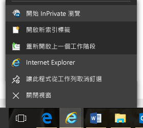

2.  移至 [Intune 註冊入口網站](https://portal.office.com/Signup/Signup.aspx?OfferId=40BE278A-DFD1-470a-9EF7-9F2596EA7FF9&dl=INTUNE_A&ali=1)，提供要求的資訊，然後按一下 **下一步**。

    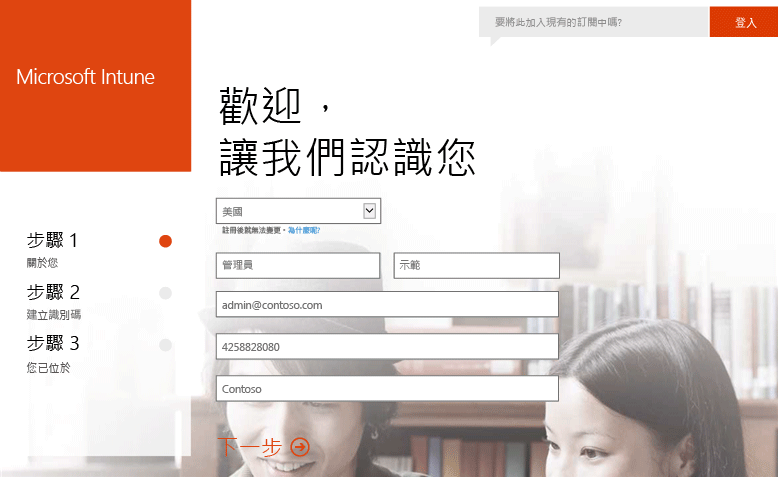

3.  輸入系統管理員帳戶的使用者識別碼和密碼，然後按一下 **下一步**。 您會使用這個識別碼登入 Intune 入口網站執行管理工作。

    

4.  輸入您的行動電話號碼，然後按一下 **簡訊驗證** 來驗證您的號碼。

    

5.  儲存螢幕顯示的資訊，然後按一下 **您可以開始使用…**。

    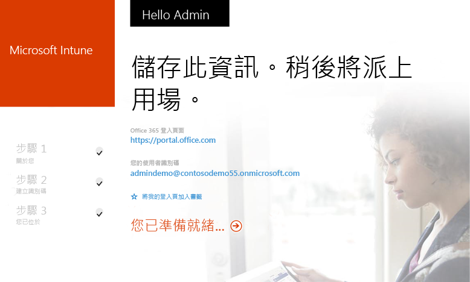

## 建立測試使用者

1.  使用 Windows 電腦，按一下 **開始** 移至使用者管理頁面。

    

2.  按一下 **+** 按鈕加入使用者。

    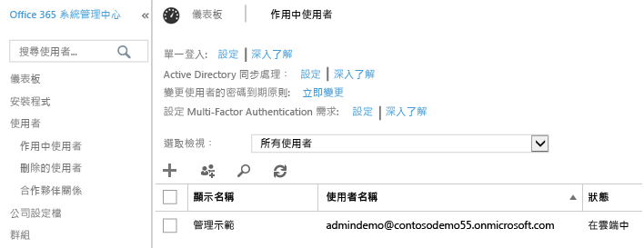

3.  在 **建立新的使用者帳戶** 頁面︰

    1.  提供測試使用者資訊。

    2.  選取 **輸入密碼** 選項。

    3.  清除 **請使用者下次登入時變更密碼** 核取方塊。

    4.  按一下 **建立**。

    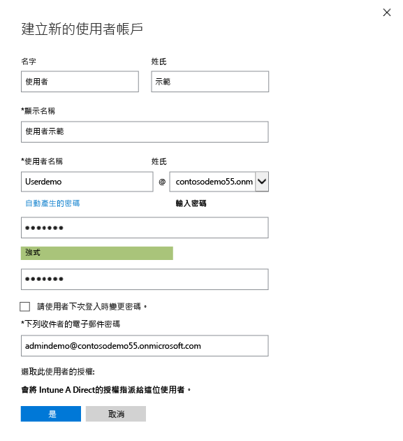

4.  在使用者建立確認的頁面中，按一下 **關閉**。

    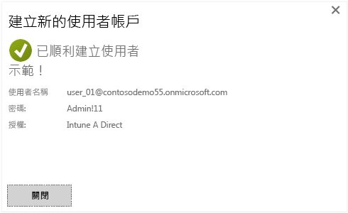

5.  按一下 **重新整理** 按鈕，查看您所建立的測試使用者。

    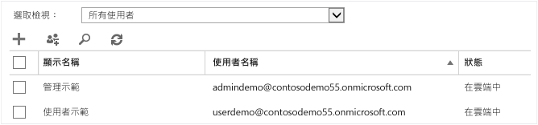

## 設定測試使用者的 iOS PIN 原則

1.  使用 Windows 電腦，將 MDM 授權單位設為 Intune︰

    1.  移至 [Intune 管理主控台](http://manage.microsoft.com/)，登入您的系統管理員帳戶，然後按一下 **開始管理行動裝置**。 [行動裝置管理授權單位] 頁面隨即開啟。

        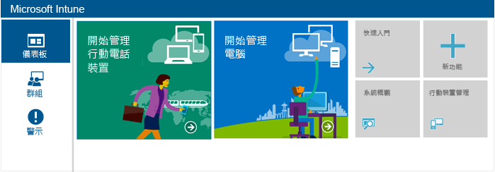

    2.  按一下 **設定行動裝置管理授權單位** 連結。

        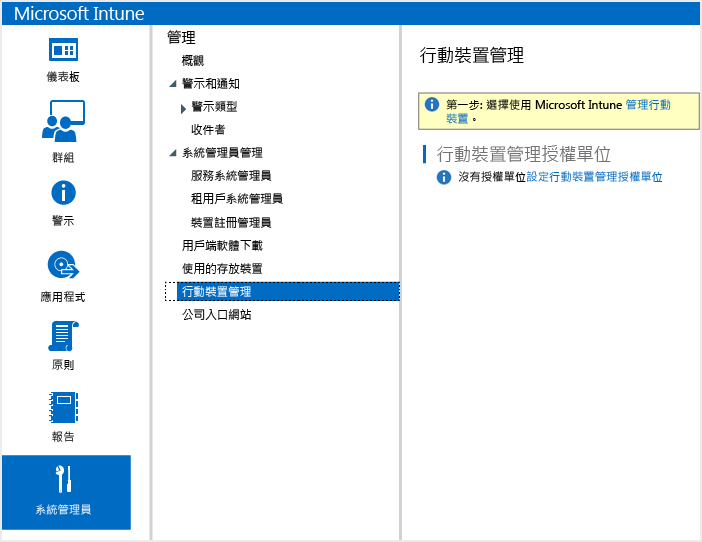

2.  啟用 iOS 裝置註冊。 這項程序會在 Apple Push Notification Service (APNs) 和您的 Intune 訂閱之間設定受信任的憑證。

    1.  按一下 **啟用 iOS 與 Mac OS X 平台**。

        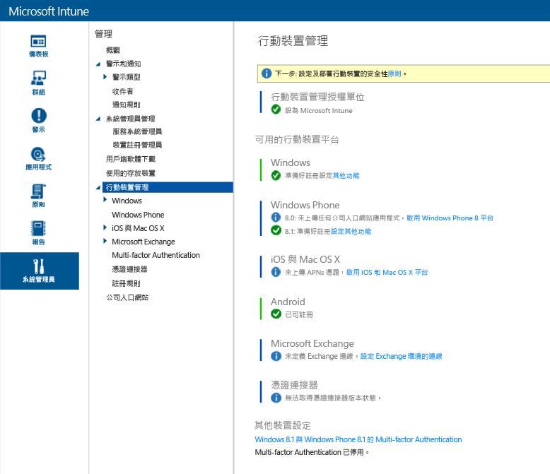

    2.  按一下 **下載 APNs 憑證要求**。

        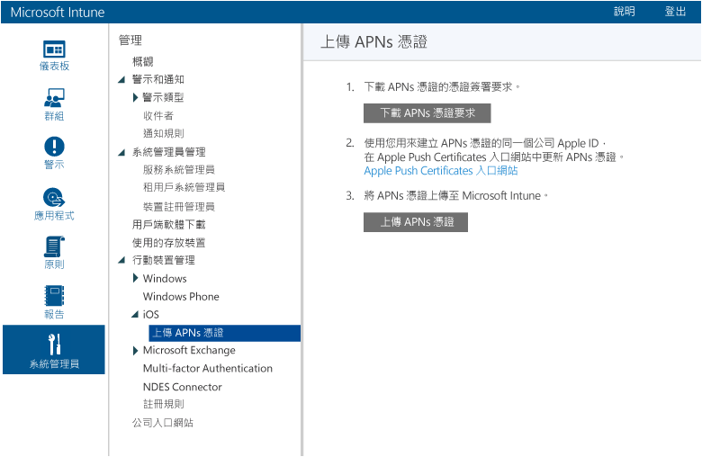

    3.  指定憑證簽署要求 (CSR) 的檔案名稱和位置，然後按一下 **儲存**。 這個檔案中有與 Intune 訂閱所持私密金鑰相對應的公開金鑰。

        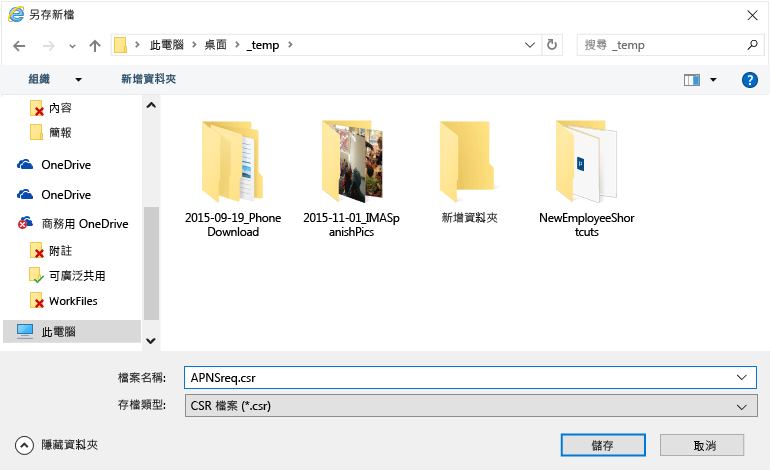

    4.  按一下 **Apple Push Certificates 入口網站** 開啟新的索引標籤。

        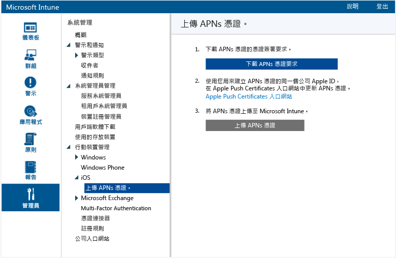

    5.  輸入您的 Apple ID 和密碼，然後按一下 **登入**。 這可以是您在 iOS 裝置上從 iOS 應用程式市集取得應用程式所使用的識別碼。

        

    6.  按一下 **建立憑證**。

        

    7.  閱讀 Apple 的使用規定，選取核取方塊，然後按一下 **接受**。

        

    8.  按一下 **瀏覽**。

        

    9. 選取您稍早儲存的 CSR 檔案，然後按一下 **開啟**。

        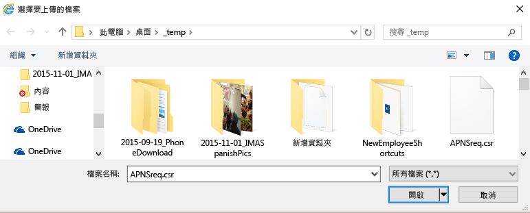

    10. 按一下 **上傳** 按鈕。

        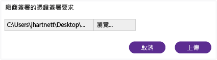

    11. 當系統提示您下載 JSON 檔案時，請按一下 **另存新檔**。

        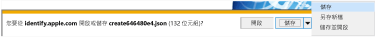

    12. 指定 JSON 檔案的位置，然後按一下 **儲存**。

        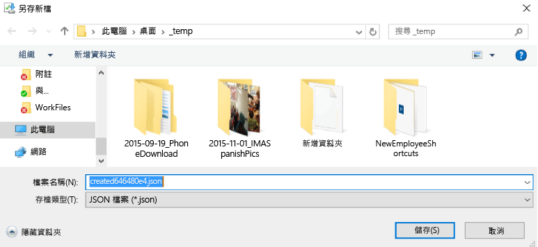

        如果幾秒之後頁面不會自動重新導向，請按一下 **取消**。

        

    13. 若要擷取新建立的憑證檔案，請按一下 **下載**。

        

    14. 當系統提示您下載 PEM 檔案時，請按一下 **另存新檔**。

        

    15. 指定 PEM 檔案的位置，然後按一下 **儲存**。

        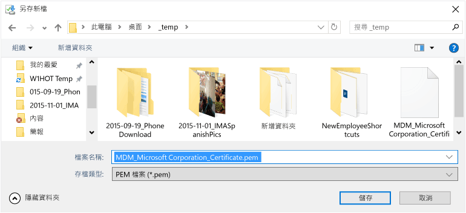

    16. 返回 [Intune 管理主控台] 索引標籤，然後按一下 **上傳 APNs 憑證**。

        

    17. 輸入您的 Apple ID，然後按一下 **瀏覽**。

        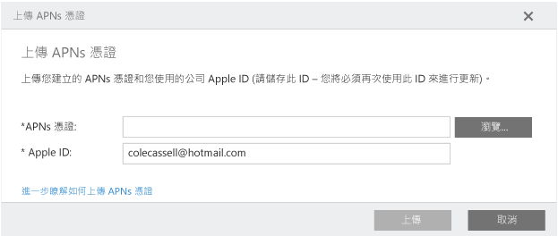

    18. 選取剛剛儲存的 PEM 檔案，然後按一下 **開啟**。

        

    19. 按一下 **上傳**。

        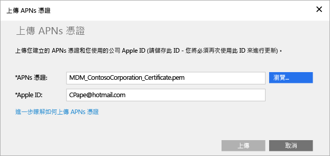

        現已設定好您的 APNs 憑證。

        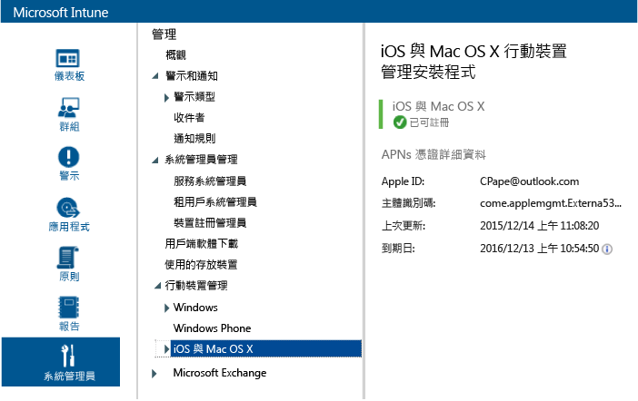

3.  建立原則的目標測試使用者群組︰

    1.  在左窗格中，按一下 **群組**。

        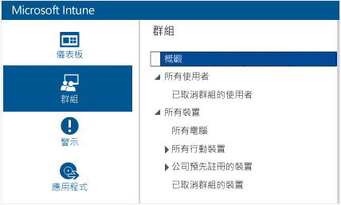

    2.  在最右邊，按一下 **建立群組**。

        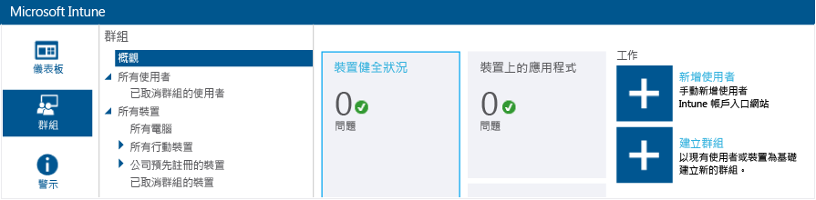

    3.  提供群組名稱，選取 **所有使用者** 為父群組，然後按一下 **下一步**。

        ![選取 [所有使用者] 作為父群組](../media/30-day-trial-walkthrus/30day-cfg-pol-36-name-group.png)

    4.  在 **群組成員資格啟動方式** 欄位中，選取 **父群組中的所有使用者**，然後按一下 **完成**。

        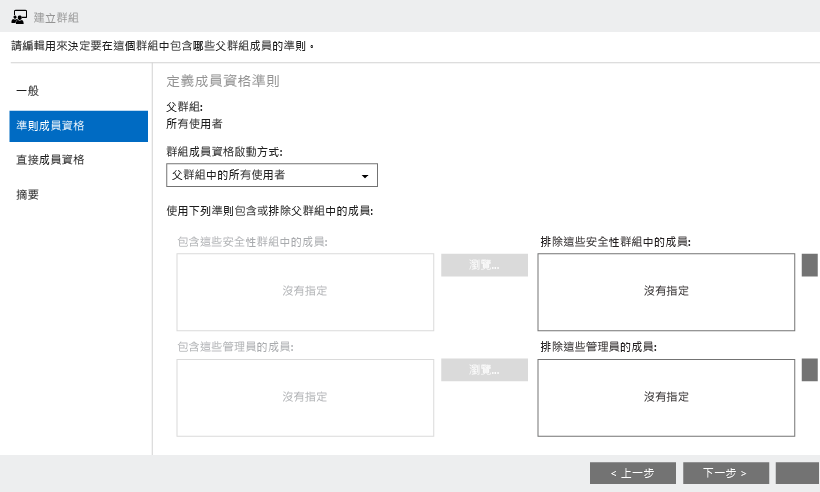

4.  建立 iOS PIN 原則，並將測試使用者群組設定為其目標︰

    1.  在左窗格中，按一下 **原則**。

        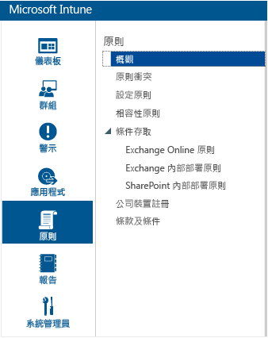

    2.  在最右邊，按一下 **新增原則**。

        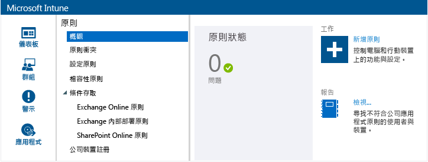

    3.  展開 iOS 節點，選取 **一般設定** 資料列，然後按一下 **建立原則**。

        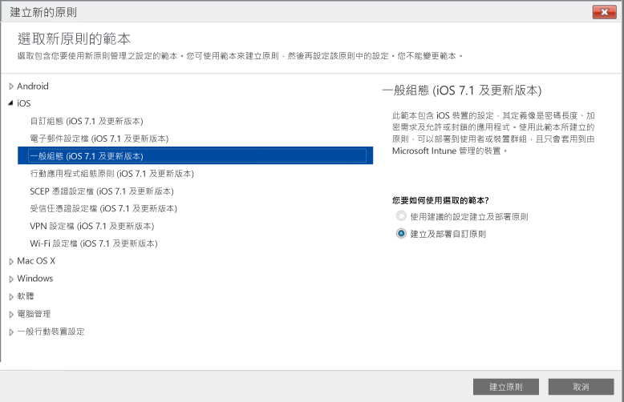

    4.  輸入原則的名稱，開啟 **需要密碼才可解除鎖定行動裝置** 選項，並將 **最小密碼長度** 設為 **4**。

        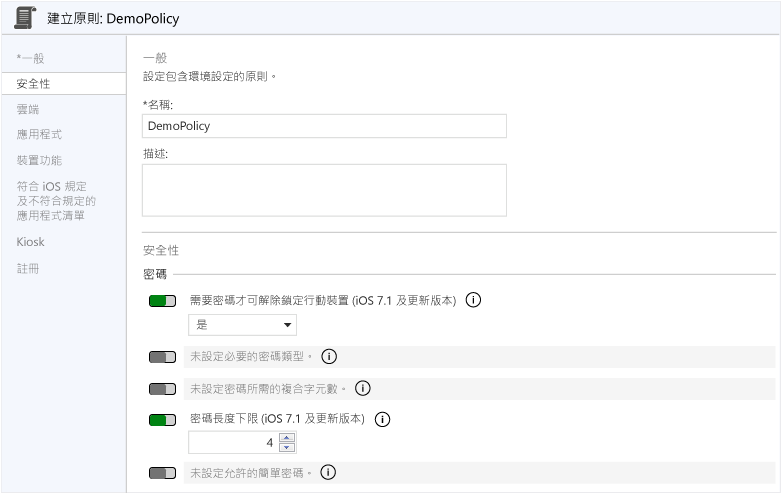

    5.  按一下 **是** 部署原則。

        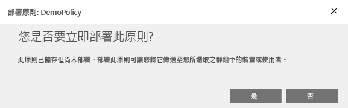

    6.  依序按一下之前建立的使用者群組及 **加入**，然後按一下 **確定**。

        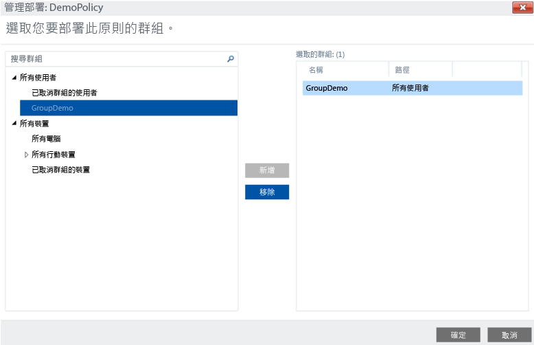

        您現在有以測試使用者群組為目標的 iOS PIN 原則。

        

## 驗證 iOS 裝置上是否強制執行此原則

1.  在 iPad 上啟動 iOS 應用程式市集，安裝並開啟免費的 **Microsoft Intune 公司入口網站** 應用程式。

    

2.  輸入您的測試使用者帳戶名稱和密碼，然後點選 **登入**。

    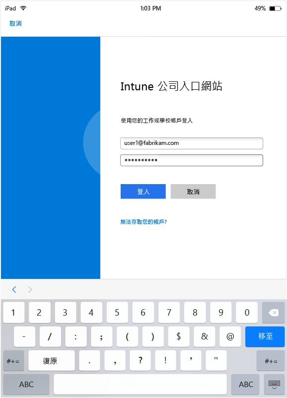

3.  點選 **註冊** 開始在 Intune 中註冊裝置。

    

4.  在 **安裝設定檔** 畫面上，點選 **安裝**。

    

5.  在 **安裝設定檔** 對話方塊中，點選 **安裝**。

    

6.  在 **警告** 畫面上，點選 **安裝**。

    

7.  在 **遠端管理** 對話方塊中，點選 **信任**。

    

8.  當管理設定檔完成安裝時，請點選 **完成**。 註冊完成。

    

9. 註冊完成後，請點選 **確定**，然後關閉公司入口網站應用程式。

    ![點選 [確定] 以關閉公司入口網站應用程式](../media/30-day-trial-walkthrus/30day-cfg-pol-53-devc-enrolled-ok.png)

10. 當系統提示您設定密碼時，請點選 **繼續**。

    

11. 輸入密碼，點選 **繼續**，再次輸入密碼，然後點選 **儲存**。

    

12. 按下電源按鈕鎖定您的 iPad、滑動解除鎖定，您現在發現需要輸入密碼才能解除鎖定裝置。

### 請參閱
[Intune 評估指南](get-started-with-a-30-day-trial-of-microsoft-intune.md)

<!--HONumber=Jul16_HO3-->

