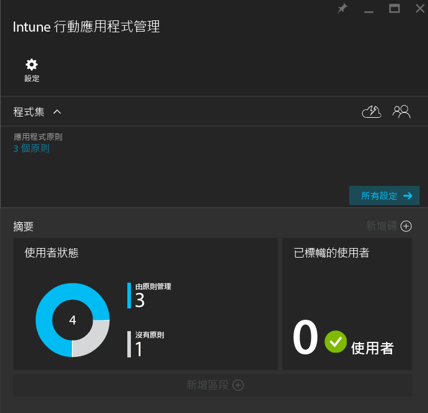
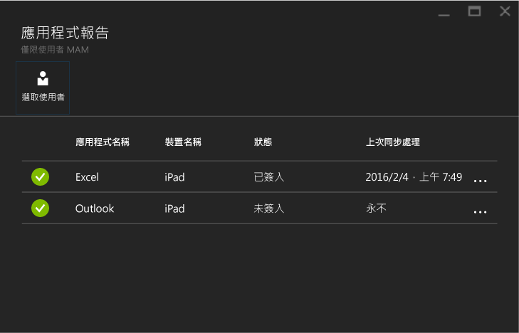

# 使用 Microsoft Intune 監視行動應用程式管理原則
在您設定行動應用程式管理 (MAM) 原則並將原則套用到使用者之後，您可以在 [Azure 入口網站](https://portal.azure.com)中監視相容性狀態。 Azure 入口網站包含原則所影響之使用者相關資訊、符合性狀態，以及您的使用者可能發生的任何問題。
## 摘要檢視
在 [Intune 行動應用程式管理] 刀鋒視窗中，您可以看到相容性狀態的摘要：

-   **使用者**︰公司中使用與原則相關聯應用程式的使用者總數。

-   **由原則管理**︰工作環境中已使用至少其中一個應用程式的使用者數目。

-   **沒有任何原則**︰使用與原則相關聯應用程式，但不是原則之目標的使用者數目。 您可以考慮將這些使用者新增至原則。

- **已標記的使用者**︰遇到問題的使用者數目。 目前只有使用已進行 JB 破解之裝置的使用者，會被報告為**已標記的使用者**。

## 詳細檢視
選擇 [使用者狀態] 磚和 [已標記的使用者] 磚，即可進入摘要的詳細檢視。

### 使用者狀態
您可以搜尋單一使用者，並查看該使用者的相容性狀態。 [應用程式報告] 刀鋒視窗會顯示所選使用者的下列資訊：
- 與使用者帳戶相關聯的裝置

- 裝置上具有 MAM 原則的應用程式

- 狀態：

  - **已簽入**︰此原則已部署至使用者，而且在在工作環境中至少使用一次應用程式。

  - **未簽入**：此原則已部署至使用者，但是從那時起並未在工作環境中使用應用程式。

>[!NOTE]
> 如果您搜尋的使用者沒有部署 MAM 原則，您會看見一則訊息，通知您該使用者不針對任何應用程式原則。

若要查看使用者的報告，請遵循下列步驟︰

1.  若要選取使用者，請選擇 [摘要] 磚，或在 [設定] 刀鋒視窗中選擇 [使用者應用程式報告] 選項：

    ![[設定] 刀鋒視窗上的 [應用程式報告] 選項](../media/mam-azure-portal-app-reporting-by-user-settings-blade.png)

2. 在開啟的 [應用程式報告] 刀鋒視窗上，選擇 [選取使用者] 來搜尋 Azure Active Directory 使用者。

    ![[應用程式報告] 刀鋒視窗上的 [選取使用者] 選項](../media/mam-azure-portal-app-reporting-select-user.png)

3. 從清單中選取一個使用者。 您會看到該使用者之相容性狀態的詳細資料。

    

### 標有旗標的使用者
詳細的檢視會顯示錯誤訊息、在錯誤發生時存取的應用程式、裝置的平台和時間戳記。  

### 請參閱
[管理 iOS 應用程式之間的資料傳輸](manage-data-transfer-between-ios-apps-with-microsoft-intune.md)

* [當 Android 應用程式由 MAM 原則管理時會發生的情況](user-experience-for-mam-enabled-android-apps-with-microsoft-intune.md)
* [當 iOS 應用程式由 MAM 原則管理時會發生的情況](user-experience-for-mam-enabled-ios-apps-with-microsoft-intune.md)

<!--HONumber=Dec16_HO2-->

