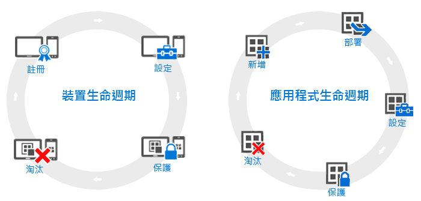

# 裝置和應用程式生命週期的概觀

雖然個別組織的需求可能會有差異，但有某些共通步驟是所有組織都必須持續採取 (而無論其作業需求為何)。 這些可以分為兩種主要的類別，都稱為**生命週期**。 您遵循的部署生命週期取決於您想要啟用的案例。 例如，您可能僅需要裝置生命週期或應用程式生命週期，或者您可能需要兩者。

為了方便管理，所有的裝置都具有生命週期。 生命週期由您註冊裝置開始，直到其淘汰為止。 [裝置管理生命週期](overview-of-device-lifecycle-in-microsoft-intune.md)會逐步引導您如何註冊裝置、如何設定與保護裝置，以及如何將裝置從管理中移除。

同樣地，您使用的應用程式將有自己的[應用程式生命週期](overview-of-app-lifecycle-in-microsoft-intune.md)，其中包括加入應用程式至 Intune，一直到不再需要應用程式時加以移除的所有步驟。

<!--HONumber=Nov16_HO5-->

