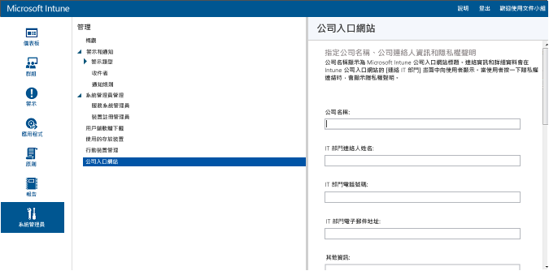

# Intune 中的行動裝置管理先決條件
可讓員工向 Intune 註冊其行動裝置需要下列步驟。 需要這些相同的步驟才能管理公司擁有的裝置。

|步驟|詳細資料|  
|-----------|-------------|  
|**步驟 1：**[啟用連線](#step-1-enable-connections)|確定已設定自訂網域名稱，而且網路通訊已準備就緒|  
|**步驟 2：**[設定 MDM 授權單位](#step-2-set-mdm-authority)|行動裝置管理授權單位會定義指派給您裝置的服務|
|**步驟 3**：[建立群組](#step-3-create-groups)|設定公司入口網站應用程式的與使用者互動設定|  
|**步驟 4**：[設定公司入口網站](#step-4-configure-company-portal)|設定公司入口網站應用程式的與使用者互動設定|  
|**步驟 5**：[指派使用者授權](#step-5-assign-user-licenses)|將 Intune 授權指派給使用者，讓使用者可以註冊裝置|
|**步驟 6**：[啟用註冊](#step-6-enable-enrollment)|啟用適用於 iOS 和 Windows 管理的平台特定設定。 Android 裝置不需要進行其他設定。|
|**步驟 7**：[後續步驟](#step-7-next-steps)|啟用適用於 iOS 和 Windows 管理的平台特定設定。 Android 裝置不需要進行其他設定。|

要搭配使用 Intune 和 Configuration Manager 嗎？
> [!div class="button"]
[檢視 SCCM 文件 >](https://docs.microsoft.com/sccm/mdm/deploy-use/setup-hybrid-mdm)

## 步驟 1：啟用連線

啟用行動裝置註冊之前，請確定您已完成下列作業︰
- [檢閱所需的網路 URL 和通訊埠](../get-started/network-infrastructure-requirements-for-microsoft-intune.md)
- [新增和驗證網域名稱](../get-started/domain-names-for-microsoft-intune.md)

## 步驟 2：設定 MDM 授權單位
MDM 授權單位會定義有權管理一組裝置的管理服務。 MDM 授權單位選項包括單獨使用 Intune，以及具備 Intune 的 Configuration Manager。 如果您將 Configuration Manager 設定為管理授權單位，就不能使用其他服務管理行動裝置。

>[!IMPORTANT]
> 請仔細考慮要單獨使用 Intune (線上服務) 還是使用具備 Intune 的 System Center Configuration Manager (搭配線上服務的內部部署軟體解決方案) 來管理行動裝置。 設定行動裝置管理授權單位之後便無法再做變更。

1.  在 [Microsoft Intune 管理主控台](http://manage.microsoft.com)中，選擇 [系統管理] &gt; [行動裝置管理]。

2.  在 [工作]  清單中，按一下 [設定行動裝置管理授權單位] 。 [設定 MDM 授權單位]  對話方塊隨即開啟。

    ![[設定 MDM 授權單位] 對話方塊](../media/intune-mdm-authority.png)

3.  Intune 要求您確認是否要以 Intune 做為 MDM 授權單位。 選取核取方塊，然後選擇 [是] 以使用 Microsoft Intune 管理行動裝置。

## 步驟 3：建立群組

您可以建立使用者和裝置群組來簡化管理，並改善已部署應用程式、原則和公司資源的目標設定。 [了解如何建立群組](use-groups-to-manage-users-and-devices-with-microsoft-intune.md#create-groups)。

## 步驟 4：設定公司入口網站

Intune 公司入口網站是使用者存取公司資料並可以執行一般工作的位置，如註冊裝置、安裝應用程式，以及找到向 IT 尋求協助的資訊。

> [!TIP]
> 當您自訂公司入口網站時，這些組態會同時套用到公司入口網站和公司入口網站應用程式。

自訂公司入口網站可協助為終端使用者提供熟悉且實用的體驗。 若要這麼做，只要以租用戶或服務管理員身分登入 [Microsoft Intune 管理主控台](https://manage.microsoft.com)，並選擇 [系統管理] &gt; [公司入口網站]，然後進行公司入口網站設定。

### 公司連絡人資訊和隱私權聲明

公司名稱顯示為公司入口網站標題。 連絡資訊和詳細資料會在公司入口網站的 [連絡 IT] 畫面中向使用者顯示。 當使用者按一下隱私權連結時，會顯示隱私權聲明。

|欄位名稱|長度上限|詳細資訊|
    |----------|------------------------|----------------|
    |公司名稱|40|這是顯示為公司入口網站標題的名稱。 **注意**︰僅可使用英數字元。 此欄位不支援特殊字元。|
    |IT 部門連絡人姓名|40|此姓名會顯示在 [連絡 IT] 頁面中。|
    |IT 部門電話號碼|20|此連絡電話號碼會顯示在 [連絡 IT] 頁面中。|
    |IT 部門電子郵件地址|40|此連絡地址會顯示在 [連絡 IT] 頁面中。 您必須輸入有效的電子郵件地址，格式為 **alias@domainname.com**。|
    |其他資訊|120|此資訊會顯示在 [連絡 IT] 頁面上。|
    |公司隱私權聲明 URL|79|您可以指定自己的公司隱私權聲明，在使用者從公司入口網站按一下隱私權連結時會顯示該聲明。 您必須使用 https://www.contoso.com 格式輸入有效的 URL。|

### 支援連絡人
支援網站將會顯示在公司入口網站中，讓使用者能夠存取線上支援。

|欄位名稱|長度上限|詳細資訊|
    |----------|------------------------|----------------|
    |支援網站 URL|150|如果想讓使用者參考您的支援網站，請在這裡指定 URL。 這個 URL 必須使用 https://www.contoso.com 的格式。 如果您沒有指定 URL，公司入口網站的 [連絡 IT] 頁面上將不會顯示支援網站的任何內容。|
    |網站名稱|40|這是支援網站的 URL 所顯示的易記名稱。 如果您指定支援網站 URL，但沒有指定易記名稱，則公司入口網站的 [連絡 IT] 頁面上將會顯示 [移到 IT 網站]。|

### 公司商標自訂

您可以使用公司標誌、公司名稱、佈景主題色彩和背景自訂您的公司入口網站。

|欄位名稱|詳細資訊|
    |----------|----------------|
    |佈景主題色彩|選取要套用到公司入口網站的佈景主題色彩。|
    |包含公司標誌|啟用此選項時，您可以上傳公司標誌以顯示在公司入口網站中。 您可以上傳兩個標誌：一個會在公司入口網站背景是白色時顯示，另一個則會在公司入口網站背景使用您選取的佈景主題色彩時顯示。 每個標誌必須是 .png 或 .jpg 檔案，且最大解析度為 400 x 100 像素，大小則是 750 KB 以下。|
    |選擇公司入口網站應用程式的背景|這項設定只會影響公司入口網站應用程式的背景。|

儲存變更之後，您可以使用管理主控台之 [公司入口網站] 頁面下方所提供的連結，檢視公司入口網站。 這些連結無法變更。 當使用者登入時，這些連結會顯示您在公司入口網站的訂閱。

## 步驟 5：指派使用者授權

您可以使用「Office 365 管理入口網站」手動新增雲端式使用者，並將授權同時指派給雲端式使用者帳戶，以及從內部部署 Active Directory 同步至 Azure Active Directory (Azure AD) 的帳戶。 您可以[同步處理內部部署使用者與 Azure AD](../get-started/start-with-a-paid-subscription-to-microsoft-intune-step-3.md#how-to-sync-on-premises-users-with-azure-ad)。

1.  使用您的租用戶系統管理員認證登入 [Office 365 管理入口網站](https://portal.office.com/Admin/Default.aspx)。

2.  選取您想要指派 Intune 使用者授權的使用者帳戶，然後選取使用者帳戶屬性上的 [Microsoft Intune] 核取方塊。

3.  使用者帳戶現在會加入至 Microsoft Intune 使用者群組，以授權使用者使用此服務並註冊裝置以納入管理。

### 同步處理內部部署使用者與 Azure AD

1. 在內部部署 Active Directory 中，為自訂網域[新增 UPN 尾碼](https://technet.microsoft.com/en-us/library/cc772007.aspx)。
2. 為您打算匯入的內部部署使用者設定新的 UPN 尾碼。
3. 執行 [Azure AD Connect 同步處理](https://azure.microsoft.com/en-us/documentation/articles/active-directory-aadconnect/)，以便與 Azure AD 整合您的內部部署使用者。
4. 順利同步處理使用者帳戶資訊之後，您便可以使用 [Office 365 管理入口網站](https://portal.office.com/Admin/Default.aspx)來指派 Microsoft Intune 授權。

## 步驟 6：啟用註冊
設定 MDM 授權單位之後，您需要設定您組織想要支援之作業系統的裝置管理。 設定裝置管理所需的步驟會因作業系統而不同。 例如，Android 作業系統不需要您在 Intune 管理主控台中採取任何動作。 另一方面，Windows 和 iOS 需要裝置與 Intune 之間有信任關係，才能允許管理。

設定下列平台的管理：
- [iOS 和 Mac](set-up-ios-and-mac-management-with-microsoft-intune.md)
- [Android](set-up-android-management-with-microsoft-intune.md)
- [Android for Work](set-up-android-for-work.md)
- [Windows 電腦和膝上型電腦](set-up-windows-device-management-with-microsoft-intune.md)
- [Windows 10 行動裝置版和 Windows Phone](set-up-windows-phone-management-with-microsoft-intune.md)

您也可以啟用[屬公司擁有的裝置註冊](manage-corporate-owned-devices.md)。

## 步驟 7：後續步驟

啟用註冊之後，您應該設定管理以符合您的業務需求。 以下是一些管理選項：

- [部署管理裝置上之設定和功能的原則](manage-settings-and-features-on-your-devices-with-microsoft-intune-policies.md)
- [啟用電子郵件、Wi-Fi 和 VPN 等公司資源的存取權](enable-access-to-company-resources-with-microsoft-intune.md)
- [新增應用程式](add-apps.md)和[部署應用程式](deploy-apps.md)至受管理的裝置
- [建立裝置相容性原則](introduction-to-device-compliance-policies-in-microsoft-intune.md)和[根據相容性限制存取](restrict-access-to-email-and-o365-services-with-microsoft-intune.md)

<!--HONumber=Dec16_HO2-->

