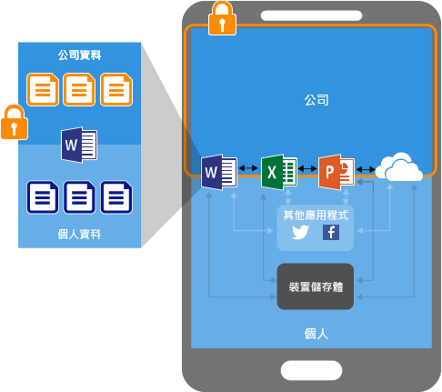
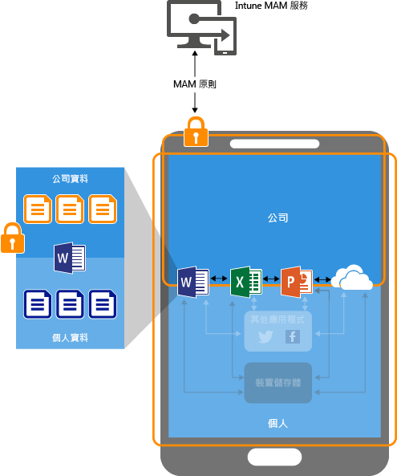

# 使用行動應用程式管理原則搭配 Microsoft Intune 保護應用程式資料

## 如何保護應用程式資料
您的員工使用行動裝置處理公私事務。 在您確保員工生產力的同時，也要防止故意和不小心的資料外洩。  此外，當員工使用並非由您管理的裝置來存取公司資料時，您會希望可以保護這些公司資料。

您可以使用 Intune 行動裝置應用程式管理 (MAM) 原則來協助保護公司的資料。 因為 Intune MAM 原則**可獨立於任何行動裝置管理 (MDM) 解決方案**之外使用，不論是否在裝置管理解決方案中註冊裝置，都可以使用 MAM 來保護公司的資料。 您可以實作**應用程式層級原則**，以限制存取公司資源，並將資料保留在 IT 部門範疇內。

您可以針對在下列裝置上執行之應用程式設定 MAM 原則：

-   **在 Microsoft Intune 中註冊︰**此類別中的裝置通常是公司所擁有的裝置。

-   **在註冊協力廠商 MDM 解決方案中註冊：**此類別中的裝置通常是公司擁有的裝置。

  > [!NOTE]
  > 不建議您使用 MAM 原則搭配協力廠商行動應用程式管理或安全容器解決方案。

-   **未在任何 MDM 解決方案中註冊︰**此類別中的裝置通常是員工所擁有的裝置，且沒有在 Intune 或其他 MDM 解決方案中受到管理或註冊。

> [!IMPORTANT]
> 您可以為連接至 Office 365 服務的 Office 行動應用程式建立行動應用程式管理原則。 連線到內部部署 Exchange、商務用 Skype 或 SharePoint 服務的應用程式不支援 MAM 原則。

## 使用 MAM 原則的優點

-   **它們可以協助於應用程式層級保護您的公司資料。** 因為行動應用程式管理不需要裝置管理，您可以同時在受管理與未受管理的裝置上保護公司資料。 管理的重心是使用者身分識別，不需要管理裝置。

-   **使用者生產力不受影響，當您在個人領域內使用應用程式時不套用原則。** 原則只會套用在工作內容上，所以您能夠在不碰到個人資料的情況下保護公司資料。

搭配 MAM 原則使用 MDM 還有其他優點，不論是否同時搭配 MDM，公司都可以使用 MAM。 例如，員工可能使用公司核發的手機，也可能使用個人平板電腦。 在此情況下，公司電話在 MDM 註冊並受 MAM 原則保護，而個人裝置只受到 MAM 原則保護。

- **MDM 確保裝置受到保護。** 例如，您可以要求存取裝置的 PIN，或者將受管理的應用程式部署到裝置。 也可以透過 MDM 解決方案將應用程式部署到裝置，取得對應用程式管理的更多控制。

- **MAM 原則確保應用程式層保護就定位。** 例如，您可以設定如下的原則：在工作環境中需要有 PIN 才能開啟應用程式、禁止資料在應用程式之間共用，以及禁止公司應用程式資料儲存到個人存放區位置。

## 支援 MAM 的裝置
下列平台目前支援 MAM：
-   iOS 8.1 或更新版本
-   Android 4 或更新版本

目前不支援 Windows 裝置。
##  MAM 原則如何保護應用程式資料

###  沒有 MAM 原則的應用程式

當您在沒有條件限制下使用應用程式時，公司和個人資料會互相混合。 公司資料最終可能會存放在類似個人存放區的位置，或者傳送至您權限範圍以外的應用程式，而導致資料遺失。 圖中的箭號顯示資料在應用程式 (公司和個人) 之間無限制移動和移至儲存體位置。

### 使用 MAM 原則的資料保護

您可以使用 MAM 原則來防止公司資料儲存至裝置的本機儲存體，並禁止資料移至未受 MAM 原則保護的其他應用程式。 MAM 原則設定包括：
- 資料重新配置原則，例如 [不可進行另存新檔]、[限制剪下、複製與貼上]。
- 存取原則設定，例如 [需要簡單 PIN 碼才可存取]、[禁止受管理的應用程式在經過破解或刷機的裝置上執行]。

### 在 MDM 解決方案所管理的裝置上使用 MAM 原則保護資料

**已在 MDM 解決方案中註冊的裝置**：上圖中顯示 MDM 與 MAM 原則共同提供的保護層。

MDM 解決方案：

-   註冊裝置。

-   將應用程式部署到裝置。

-   提供持續的裝置合規性和管理。

**MAM 原則很重要，因為它們︰**

-   協助保護公司資料不外洩給消費性應用程式和服務。

-   對行動應用程式套用限制 (另存新檔、剪貼簿、PIN 等等)。

-   抹除應用程式中的公司資料，但不從裝置移除這些應用程式。

### 在未註冊的裝置上使用 MAM 原則保護資料

上圖說明資料保護原則在沒有 MDM 的情況，於應用程式層級的運作方式。

對於未註冊任何 MDM 解決方案的 BYOD 裝置，MAM 原則可以協助在應用程式層級保護公司資料。

不過，有一些限制需要注意：

-   您無法將應用程式部署到裝置。 使用者必須從存放區取得應用程式。

-   您無法在這些裝置上佈建憑證設定檔。

-   您無法在這些裝置上設定公司 Wi-Fi 與 VPN 設定。

## 多重身分識別

當 MAM 原則只有在工作環境中使用應用程式時才會套用，支援多重身分識別的應用程式讓您能夠使用不同的帳戶 (工作和個人) 來存取相同的應用程式。  

例如，當使用者使用其工作帳戶啟動 OneDrive 應用程式，他們無法將檔案移動至個人存放區位置。 不過，當使用者以個人帳戶使用 OneDrive 時，他們可以從個人 OneDrive 複製並移動資料，而沒有任何限制。  

所有的 Office 行動裝置應用程式都支援多重身分存取。

##  後續步驟
- [準備好設定行動應用程式管理原則](get-ready-to-configure-mobile-app-management-policies-with-microsoft-intune.md)

- [使用 Microsoft Intune 建立並部署行動應用程式管理原則](create-and-deploy-mobile-app-management-policies-with-microsoft-intune.md)

<!--HONumber=Nov16_HO5-->

