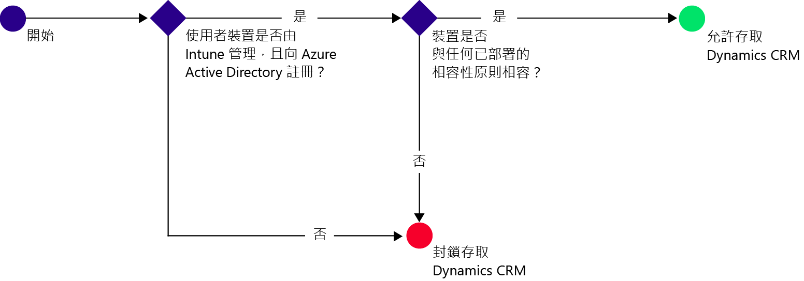

# 使用 Intune 限制對 Dynamics CRM Online 的存取

[!INCLUDE[classic-portal](../includes/classic-portal.md)]

您可以從 iOS 和 Android 裝置使用 Microsoft Intune 條件存取，以控制對 Microsoft Dynamics CRM Online 的存取。  Intune 條件式存取有兩個元件：
* [裝置合規性原則](introduction-to-device-compliance-policies-in-microsoft-intune.md)，裝置必須遵循此原則才算符合規範。
* [條件式存取原則](restrict-access-to-email-and-o365-services-with-microsoft-intune.md)，其中指定裝置必須符合才能存取服務的條件。

若要深入了解條件式存取如何運作，請參閱[限制電子郵件、Office 365 和其他服務的存取](restrict-access-to-email-and-o365-services-with-microsoft-intune.md)一文。

> [!IMPORTANT]
> 若要部署條件式存取，您必須訂閱 Intune 和 Azure Active Directory Premium，且使用者必須獲這兩項產品授權。 **Enterprise Mobility + Security (EMS) 訂閱**包括 Intune 和 Azure Active Directory Premium 訂閱。 如需詳細資訊，請瀏覽 [Enterprise Mobility 定價頁面](https://www.microsoft.com/en-us/cloud-platform/enterprise-mobility-pricing)。 若無 EMS 訂閱，您可以取得 Azure Active Directory Premium 訂閱。 請參閱 [Azure Active Directory 定價頁面](https://azure.microsoft.com/en-us/pricing/details/active-directory/)。

當目標使用者嘗試在其裝置上使用 Dynamics CRM 應用程式時，就會進行下列評估：

需要存取 Dynamics CRM Online 的裝置必須：
* 為 **Android** 或 **iOS** 裝置。
* **註冊** Intune。
* **符合**任何已部署的 Intune 合規性原則。

裝置狀態儲存在 Azure Active Directory 中，它會根據您指定的條件來授與或封鎖存取。

如不符合條件，使用者會在登入時看見下列訊息之一：
* 如果裝置未註冊 Intune，或未在 Azure Active Directory 中登錄，就會顯示訊息，指示如何安裝及註冊公司入口網站應用程式。
* 如果裝置不符合規範，即會顯示一則訊息，將使用者引導至 Microsoft Intune 公司入口網站或公司入口網站應用程式，讓他們能夠在該處找到問題的相關資訊，以及如何修復問題的方法。

## 設定 Dynamics CRM Online 的條件式存取  
### 步驟 1：設定 Active Directory 安全性群組

在開始之前，請先為條件式存取原則設定 Azure Active Directory 安全性群組。 您可以在 **Office 365 系統管理中心**設定這些群組。 您可以使用這些群組將使用者設為原則目標或者將他們從原則中豁免。 當使用者成為原則的目標時，他們使用的每個裝置都必須相容，才能存取資源。

您可以指定兩種群組類型來用於 Dynamics CRM 原則︰
* **目標群組**。 包含套用原則的使用者群組。
* **豁免群組**。 包含從原則中豁免的使用者群組。

如果使用者同時隸屬於這兩個群組，則將免套用原則。

### 步驟 2：設定及部署相容性原則
[建立](create-a-device-compliance-policy-in-microsoft-intune.md)合規性原則並[部署](deploy-and-monitor-a-device-compliance-policy-in-microsoft-intune.md)到將受此原則影響的所有裝置。 這些是目標群組中的使用者所使用的所有裝置。

> [!NOTE]
> 雖然合規性原則會部署到 Intune 群組，但條件式存取原則以 Azure Active Directory 安全性群組為目標。

> [!IMPORTANT]
> 如果您尚未部署相容性原則，則會將裝置視為相容。

當您就緒時，請繼續執行步驟 3。
### 步驟 3︰設定 Dynamics CRM 原則
接著，設定原則要求只有受管理和相容的裝置才可以存取 Dynamics CRM。 這項原則會儲存在 Azure Active Directory。

1.  在 Intune 管理主控台中，選擇 [原則] > [條件式存取] > [Dynamics CRM Online 原則]。

  

2.  選擇 [啟用條件式存取] 原則。
3.  在 [應用程存取] 下，您可以選擇將條件式存取原則套用至：
  * **iOS**
  * **Android**
4.  選擇 [目標群組] 下方的 [修改]，選取要套用原則的 Azure Active Directory 安全性群組。 您可以選擇以所有使用者或僅一群特定的使用者為目標。
5.  選擇性地選擇 [免套用的群組] 下方的 [修改]，選取免套用此原則的 Azure Active Directory 安全性群組。
6.  完成之後，請選擇 [儲存]。

您現在已設定 Dynamics CRM 的條件式存取。 您不需部署條件式存取原則，它會立即生效。
##  監視相容性及條件式存取原則

在 [群組]  工作區中，您可以檢視裝置的條件式存取狀態。

選擇任何行動裝置群組，然後在 [裝置] 索引標籤上，選擇下列 [篩選器] 其中之一：
* **沒有登錄 AAD 的裝置** 這些裝置受到封鎖而無法存取 Dynamics CRM。
* **不符合規範的裝置**。 這些裝置受到封鎖而無法存取 Dynamics CRM。
* **已登錄了 AAD 並符合規範的裝置**。 這些裝置可以存取 Dynamics CRM。

##  後續步驟
* [限制 Exchange Online 的存取](restrict-access-to-exchange-online-with-microsoft-intune.md)

* [限制 Exchange 內部部署 的存取](restrict-access-to-exchange-onpremises-with-microsoft-intune.md)
* [限制 SharePoint Online 的存取](restrict-access-to-sharepoint-online-with-microsoft-intune.md)

* [限制商務用 Skype Online 的存取](restrict-access-to-skype-for-business-online-with-microsoft-intune.md)

<!--HONumber=Jan17_HO4-->

