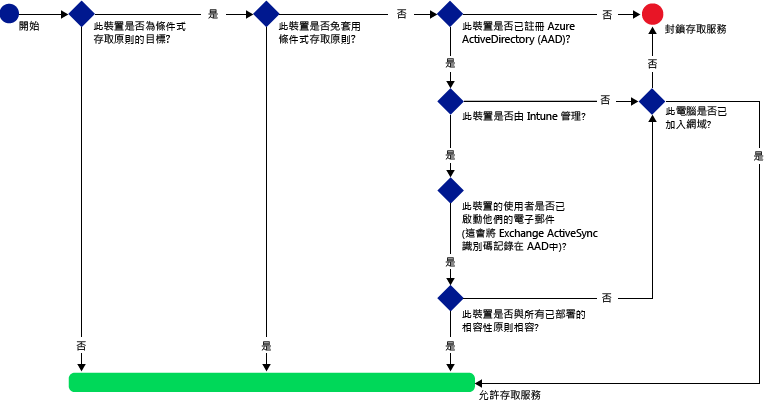
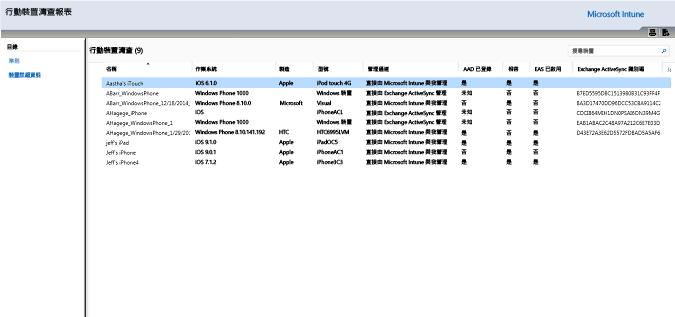
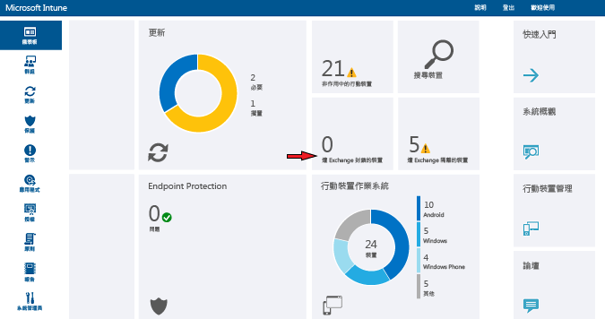

# 使用 Intune 限制 Exchange Online 和新版 Exchange Online Dedicated 的電子郵件存取

[!INCLUDE[classic-portal](../includes/classic-portal.md)]

您可以使用 Microsoft Intune，設定 Exchange Online 或 Exchange Online Dedicated 的條件式存取。 若要深入了解條件式存取如何運作，請參閱[限制電子郵件、O365 和其他服務的存取](restrict-access-to-email-and-o365-services-with-microsoft-intune.md)一文。

> [!NOTE]
>若要判斷您的 Exchange Online Dedicated 環境為新版或舊版，請連絡您的帳戶管理員。

## 開始之前

若要設定條件式存取，您必須：

-   具有**包含 Exchange Online (例如 E3) 的 Office 365 訂閱**，而且使用者必須獲得 Exchange Online 的授權。

- 具有 **Enterprise Mobility + Security (EMS) 訂用帳戶**或 **Azure Active Directory (Azure AD) Premium 訂用帳戶**，且使用者必須獲得 EMS 或 Azure AD 的授權。 如需詳細資訊，請參閱 [Enterprise Mobility 定價頁面](https://www.microsoft.com/en-us/cloud-platform/enterprise-mobility-pricing)或 [Azure Active Directory 定價頁面](https://azure.microsoft.com/en-us/pricing/details/active-directory/)。

-  考慮設定選擇性 **Intune Service to Service Connector**，它可將 [!INCLUDE[wit_nextref](../includes/wit_nextref_md.md)] 連接至 Exchange Online，並協助您透過 [!INCLUDE[wit_nextref](../includes/wit_nextref_md.md)] 主控台管理裝置資訊。 使用相容性原則或條件式存取原則時，您不需要使用連接器，但必須執行報告，以協助評估條件式存取的影響。
    -  深入了解 [Intune Service To Service Connector](intune-service-to-service-exchange-connector.md)。

   > [!NOTE]
   > 如果您想要針對 Exchange Online 及 Exchange 內部部署使用條件式存取，則請勿設定 Intune Service To Service Connector。

### 裝置合規性需求

在您設定好條件式存取原則及目標使用者之後，使用者所用的**裝置**必須符合下列條件，才能連接至電子郵件：

-   電腦應已加入網域或已向 [!INCLUDE[wit_nextref](../includes/wit_nextref_md.md)] **註冊**。

-  已在 **Azure Active Directory** 中註冊。 這會在裝置向 [!INCLUDE[wit_nextref](../includes/wit_nextref_md.md)] 註冊時自動完成。 此外，必須向 Azure Active Directory 註冊用戶端 Exchange ActiveSync 識別碼。

  若是 Intune 和 Office 365 客戶，系統會自動啟用 Azure Active Directory 裝置註冊服務。 已部署 ADFS 裝置註冊服務的客戶將不會在內部部署 Active Directory 中看到已註冊的裝置。

-   裝置必須**符合**所部署的 [!INCLUDE[wit_nextref](../includes/wit_nextref_md.md)] 相容性原則，或已加入內部部署網域。

如果不符合條件式存取原則，使用者會在登入時看到下列其中一個訊息：

- 如果裝置未向 [!INCLUDE[wit_nextref](../includes/wit_nextref_md.md)] 註冊，或未在 Azure Active Directory 中註冊，就會顯示一則訊息，其中包含安裝公司入口網站應用程式、註冊裝置及啟用電子郵件的指示。 此程序也會將裝置的 Exchange ActiveSync 識別碼與 Azure Active Directory 中的記錄產生關聯。

-   如果裝置評估結果為未遵循相容性原則規則，系統會將使用者引導至 [!INCLUDE[wit_nextref](../includes/wit_nextref_md.md)] 公司入口網站或公司入口網站應用程式，以尋找問題的相關資訊與修復問題的方法。

### 條件式存取對 Exchange online 的運作方式

下圖說明 Exchange Online 條件式存取原則的使用流程。

## 支援行動裝置
您可以限制**使用新式驗證的 Outlook 和其他應用程式**，使其無法存取 Exchange Online 電子郵件。 支援下列版本：

- Android 4.0 和更新版本、Samsung Knox Standard 4.0 和更新版本，以及 Android for Work
- iOS 8.0 和更新版本

[!INCLUDE[wit_nextref](../includes/afw_rollout_disclaimer.md)]

**新式驗證**可將 Active Directory 驗證程式庫 (ADAL) 型登入功能整合到 Office 用戶端中。

-   ADAL 型驗證可讓 Office 用戶端透過瀏覽器進行驗證 (又稱為被動驗證)。 系統會將使用者導向登入網頁，以便進行驗證。
-   這個新的登入方法可啟用**多重要素驗證**和**憑證式驗證**這類更高的安全性功能。 如需詳細資訊，請參閱[新式驗證的運作方式](https://support.office.com/en-US/article/How-modern-authentication-works-for-Office-2013-and-Office-2016-client-apps-e4c45989-4b1a-462e-a81b-2a13191cf517)。 您可以設定 ADFS 宣告規則來封鎖非新式驗證通訊協定。 [案例 3：除了瀏覽器架構的應用程式以外，封鎖所有對 O365 的存取](https://technet.microsoft.com/library/dn592182.aspx)提供詳細指示。

您可以限制使用者，使其無法透過 **iOS** 和 **Android** 裝置的瀏覽器，存取 Exchange Online 上的 **Outlook Web Access (OWA)**。 只允許從符合規範裝置上的支援瀏覽器存取︰

* Safari (iOS)
* Chrome (Android)
* Intune Managed Browser (iOS、Android 5.0 和更新版本)

   > [!IMPORTANT]
   > **不支援的瀏覽器則會遭到封鎖**。

**適用於 iOS 和 Android 的 OWA 應用程式可以修改為不使用新式驗證，且不予支援。必須透過 ADFS 宣告規則封鎖從 OWA 應用程式進行存取。**

您可以限制從下列平台內建的 **Exchange ActiveSync 電子郵件用戶端**來存取 Exchange 電子郵件：

- Android 4.0 和更新版本、Samsung Knox Standard 4.0 和更新版本

- iOS 8.0 和更新版本

- Windows Phone 8.1 和更新版本

## 對電腦的支援

如果執行 Office 桌面應用程式的電腦符合下列需求，您可以為這些電腦設定條件式存取，以便存取 **Exchange Online** 和 **SharePoint Online**：

-   電腦必須執行 Windows 7.0、Windows 8.1 或 Windows 10。

  >[!NOTE]
  > 若要搭配使用條件式存取與 Windows 10 電腦，您必須使用 Windows 10 年度更新版來更新這些電腦。

  電腦必須已加入網域或符合相容性規則。

  電腦必須在 [!INCLUDE[wit_nextref](../includes/wit_nextref_md.md)] 註冊且符合原則才算相容。

  若是已加入網域的電腦，您必須設定條件式存取以向 Azure Active Directory [自動註冊裝置](https://azure.microsoft.com/documentation/articles/active-directory-conditional-access-automatic-device-registration/)。

  >[!NOTE]
    >執行 Intune 電腦用戶端的電腦不支援條件式存取。

-   [必須啟用 Office 365 新式驗證](https://support.office.com/en-US/article/Using-Office-365-modern-authentication-with-Office-clients-776c0036-66fd-41cb-8928-5495c0f9168a)，並且具備所有最新的 Office 更新。

    新式驗證可將 Active Directory 驗證程式庫 (ADAL) 型登入功能整合到 Office 2013/Windows 用戶端中。 如此即可啟用**多重要素驗證**和**憑證式驗證**這類更高的安全性功能。

-   您可以設定 ADFS 宣告規則來封鎖非新式驗證通訊協定。 [案例 3：除了瀏覽器架構的應用程式以外，封鎖所有對 O365 的存取](https://technet.microsoft.com/library/dn592182.aspx)提供詳細指示。

## 設定條件式存取
### 步驟 1：設定及部署相容性原則
請務必[建立](create-a-device-compliance-policy-in-microsoft-intune.md)相容性原則，並將其[部署](deploy-and-monitor-a-device-compliance-policy-in-microsoft-intune.md)到使用者群組 (這些使用者群組也會取得條件式存取原則)。

> [!IMPORTANT]
> 如果您尚未部署相容性原則，則會將裝置視為符合規定，並允許存取 Exchange。

### 步驟 2：評估條件式存取原則的效果
您可以使用**行動裝置清查報表**，識別在您設定條件式存取原則之後可能不允許存取 Exchange 的裝置。

若要這麼做，請使用 [Microsoft Intune Service to Service Connector](intune-service-to-service-exchange-connector.md) 來設定 [!INCLUDE[wit_nextref](../includes/wit_nextref_md.md)] 和 Exchange 之間的連線。
1.  瀏覽至 [報表] > [行動裝置清查報表]。
![[行動裝置清查報表] 頁面的螢幕擷取畫面](../media/IntuneSA2bMobileDeviceInventoryReport.png)

2.  在報表參數中，選取您要評估的 [!INCLUDE[wit_nextref](../includes/wit_nextref_md.md)] 群組，以及要套用原則的裝置平台 (如有需要)。
3.  選取符合組織需求的準則之後，請選擇 [檢視報表]。
報表檢視器會在新視窗中開啟。

執行報表之後，請檢查下列四欄以判斷是否會封鎖使用者：

-   **管理通道**：指出裝置是否受到 Intune、Exchange ActiveSync 或兩者所管理。

-   **AAD 已登錄**：指出是否已向 Azure Active Directory 登錄裝置 (又稱為「工作地方聯結」)。

-   **相容**：指出裝置是否符合您部署的任何相容性原則。

-   **Exchange ActiveSync 識別碼**：iOS 和 Android 裝置的 Exchange ActiveSync 識別碼必須與 Azure Active Directory 中的裝置登錄記錄建立關聯。 這會在使用者選擇隔離電子郵件中的 [啟用電子郵件] 連結時發生。

    > [!NOTE]
    > Windows Phone 裝置永遠都會在此欄中顯示值。

除非欄值符合下表所列的值，否則會封鎖隸屬於目標群組的裝置，使其無法存取 Exchange：

--------------------------
|管理通道|AAD 已登錄|符合標準|Exchange ActiveSync 識別碼|產生的動作|
|----------------------|------------------|-------------|--------------------------|--------------------|
|**受到 Microsoft Intune 和 Exchange ActiveSync 所管理**|是|是|顯示值|允許電子郵件存取|
|任何其他值|否|否|不會顯示任何值|封鎖電子郵件存取|
----------------------
您可以匯出報表的內容，並使用 [電子郵件地址]  欄，通知使用者他們即將遭到封鎖。

### 步驟 3：針對條件式存取原則設定使用者群組
條件式存取原則以不同的 Azure Active Directory 使用者安全性群組為目標。 您也可以從條件式存取原則中免除特定使用者群組。 當使用者成為原則的目標時，他們使用的每個裝置都必須符合規定，才能存取電子郵件。

您可以在 **Office 365 系統管理中心**或 **Intune 帳戶入口網站**中設定這些群組。

您可以在每個原則中指定兩種群組類型：

-   **目標群組**：要套用原則的使用者群組。

-   **免套用的群組**：免套用原則的使用者群組 (選擇性)。

如果使用者同時隸屬於這兩個群組，則將免套用原則。

系統只會評估條件式存取原則的目標群組。

### 步驟 4：設定條件式存取原則

>[!NOTE]
> 您也可以在 Azure AD 管理主控台中建立條件式存取原則。 除了其他條件式存取原則 (例如多重要素驗證) 之外，Azure AD 管理主控台還可讓您建立 Intune 裝置條件式存取原則 (在 Azure AD 中稱為「裝置型條件式存取原則」)。

>您也可以針對 Azure AD 所支援的協力廠商企業應用程式 (例如，Salesforce 和 Box)，設定條件式存取原則。 如需詳細資訊，請參閱[如何設定 Azure Active Directory 裝置型條件式存取原則來控制對 Azure Active Directory 連線應用程式的存取](https://azure.microsoft.com/en-us/documentation/articles/active-directory-conditional-access-policy-connected-applications/)。

1.  在 [Microsoft Intune 管理主控台](https://manage.microsoft.com)中，選擇 [原則]  >  [條件式存取]  >  [Exchange Online 原則]。

2.  在 [Exchange Online 原則] 頁面上，選擇 [啟用 Exchange Online 的條件式存取原則]。

    > [!NOTE]
    > 如果您尚未部署相容性原則，則會將裝置視為符合規範。
    >
    > 無論相容性狀態為何，原則皆會要求所有使用者向 [!INCLUDE[wit_nextref](../includes/wit_nextref_md.md)] 註冊裝置。

3.  在 [應用程式存取] 下，針對使用新式驗證的應用程式，您有兩種方法可選擇要套用原則的平台。 支援的平台包括 Android、iOS、Windows 和 Windows Phone。

    -   **所有平台**

        任何用來存取 **Exchange Online** 的裝置都必須在 Intune 中註冊並符合原則。 使用**新式驗證**的任何用戶端應用程式都必須遵守條件式存取原則。 如果 Intune 目前不支援此平台，則會封鎖存取 **Exchange Online**。

        選取 [所有平台] 選項表示不論用戶端應用程式所回報的平台為何，Azure Active Directory 都會將此原則套用至所有驗證要求。 所有平台都必須經過註冊並符合規範，除了︰
        *   必須註冊並符合規範的 Windows 裝置、使用內部部署 Active Directory 加入網域的 Windows 裝置，或兩者。
        * 不支援例如 Mac OS 的平台。 即使這些平台的應用程式是使用新式驗證，仍會受到封鎖。

    -   **特定平台**

         在您指定之裝置平台上使用**新式驗證**的任何用戶端應用程式，都會套用條件式存取原則。

4. 在 **Outlook Web Access (OWA)** 中，您可以選擇只允許透過支援的瀏覽器來存取 Exchange Online︰Safari (iOS)，以及 Chrome (Android)。 從其他瀏覽器存取則會遭到禁止。 您選取的相同 Outlook 應用程式存取平台限制也適用於此處。

  在 **Android** 裝置上，使用者必須啟用瀏覽器存取。 若要完成這項動作，使用者必須啟用已註冊裝置上的 [啟用瀏覽器存取] 選項，如下所示：
  1.    開啟**公司入口網站應用程式**。
  2.    透過省略符號 (...) 或硬體功能表按鈕，移至 [設定] 頁面。
  3.    按下 **[啟用瀏覽器存取]** 按鈕。
  4.    在 Chrome 瀏覽器中，登出 Office 365 並重新啟動 Chrome。

  在 **iOS** 和 **Android** 平台上，若要識別用來存取服務的裝置，Azure Active Directory 會將傳輸層安全性 (TLS) 憑證核發給裝置。 裝置會顯示憑證，並提示使用者選取該憑證，如以下螢幕擷取畫面所示。 使用者必須選取此憑證，才能繼續使用瀏覽器。

  **iOS**

  

  **Android**

  

5.  在 [Exchange ActiveSync 應用程式] 下，您可以選擇禁止不相容的裝置存取 Exchange Online。 針對執行非支援平台的裝置，您也可以選擇允許或封鎖其存取電子郵件。 支援的平台包括 Android、iOS、Windows 和 Windows Phone。

 **Android for Work** 裝置上的 Exchange Active Sync 應用程式：
 -  Android for Work 裝置只支援**工作設定檔**中的 **Gmail** 和 **Nine Work** 應用程式。 若要讓條件式存取在 Android for Work 裝置上正常運作，您必須部署 Gmail 或 Nine Work 應用程式的電子郵件設定檔，並將它部署為**必要**安裝。

6.  在 [目標群組] 下，選取要套用原則的 Active Directory 安全性群組使用者。 您可以選擇針對所有使用者或選取的使用者群組清單。
![Exchange Online 條件式存取原則頁面的螢幕擷取畫面，其中顯示 [目標群組] 和 [免套用的群組] 選項](../media/IntuneSA5eTargetedExemptedGroups.PNG)
    > [!NOTE]
    > 針對 [目標群組] 中的使用者，Intune 原則會取代 Exchange 規則和原則。
    >
    > 只有在下列情況中，Exchange 才會強制 Exchange 允許、封鎖和隔離規則及 Exchange 原則：
    >
    > -   使用者未取得使用 Intune 的授權。
    > -   使用者已取得使用 Intune 的授權，但不屬於條件式存取原則中的任何目標安全性群組。

6.  在 [免套用的群組] 下方，選取免套用此原則之使用者的 Active Directory 安全性群組。 若使用者同時隸屬於目標群組及免套用的群組，則免套用此原則。

7.  完成後，選擇 [儲存]。

-   您不需部署條件式存取原則，它會立即生效。

-   在使用者建立電子郵件帳戶之後，裝置會立即遭到封鎖。

-   如果受封鎖的使用者向 [!INCLUDE[wit_nextref](../includes/wit_nextref_md.md)] 註冊裝置並修正任何不符合規範的問題，則會在&2; 分鐘內解除封鎖電子郵件存取。

-   如果使用者取消註冊其裝置，大約會在&6; 小時後封鎖電子郵件。

若要查看**如何設定條件式存取原則以限制裝置存取的範例案例**，請參閱[限制存取電子郵件的範例案例](restrict-email-access-example-scenarios.md)。

## 監視相容性及條件式存取原則

#### 檢視遭 Exchange 封鎖的裝置

在 [!INCLUDE[wit_nextref](../includes/wit_nextref_md.md)] 儀表板上，選擇 [遭 Exchange 封鎖的裝置] 磚，以顯示已封鎖的裝置數目以及其他更多資訊的連結。

## 後續步驟
- [限制 SharePoint Online 的存取](restrict-access-to-sharepoint-online-with-microsoft-intune.md)

- [限制商務用 Skype Online 的存取](restrict-access-to-skype-for-business-online-with-microsoft-intune.md)

<!--HONumber=Feb17_HO1-->

