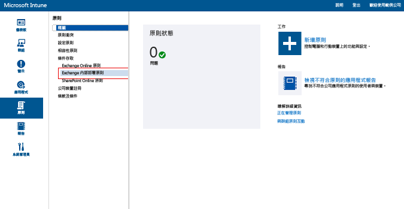

# 使用 Intune 限制 Exchange 內部部署和舊版 Exchange Online Dedicated 的電子郵件存取

[!INCLUDE[classic-portal](../includes/classic-portal.md)]

您可以使用 Microsoft Intune 設定條件式存取，控制 Exchange 內部部署或舊版 Exchange Online Dedicated 的電子郵件存取。
若要深入了解條件式存取如何運作，請參閱[限制電子郵件和 O365 服務的存取](restrict-access-to-email-and-o365-services-with-microsoft-intune.md)一文。

> [!NOTE]
> 若要判斷您的 Exchange Online Dedicated 環境為新版或舊版，請連絡您的帳戶管理員。

## 開始之前

請務必確認下列項目︰

-   您的 Exchange 版本必須是 **Exchange 2010 或更新版本**。 支援 Exchange Server Client Access Server (CAS) 陣列。

-   您必須使用 [Intune On-Premises Exchange Connector](intune-on-premises-exchange-connector.md)，將 [!INCLUDE[wit_nextref](../includes/wit_nextref_md.md)] 連接到 Exchange 內部部署。 這可讓您透過 [!INCLUDE[wit_nextref](../includes/wit_nextref_md.md)] 主控台管理裝置。

    -   Intune 主控台提供給您的內部部署 Exchange Connector 是專用於您的 Intune 租用戶，無法搭配任何其他租用戶使用。 建議您也要注意：租用戶專屬的 Exchange Connector **只能安裝在一部電腦上**。

        您可以從 Intune 管理主控台下載連接器。 如需如何設定內部部署 Exchange 連接器的逐步解說，請參閱[設定適用於內部部署或託管 Exchange 的 Exchange 內部部署連接器](intune-on-premises-exchange-connector.md)。

    -   您可以將連接器安裝在任何能與 Exchange 伺服器通訊的電腦上。

    -   連接器支援 **Exchange CAS 環境**。 技術上來說，您也可以直接將連接器安裝在 Exchange CAS 伺服器上。 不過，我們不建議您這麼做，因為這樣會增加伺服器的負載。 設定連接器時，您必須將它設為可以與其中一部 Exchange CAS 伺服器通訊。

-   設定 **Exchange ActiveSync** 時，您必須使用憑證式驗證或使用者認證項目。

### 裝置合規性需求

在您設定好條件式存取原則及目標使用者之後，使用者所用的**裝置**必須符合下列條件，才能連接至電子郵件：

-  電腦應已加入網域或已向 [!INCLUDE[wit_nextref](../includes/wit_nextref_md.md)] **註冊**。

-  已在 **Azure Active Directory** 中註冊。 此外，必須向 Azure Active Directory 註冊用戶端 Exchange ActiveSync 識別碼。

  若是 Intune 和 Office 365 客戶，系統會自動啟用 Azure Active Directory 裝置註冊服務。 已部署 ADFS 裝置註冊服務的客戶將不會在內部部署 Active Directory 中看到已註冊的裝置。 **這不適用於 Windows 電腦和 Windows Phone 裝置**。

-   裝置必須**符合**所部署的 [!INCLUDE[wit_nextref](../includes/wit_nextref_md.md)] 相容性原則。

### 條件式存取對 Exchange 內部部署的運作方式

下圖說明 Exchange 內部部署的條件式存取原則在評估允許或封鎖裝置時的流程。

如果不符合條件式存取原則，使用者會在登入時看到下列其中一個訊息：

- 如果裝置未向 [!INCLUDE[wit_nextref](../includes/wit_nextref_md.md)] 註冊，或未在 Azure Active Directory 中註冊，就會顯示一則訊息，其中包含安裝公司入口網站應用程式、註冊裝置及啟用電子郵件的指示。 此程序也會將裝置的 Exchange ActiveSync 識別碼與 Azure Active Directory 中的記錄產生關聯。

-   如果裝置不符合規範，就會顯示一則訊息，以將使用者引導至 [!INCLUDE[wit_nextref](../includes/wit_nextref_md.md)] 公司入口網站或公司入口網站應用程式，以尋找問題的相關資訊與修復的方法。

## 支援行動裝置
支援下列版本：
-   Windows Phone 8.1 和更新版本。

-   iOS 上的原生電子郵件應用程式。

-   Exchange ActiveSync 郵件用戶端 (例如 Android 4 或更新版本上的 Gmail)。
- **Android for Work 裝置**上的 Exchange ActiveSync 郵件用戶端：Android for Work 裝置只支援 **Work 設定檔**中的 **Gmail** 和 **Nine Work** 應用程式。 若要讓條件式存取搭配 Android for Work 使用，您必須部署 Gmail 或 Nine Work 應用程式的電子郵件設定檔，並將這些應用程式部署為必要安裝。 

[!INCLUDE[wit_nextref](../includes/afw_rollout_disclaimer.md)]

> [!NOTE]
> 不支援適用於 Android 和 iOS 的 Microsoft Outlook 應用程式。

## 對電腦的支援
支援下列項目：
-   Windows 8.1 和更新版本上的**郵件**應用程式 (電腦已註冊 [!INCLUDE[wit_nextref](../includes/wit_nextref_md.md)])。

##  設定條件式存取原則

1.  在 [Microsoft Intune 管理主控台](https://manage.microsoft.com)中，選擇 **[原則]** > **[條件式存取]** > **[Exchange 內部部署原則]**。

2.  使用所需的設定來設定原則：

  - **封鎖不符合規範或未向 Microsoft Intune 註冊之裝置的電子郵件應用程式存取 Exchange 內部部署**：當您選取此選項時，將封鎖未受 [!INCLUDE[wit_nextref](../includes/wit_nextref_md.md)] 管理或不符合相容性原則的裝置存取 Exchange 服務。

  - **預設規則覆寫 - 一律允許已註冊且相容的裝置存取 Exchange**：當您選取此選項時，將允許已在 Intune 中註冊且符合相容性原則的裝置存取 Exchange。
  此規則會覆寫 [預設規則]，這表示即使您將 [預設規則] 設為隔離或封鎖存取，已註冊且符合規範的裝置仍能夠存取 Exchange。

  - **目標群組**：選取必須向 [!INCLUDE[wit_nextref](../includes/wit_nextref_md.md)] 註冊裝置才能存取 Exchange 的 [!INCLUDE[wit_nextref](../includes/wit_nextref_md.md)] 使用者群組。

  - **免套用的群組**：選取免套用條件式存取原則的 [!INCLUDE[wit_nextref](../includes/wit_nextref_md.md)] 使用者群組。 此清單中的使用者即使也在 [目標群組] 清單中，仍免套用原則。

  - **平台例外狀況**：選擇 [新增規則] 設定規則，以針對指定的行動裝置系列和機型來定義存取層級。 由於這些裝置可以是任何類型，因此您也可以設定 [!INCLUDE[wit_nextref](../includes/wit_nextref_md.md)] 不支援的裝置類型。

  - **預設規則**：針對任何其他規則未涵蓋的裝置，您可以選擇允許它存取 Exchange、封鎖它或隔離它。 當您設定規則以允許存取時，對於已註冊且相容的裝置而言，將自動授與 iOS、Windows 和 Samsung KNOX 裝置的電子郵件存取。 使用者不必經過任何程序即可取得電子郵件。

        如果 Android 裝置不是執行 Samsung KNOX，使用者會收到隔離電子郵件，其中包含驗證註冊和相容性的引導式逐步解說，之後才可存取電子郵件。 如果您將規則設為封鎖存取或隔離裝置，則所有裝置都將遭封鎖而無法存取 Exchange，不論是否已在 Intune 註冊皆同。 若要避免已註冊且符合規範的裝置受到此規則的影響，請核取 [預設規則覆寫] 方塊。
>[!TIP]
>如果您想先封鎖所有裝置之後再授與電子郵件存取權，請選擇 [封鎖存取] 規則或 [隔離] 規則。 預設規則將套用到所有裝置類型，因此您設定為平台例外狀況的裝置類型以及 [!INCLUDE[wit_nextref](../includes/wit_nextref_md.md)] 不支援的裝置類型也會受到影響。

  - **使用者通知**：除了 Exchange 傳送的通知電子郵件，Intune 也會傳送包含裝置解除封鎖步驟的電子郵件。 您可以編輯預設訊息，依照您的需求來自訂。 萬一使用者在收到 Intune 通知電子郵件之前 (這封包含修復指示的電子郵件會傳遞到使用者的 Exchange 信箱)，裝置就遭到封鎖，他們可以使用未封鎖的裝置或其他方法來存取 Exchange 並檢視該訊息。

        This is especially true when the **Default Rule** is set to block or quarantine. In this case, the user has to go to their app store, download the Microsoft Company Portal app, and enroll their device. This is applicable to iOS, Windows, and Samsung KNOX devices. For devices that don't run Samsung KNOX, you need to send the quarantine email to an alternate email account. The user has to copy the email to their blocked device to complete the enrollment and compliance process.
  > [!NOTE]
  > 為了讓 Exchange 能夠傳送通知電子郵件，您必須指定應該用來傳送通知電子郵件的帳戶。
  >
  > 如需詳細資訊，請參閱[設定適用於內部部署或託管 Exchange 的內部部署 Exchange Connector](intune-on-premises-exchange-connector.md)。

3.  完成後，選擇 [儲存]。

-   您不需部署條件式存取原則，它會立即生效。

-   在使用者設好 Exchange ActiveSync 設定檔之後，可能需要&1;-3 個小時才能封鎖裝置 (如果不是由 [!INCLUDE[wit_nextref](../includes/wit_nextref_md.md)] 管理)。

-   如果封鎖的使用者之後向 [!INCLUDE[wit_nextref](../includes/wit_nextref_md.md)] 註冊裝置並修復不相容性，則會在&2; 分鐘內解除封鎖電子郵件存取。

-   如果使用者從 [!INCLUDE[wit_nextref](../includes/wit_nextref_md.md)] 取消註冊，則可能需要&1;-3 個小時才能封鎖裝置。

**若要查看如何設定條件式存取原則以限制裝置存取的範例案例，請參閱[限制存取電子郵件的範例案例](restrict-email-access-example-scenarios.md)。**

## 後續步驟
-   [限制 SharePoint Online 的存取](restrict-access-to-sharepoint-online-with-microsoft-intune.md)

-   [限制商務用 Skype Online 的存取](restrict-access-to-skype-for-business-online-with-microsoft-intune.md)

<!--HONumber=Feb17_HO1-->

