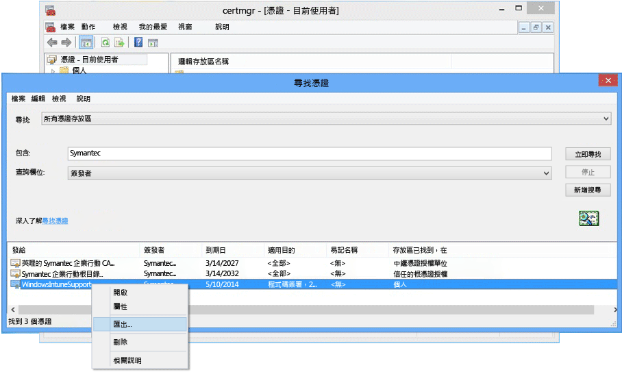

# <a name="sign-line-of-business-apps-so-they-can-be-deployed-to-windows-devices-with-intune"></a>簽署企業營運應用程式以使用 Intune 將它們部署到 Windows 裝置

身為 Intune 系統管理員，您可以將企業營運 (LOB) 應用程式部署到 Windows 和 Windows 10 行動裝置版的裝置，包括公司入口網站應用程式。 若要將 .appx 或.xap 應用程式部署到 Windows 10 和 Windows 10 行動裝置版的裝置，或將任何 LOB 應用程式部署到 Windows 8.1 或 Windows Phone 8.1 裝置，您必須取得 **Symantec 企業行動程式碼簽署憑證**。 這些適用於個別 Windows 裝置的應用程式只信任 Symantec 憑證。 您可以針對 Windows 10 應用程式和「通用」應用程式，使用自己的憑證授權單位。 您必須擁有此憑證，才能執行下列動作：

-   簽署公司入口網站應用程式以部署到 Windows 電腦、Windows 10 行動裝置版的裝置和 Windows Phone 裝置

-   簽署公司企業營運系統應用程式，讓 Intune 可將其部署到 Windows Phone

下列步驟可協助您取得所需的憑證及簽署應用程式。 您需要 Windows Phone 開發人員中心帳戶，還必須購買 Symantec 憑證。


1. **加入 Windows Phone 開發人員中心**<br>
   在登入以購買公司帳戶時，使用公司帳戶資訊加入 [Windows Phone 開發人員中心](http://go.microsoft.com/fwlink/?LinkId=268442) 。 這項要求需要在您收到程式碼簽署憑證之前，由公司主管人員授權。

2. **取得公司 Symantec 憑證**<br>
  使用您的 Symantec 識別碼，從 [Symantec 網站](http://go.microsoft.com/fwlink/?LinkId=268441) 購買憑證。 購買憑證後，您在 Windows Phone 開發人員中心帳戶中指定的公司核准者將收到一封請求核准憑證要求的電子郵件。 如需 Symantec 憑證需求的詳細資訊，請參閱[為什麼 Windows Phone 需要 Symantec 憑證？](https://technet.microsoft.com/en-us/library/dn764959.aspx#BKMK_Symantec) Windows 裝置註冊常見問題集。

3.  **匯入憑證**<br>
    一旦核准要求後，您就會收到包含匯入憑證指示的電子郵件。 請遵循電子郵件中的指示，匯入憑證。

4.  **確認憑證已匯入**<br>
    若要確認憑證是否已正確匯入，請移至 [憑證] 嵌入式管理單元，以滑鼠右鍵按一下 [憑證]，然後選取 [尋找憑證]。 在 [包含]  欄位中輸入 “Symantec”，然後按一下 [立即尋找] 。 您匯入的憑證應該會出現在結果中。

    

5. **匯出簽署憑證**<br>
    確認憑證存在之後，您就可以匯出 .pfx 檔案來簽署公司入口網站。 選取 [使用目的] 為「程式碼簽署」的 Symantec 憑證。 以滑鼠右鍵按一下該程式碼簽署憑證，然後選取 [匯出]。

    

    在 **[憑證匯出精靈]**中，選取 [是，匯出私密金鑰]  ，然後按一下 [下一步] 。 **選取 [個人資訊交換 – PKCS #12 (.PFX)]**，然後選取 [如果可能的話，包含憑證路徑中的所有憑證]。 完成精靈。 如需詳細資訊，請參閱 [How to Export a Certificate with the Private Key (如何以私密金鑰匯出憑證)](http://go.microsoft.com/fwlink/?LinkID=203031)。

6.  **將應用程式上傳至 Intune**<br>
    上傳已簽署的應用程式檔案和您的程式碼簽署憑證，讓使用者能夠使用應用程式。

    1.  在 [Intune 管理主控台](http://manage.microsoft.com)中，按一下 **[系統管理]** &gt; **[Windows Phone]**。

    2.  按一下 [上傳已簽署的應用程式檔案] ，並使用您的 Intune 系統管理員識別碼登入。

    3.  將您匯出的憑證 (.pfx) 檔案新增至 [程式碼簽署憑證]，並建立憑證的密碼。

    4.  完成精靈。

## <a name="example-download-sign-and-deploy-the-company-portal-app-for-windows-devices"></a>範例：下載、簽署和部署適用於 Windows 裝置的公司入口網站應用程式

您可以使用 Intune，將公司入口網站應用程式部署到 Windows 裝置 (包括 Windows Phone 和 Windows 10 行動裝置版的裝置)，而不是從 Windows 市集進行安裝。 您必須下載公司入口網站應用程式，並使用您的憑證進行簽署。  只有在您的使用者不會使用公司市集，並且您想要將公司入口網站部署到 Windows Phone 8.1 裝置時，才需要執行這項動作。


1.  **下載公司入口網站**

    若要使用 Intune 部署公司入口網站應用程式，您可以從下載中心下載[適用於 Windows Phone 8.1 的 Microsoft Intune 公司入口網站應用程式](http://go.microsoft.com/fwlink/?LinkId=615799)，並執行自我解壓縮 (.exe) 檔案。 此檔案會包含兩個檔案：

    -   CompanyPortal.appx - 適用於 Windows Phone 8.1 的公司入口網站安裝應用程式

    -   WinPhoneCompanyPortal.ps1 - PowerShell 指令碼，您可用來簽署公司入口網站應用程式檔案，因此可將它部署到 Windows Phone 8.1 裝置

    或者，您可以從[商務用 Windows 市集](http://businessstore.microsoft.com/)下載 Windows Phone 8.1 公司入口網站 (離線授權套件) 或 Windows 10 公司入口網站 (離線授權套件)。 您必須使用離線授權及下載來供離線使用的適當封裝，來取得公司入口網站應用程式。 選項中的 Windows 8 和 Windows Phone 8 平台清單會參考其 8.1 對應項。 如需如何使用 Intune 執行此作業的相關詳細資訊，請參閱[管理購自商務用 Windows 市集的應用程式](manage-apps-you-purchased-from-the-windows-store-for-business-with-microsoft-intune.md)。

2.  **下載 Windows Phone SDK** 下載 Windows Phone SDK 8.0](http://go.microsoft.com/fwlink/?LinkId=615570)，並將 SDK 安裝到您的電腦。 您需要有這個 SDK，才能產生應用程式註冊權杖。

3.  **產生 AETX 檔案**：使用 AETGenerator.exe，從 Symantec PFX 檔案產生應用程式註冊權杖 (.aetx) 檔案，其為 Windows Phone SDK 8.0 的一部分。 如需如何建立 AETX 檔案的相關指示，請參閱 [如何產生適用於 Windows Phone 的應用程式註冊權杖](https://msdn.microsoft.com/library/windows/apps/jj735576.aspx)

4.  **下載適用於 Windows 8.1 的 Windows SDK**：下載並安裝 [Windows Phone SDK](http://go.microsoft.com/fwlink/?LinkId=613525) (http://go.microsoft.com/fwlink/?LinkId=613525)。 請注意，公司入口網站應用程式隨附的 PowerShell 指令碼會使用預設安裝位置 `${env:ProgramFiles(x86)}\Windows Kits\8.1`。 如果您安裝在其他地方，就必須在 cmdlet 參數中包含位置。

5.  **使用 PowerShell 進行應用程式的程式碼簽署**：以系統管理員身分，在主機電腦上開啟與 Windows SDK 一併安裝的 **Windows PowerShell**、Symantec 企業行動程式碼簽署憑證，巡覽至 Sign-WinPhoneCompanyPortal.ps1 檔案，然後執行指令碼。

    **範例 1**

    ```
    .\Sign-WinPhoneCompanyPortal.ps1 -InputAppx 'C:\temp\CompanyPortal.appx' -OutputAppx 'C:\temp\CompanyPortalEnterpriseSigned.appx' -PfxFilePath 'C:\signing\cert.pfx' -PfxPassword '1234' -AetxPath 'C:\signing\cert.aetx'
    ```
    這個範例會簽署 C:\temp\ 中的 CompanyPortal.appx，並產生 CompanyPortalEnterpriseSigned.appx。 它會使用 PFX 密碼 1234，並從 PFX 檔案中讀取發行者識別碼。 它也會從 cert.aetx 檔案讀取企業識別碼。

    **範例 2**

    ```
    .\Sign-WinPhoneCompanyPortal.ps1 -InputAppx 'C:\temp\CompanyPortal.appx' -OutputAppx 'C:\temp\CompanyPortalEnterpriseSigned.appx' -PfxFilePath 'C:\signing\cert.pfx' -PfxPassword '1234' -PublisherId 'OID.0.9.2342.19200300.100.1.1=1000000001, CN="Test, Inc.", OU=Test 1' -EnterpriseId 1000000001
    ```
    這個範例會簽署 C:\temp\ 中的 CompanyPortal.appx，並產生 CompanyPortalEnterpriseSigned.appx。 其會使用 PFX 密碼 1234，並使用指定的發行者識別碼。

    **參數：**

    -   `-InputAppx` - 以單引號括住的 CompanyPortal.appx 檔案的本機路徑。 例如 ' C:\temp\CompanyPortal.appx'

    -   `-OutputAppx` - 以單引號括住的已簽署公司入口網站應用程式的本機路徑和檔案名稱。 例如，' C:\temp\CompanyPortalEnterpriseSigned.appx'

    -   `-PfxFilePath` - Symantec 憑證的已匯出 PFX 檔案的本機路徑和檔案名稱。 例如，' C:\signing\cert.pfx'

    -   `-PfxPassword` - 以單引號括住、用來簽署 PFX 檔案的密碼。 例如，'1234'

    -   `-AetxPath` - 如果未定義的 'EnterpriseId' 引數，可用來讀取企業識別碼的 .aetx 檔案的本機路徑。 您必須提供這個引數或 EnterpriseId。 例如，'C:\signing\cert.aetx'

    -   `-PublisherId` - 企業的發行者識別碼。 如果這個參數不存在，則會使用 Symantec 企業行動程式碼簽署憑證的 [主旨] 欄位。 例如 'OID.0.9.2342.19200300.100.1.1=1000000001, CN="Test, Inc.", OU=Test 1'

    -   `-SdkPath` - 適用於 Windows 8.1 之 Windows SDK 的根資料夾路徑。 這個引數是選擇性，且預設值為 ${env:ProgramFiles(x86)}\Windows Kits\8.1。

    -   `-EnterpriseId` - 企業識別碼。 您必須提供這個引數或 'AetxPath'。 如果未提供這個引數，則會從 AETX 檔案讀取企業識別碼。 例如，1000000001

6.  部署 Windows Phone 8.1 公司入口網站 (SSP.appx) 應用程式。 如需指引，請參閱[在 Microsoft Intune 中部署應用程式](deploy-apps-in-microsoft-intune.md)。

## <a name="how-to-renew-the-symantec-enterprise-code-signing-certificate"></a>如何更新 Symantec 企業程式碼簽署憑證

用來部署 Windows 和 Windows Phone 行動應用程式的 Symantec 憑證必須定期更新。

1.  在憑證到期約 14 天前，請尋找 Symantec 寄來的更新電子郵件。 這封電子郵件會包含來自 Symantec 有關更新您企業憑證的指引。

    如需 Symantec 憑證的詳細資訊，請瀏覽 [www.symantec.com](http://www.symantec.com)，或致電 1-877-438-8776 或 1-650-426-3400。

2.  移至網站 (例如， [https://products.websecurity.symantec.com/orders/enrollment/microsoftCert.do](https://products.websecurity.symantec.com/orders/enrollment/microsoftCert.do))，並使用 Symantec 發行者識別碼和與憑證相關的電子郵件位址登入。 請務必使用您用以下載憑證的電腦來啟動更新。

3.  一旦更新核准，且已支付，即可下載憑證。

### <a name="how-to-install-the-updated-certificate-for-line-of-business-lob-apps"></a>如何安裝企業營運 (LOB) 應用程式的更新憑證

1.  簽署企業營運應用程式的最新版本。

2.  開啟 Intune 管理主控台 ([https://admin.manage.microsoft.com](https://admin.manage.microsoft.com))，並移至 [管理員] &gt; [行動裝置管理] &gt; [Windows Phone]，然後按一下 [上傳已簽署的應用程式]。

3.  上傳新簽署的公司入口網站。 您會需要新簽署的 SSP.xap，以及您從 Symantec 收到的 .PFX 檔案，或由此 .PFX 檔案所建立的應用程式註冊權杖。

4.  上傳完成後，請從 [軟體]   工作區中移除舊版公司入口網站。

5.  使用新的憑證簽署所有新增及更新的企業營運應用程式。 現有的應用程式無須重新簽署，也無須重新部署。


<!--HONumber=Dec16_HO2-->


