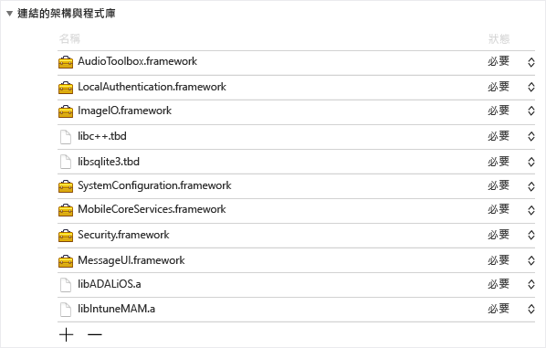
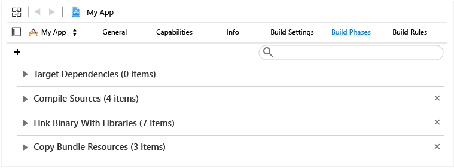
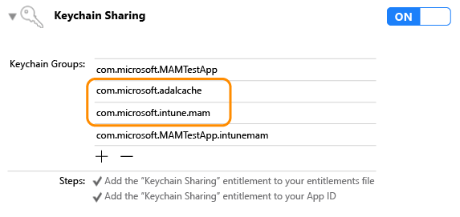

# Microsoft Intune App SDK for iOS 開發人員指南

> [!NOTE]
> 您可能想要先閱讀 [Intune App SDK 快速入門指南](intune-app-sdk-get-started.md)，其中說明如何在每個支援的平台上進行整合準備。* 

Microsoft Intune App SDK for iOS 可讓您將 Intune 行動應用程式管理 (MAM) 併入 iOS 應用程式中。 啟用 MAM 的應用程式是與 Intune App SDK 整合的應用程式，可讓 IT 系統管理員將原則部署至主動管理的行動應用程式。

## SDK 的功能

Intune App SDK for iOS 包含靜態程式庫、資源檔、API 標頭、偵錯設定 plist 及設定程式工具。 若要強制執行大部分原則，行動應用程式只需要包含資源檔並以靜態方式連結至程式庫。 進階 Intune MAM 功能則是透過 API 來強制執行。
本指南將說明如何使用下列項目來整合 Intune App SDK for iOS：

* **`libIntuneMAM.a`**：Intune App SDK 程式庫。 將這個程式庫連結至您的專案，以啟用行動應用程式的 MAM。 您可以在本文的＜使用 Intune App SDK 建置您的應用程式＞一節中找到相關指示。

* **`IntuneMAMResources.Bundle`**：包含 SDK 相依資源的資源配套。 

* **標頭**：公開 Intune App SDK API。 如果您使用 API，您必須加入包含 API 的標頭檔。 

## Intune App SDK 的運作方式

Intune App SDK for iOS 的目標是以最少的程式碼變更，將管理功能加入 iOS 應用程式中。 減少程式碼變更數量可縮短上市時間，同時提高行動應用程式的一致性與穩定性。 

應用程式必須連結至靜態程式庫並包含資源配套。 MAMDebugSettings.plist 是選擇性檔案，可包含在套件中，以模擬如何將 MAM 原則套用至應用程式，而不必透過 Microsoft Intune 部署應用程式。 此外在偵錯組建中，您還可以透過 iTunes 檔案共用，將 MAMDebugSettings.plist 檔案傳輸至應用程式的 [文件] 目錄，以套用 MAMDebugSettings.plist 檔案中的原則。

## 使用 Intune App SDK 建置您的應用程式 

請完成下列步驟以啟用 Intune App SDK：

1. 執行下列作業以連結至 `libIntuneMAM.a` 程式庫：

    將 libIntuneMAM.a 程式庫拖放至專案目標的 [連結架構和程式庫] 清單中。  

    
 
    **注意**：發行至 App Store 時，請使用針對發行建置的 libIntuneMAM.a 版本，而非偵錯版本。 發行版本會在 [發行] 資料夾中。 偵錯版本包含詳細資訊輸出，適用於偵錯與 Intune App SDK 相關的問題。

2. 將下列 iOS 架構加入專案中 (如有遺漏)。
    * `MessageUI.framework`
    * `Security.framework`
    * `MobileCoreServices.framework`
    * `SystemConfiguration.framework`
    * `libsqlite3.dylib`
    * `libc++.dylib`
    * `ImageIO.framework`
    * `LocalAuthentication.Framework`
    * `AudioToolbox.framework` 

    **注意**：如果應用程式是以 iOS7 為目標，請將 `LocalAuthentication.Framework` 的 [狀態] 屬性設定為 [選擇性]。 

    如果未設定 [狀態]，則應用程式將無法在 iOS7 上啟動。

    **注意**：Xcode 7 已將 `.dylib` 副檔名切換為 `.tbd`。

3. 藉由拖曳 [建置階段] 內 [複製配套資源] 下的資源配套，將 `IntuneMAMResources.bundle` 資源配套加入專案中。 

    

4. 將 `-force_load {PATH_TO_LIB}/libIntuneMAM.a` 加入下列任一項中，並以 Intune App SDK 位置取代 `{PATH_TO_LIB}` ：
    * 專案的 OTHER_LDFLAGS 組建組態設定 
    * UI 的 [其他連結器旗標] 

    **注意**：若要尋找 `PATH_TO_LIB`，請選取 `libIntuneMAM.a` 檔案，然後從 [檔案] 功能表選擇 [取得資訊]。 從 [資訊] 視窗的 [一般] 區段，複製並貼上的 [位置] 資訊 (路徑) 。

5. 如果您的行動應用程式在其 `info.plist`中定義主要 Nib 或腳本，請移除 [主要腳本] 或 [主要 Nib] 檔案欄位。 如果適當的話，請使用下列索引鍵名稱，將您先前移除的腳本或 Nib 值加入名為 `IntuneMAMSettings` 的新目錄下：
    * `MainStoryboardFile`
    * `MainStoryboardFile~ipad`
    * `MainNibFile`
    * `MainNibFile~ipad `
    
    如果您的行動應用程式未在其 `info.plist`中定義主要 Nib 或腳本，則 **不需要**。 

    **注意**：您可以在文件本文中的任何位置按一下滑鼠右鍵，然後將檢視類型變更為 [顯示原始索引鍵/值]，來檢視原始格式的 `info.plist` (以查看索引鍵名稱)。

6. 如果尚未啟用 Keychain 共用，請在每個專案目標中按一下 [功能]，然後啟用 Keychain 共用參數來加以啟用。 您必須共用 Keychain 才能繼續進行下一個步驟。

    **注意**：您的佈建設定檔必須能夠支援新的 Keychain 共用值。 Keychain 存取群組應該支援萬用字元。 若要驗證這項作業，請在文字編輯器中開啟 `.mobileprovision` 檔案，搜尋 'keychain-access-groups'，並確認是否有萬用字元，例如： 

       <key>keychain-access-groups</key>
       <array>
       <string>YOURBUNDLESEEDID.*</string>
       </array>

7. 啟用 Keychain 共用之後，請遵循下列步驟建立另一個用於儲存 Intune App SDK 資料的存取群組。 您可以使用 UI 或權利檔案來建立 Keychain 存取群組：

    使用 UI 建立 Keychain 存取群組： 
    
    * 如果您的行動應用程式未定義任何 Keychain 存取群組，請加入應用程式的配套識別碼作為第一個群組。
    * 加入共用的 Keychain 群組 com.microsoft.intune.mam。 Intune App SDK 使用這個存取群組來儲存資料。  
    * 藉由拖曳 [建置階段] 內 [複製配套資源] 下的資源配套，將 `com.microsoft.adalcache` 加入現有的存取群組中。 
 
    

    如果您使用權利檔案來建立 Keychain 存取群組，而不是透過一般 UI，則必須在權利檔案中，於 Keychain 存取群組之前加上 `$(AppIdentifierPrefix)` 。 例如： `$(AppIdentifierPrefix)com.microsoft.intune.mam` 和 `$(AppIdentifierPrefix)com.microsoft.adalcache`。

    **注意**：權利檔案是行動應用程式特有的 XML 檔案，可用來指定 iOS 應用程式內的特殊權限和功能。

8. 若是針對 iOS 9+ 開發的行動應用程式，您必須包含行動應用程式傳遞給行動應用程式 `UIApplication canOpenURL` 檔案之 `LSApplicationQueriesSchemes` 陣列中 `info.plist` 的每個通訊協定。 此外，針對每個列出的通訊協定，必須對加入的新通訊協定附加 `-intunemam`。 您也必須在陣列中包含 `http-intunemam`、 `https-intunemam`和 `ms-outlook-intunemam` 。 

9. 如果應用程式在其 `info.plist file`中定義 URL 配置，請針對每個 URL 配置，加入另一個具有 `-intunemam` 尾碼的配置。

10. 如果應用程式在其權利中定義應用程式群組，請將這些群組以字串陣列形式加入 `IntuneMAMSettings` 字典的 `AppGroupIdentitifiers` 索引鍵下。

11. 將您的行動應用程式連結至 ADAL 程式庫。 您可以在 [Github](https://github.com/AzureAD/azure-activedirectory-library-for-objc) 上取得 Objective C 的 ADAL 程式庫。

    **注意**：Intune App SDK 自 2015 年 6 月 19 日起，已經過 ADAL Broker 分支程式碼的測試。 請確定您要連結的版本是最新/有效的 ADAL 程式庫版本。

12. 藉由拖曳 [建置階段] 內 [複製配套資源] 下的資源配套，將 `ADALiOSBundle.bundle resource` 配套包含在專案中。

13. 連結至程式庫時，使用 `-force_load PATH_TO_ADAL_LIBRARY` 連結器選項。

    將 `-force_load {PATH_TO_LIB}/libADALiOS.a` 加入專案的 OTHER_LDFLAGS 組建組態設定或 UI 的 [其他連結器旗標] 中。 應該使用 ADAL 二進位檔位置取代 “PATH_TO_LIB”。 

如果您的行動應用程式使用 ADAL 進行自我驗證，請檢閱本文的＜進行 Azure Directory Authentication Library 設定＞一節。

### 遙測 

Intune App SDK for iOS 預設會記錄傳送至 Microsoft Intune 的使用事件遙測資料。

當發生下列使用事件時，會記錄資料： 

1. 應用程式啟動，以協助 Microsoft Intune 依管理類型了解啟用 MAM 的應用程式使用量。

2. EnrollApplication API 呼叫，以協助 Microsoft Intune 了解從用戶端呼叫 enrollApplication 的成功率和各種其他效能標準。

**注意**：如果您選擇不要將 Intune App SDK 遙測資料從您的行動應用程式傳送至 Microsoft Intune，您 **必須停用** Intune App SDK 遙測擷取，方法是在 `MAMTelemetryDisabled` 中，將 `IntuneMAMSettings`。

## 進行 Azure Directory Authentication Library (ADAL) 設定 (選擇性)

Intune App SDK 在自我驗證和條件式啟動案例中會使用 ADAL。 一般來說，ADAL 需要應用程式登錄並取得稱為 `ClientID`的唯一識別碼及其他識別碼，以確保授與應用程式的權杖安全無虞。 Intune App SDK 在連絡 Azure Active Directory 時，會使用預設登錄值。  如果應用程式本身在自我驗證案例中使用 ADAL，應用程式必須使用其現有的登錄值並覆寫 Intune App SDK 預設值，以確保不會提示使用者驗證兩次 (一次是由 Intune App SDK，另一次是由應用程式)。 

如果應用程式本身使用 ADAL 進行驗證，則需要下列步驟。 如果您的行動應用程式未依賴 ADAL，則不需要採取任何進一步的動作。 

1. 在專案的 `Info.plist`中，於索引鍵名稱為 `IntuneMAMSettings` 的 `ADALClientId`字典下，指定要用於呼叫 ADAL 的 `ClientID` 。 

2. 在專案的 `Info.plist`中，於索引鍵名稱為 `IntuneMAMSettings` 的 `ADALRedirectUri`字典下，指定要用於呼叫 ADAL 的重新導向 URI。 根據您應用程式的重新導向 URI 格式，您可能還需要指定 `ADALRedirectScheme` 。

### 建置您的擴充功能 (選擇性) 

建置擴充功能時，請遵循如本文之＜使用 Intune App SDK 建置您的應用程式＞一節所述的相同指示，來建置您的行動應用程式。 此外，請更新每個擴充功能的 info.plist 檔案，將包含應用程式配套識別碼的值，加入 IntuneMAMSettings 字典下的 ContainingAppBundleId 索引鍵中。

### 建置您的架構 (選擇性)

有了 Intune App SDK 的最新變更，如果您的行動應用程式包含內嵌應用程式架構，則不需要使用任何特定連結器旗標來編譯行動應用程式。 

### 啟動映像檔 (選擇性)

如果啟用 MAM 的應用程式是由 Microsoft Intune 主動管理，Intune App SDK 會在應用程式啟動時顯示啟動畫面，向使用者表示應用程式已受管理。 您可以選擇性地加入要在 [由您的公司管理] 啟動頁上顯示的映像檔。 請使用下列映像方針：

* 使用索引鍵名稱 `IntuneMAMSettings` 和 `SplashIconFile` 和 `SplashIconFile~ipad`。 

* 映像大小和需求：

    * iPhone 6s Plus 和 iPhone 6 Plus 為 180 x 180，其他 iPhone 機型為 120x120，iPad 為 152x152。 
    
    * 從檔案名稱中移除 `.png` 副檔名 
    
    * 連結至程式庫時，使用 `@2x` 尾碼，針對 3 倍縮放版本使用 `@3x` 尾碼。 如果映像大小不正確，則會縮放成最適大小。 如果未指定 SplashIconFile 值，Intune App SDK 會選取其中一個應用程式圖示 (iPhones 為 60x60，iPad 為 76x76)。

**注意**：這個畫面會在啟動時觸發，但使用者可永久關閉畫面。

## 進行 Intune App SDK 設定

包含在應用程式 `IntuneMAMSettings` 中的 `info.plist` 字典可用來設定 Intune App SDK。 以下是所有支援的設定清單。 

其中一些設定可能在前幾節中討論過，而且有些設定並不適用於所有應用程式。 

設定  | 類型  | 定義 | 必要？
--|--|--|--
ADALClientId  | 字串  | 應用程式的 AAD 用戶端識別碼。 | 如果應用程式使用 ADAL，則為必要項。
ADALRedirectUri  | 字串  | 應用程式的 AAD 重新導向 URI | 如果應用程式使用 ADAL，則為必要項。 
AppGroupIdentifier | 字串陣列  | 應用程式之權利 com.apple.security.application-groups 區段中的應用程式群組陣列。 | 如果應用程式使用應用程式群組，則為必要項。
ContainingAppBundleId  | 字串 | 指定含有應用程式之擴充功能的配套識別碼。 | 對 IOS 擴充功能而言為必要項。
MainNibFile MainNibFile~ipad  | 字串  | 這項設定應該包含應用程式的主要 nib 檔案名稱。  | 如果應用程式在其 info.plist 中定義 MainNibFile，則為必要項。
MainStoryboardFile MainStoryboardFile~ipad  | 字串  | 這項設定應該包含應用程式的主要腳本檔案名稱。 | 如果應用程式在其 info.plist 中定義 UIMainStoryboardFile，則為必要項
SplashIconFile~ipad  IntuneMAMSettings  | 字串  | 指定 Intune 啟動顯示畫面的圖示檔。 如需詳細資訊，請參閱本文的＜啟動映像檔＞一節。 | 選擇性。
SplashDuration | 數字 | Intune 啟動顯示畫面將於應用程式啟動時顯示的最短時間 (以秒為單位)。 預設為 1.5。 | 選擇性。
ADALLogOverrideDisabled | 布林值  | 指定 SDK 是否會將所有 ADAL 記錄 (包括任何來自應用程式的 ADAL 呼叫) 路由傳送至其本身的記錄檔。 預設為 [否]。 如果要讓應用程式設定自己的 ADAL 記錄回呼，請設定為 [是]。 | 選擇性。

## Intune App SDK 的標頭 

下列標頭包含啟用 Intune App SDK 功能所需的 API 函式呼叫。 

    IntuneMAMAsyncResult.h
    IntuneMAMDataProtectionInfo.h
    IntuneMAMDataProtectionManager.h
    IntuneMAMFileProtectionInfo.h
    IntuneMAMFileProtectionManager.h
    IntuneMAMPolicyDelegate.h
    IntuneMAMLogger.h

## 在 Xcode 中對 Intune App SDK 進行偵錯

使用 Microsoft Intune 測試啟用MAM 的應用程式之前，您可以在 Xcode 中使用 `Settings.bundle` 。 這可讓您設定測試原則，而不需要連線到 Intune。 若要加以啟用：

* 以滑鼠右鍵按一下您專案中的最上層資料夾，然後加入 `Settings.bundle` 。 從功能表選取 [新增] -> [新增檔案]。 選取在 [資源] 下找到之要加入的 [設定配套] 範本。

* 只在偵錯組建中，將 `MAMDebugSettings.plist` 複製到 `Settings.bundle`。

* 在 Settings.bundle 的 `Root.plist` 中，加入子窗格類型和 `MAMDebugSettings`。

* 在 [設定] -> [您的應用程式名稱] 中，切換 [啟用測試原則]。

* 在 Xcode 內部或外部啟動應用程式。 

* 在 [設定] -> [您的應用程式名稱] -> [啟用測試原則] 中，切換原則，例如'PIN'。

* 在 Xcode 內部或外部啟動應用程式。 確認 PIN 如預期般運作。

> [!NOTE]
> 您現在可以使用 [設定] > [您的應用程式名稱] > [Enable Test Policies (啟用測試原則)]，來啟用並切換設定。

## 建議的 iOS 最佳作法

以下是開發 iOS 時建議的一些最佳作法:

IOS 檔案系統區分大小寫。 請確定檔案名稱的大小寫正確，例如 `libIntuneMAM.a` 和 `IntuneMAMResources.bundle`。

如果 Xcode 在尋找 `libIntuneMAM.a`時遇到問題，您可以藉由將這個程式庫的路徑加入連結器搜尋路徑中，來修正問題。

<!--HONumber=Sep16_HO2-->

