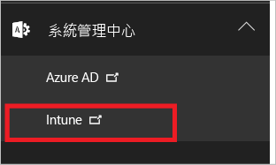
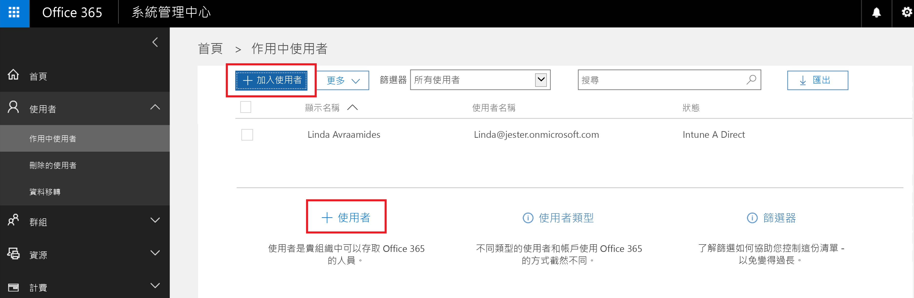
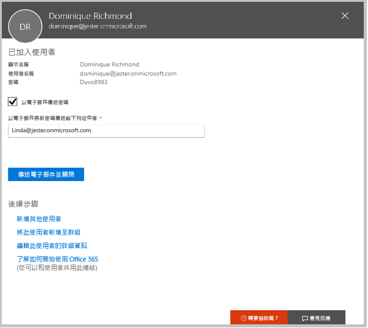
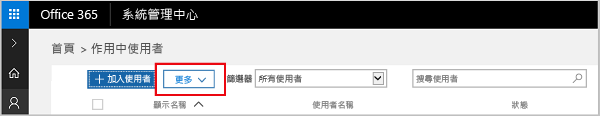

# 註冊 Microsoft Intune 免費試用
本文將逐步引導您註冊 Intune 試用及準備一些使用者來試用，您就能依據相關聯的評估指南了解 Intune 如何管理行動裝置。 <!---or app data when devices are not enrolled in Intune.--->

## 假設
本註冊文章與評估指南假設您使用的是僅供評估用途的試用版，且您訂閱時想要以全新的環境開始。

為使您可以輕鬆地開始使用試用版，我們設定了一個非常簡單的環境，其中僅使用 Intune，並假設它將會是您管理裝置的唯一方法 (又稱為行動裝置管理授權單位)。 不過，如果您想要進一步探索，在整個指南中我們將指引您進入更深入的技術內容。

您可以在試用版中執行訂閱版的所有動作；唯一的差別是試用版中限制 100 個使用者帳戶。

## 註冊試用版
請造訪 [Intune 註冊](https://portal.office.com/Signup/Signup.aspx?OfferId=40BE278A-DFD1-470a-9EF7-9F2596EA7FF9&dl=INTUNE_A&ali=1#0%20) 頁面並填寫表格以註冊試用版訂閱。

如果您已經有工作或學校帳戶，而且想要將它用於您的 Intune 試用版，請改為依照[這些登入指示](https://docs.microsoft.com/en-us/intune/get-started/start-with-a-paid-subscription-to-microsoft-intune-step-1)執行作業。 但是，本文章和其評估指南是假設您沒有使用那些帳戶。

> [!TIP]
> 如果您大部分的 IT 作業和使用者的地區設定都和您不一樣，您可以為您的試用版設定該地區設定以測試效能。

### 註冊後的考量
當您註冊試用版時，您將會在您於註冊過程中提供的電子郵件位址收到包含帳戶資訊的電子郵件訊息。 本電子郵件可確認您的試用版是使用中的狀態。

完成註冊程序後，會將您導向另一個頁面，讓您使用 Office 365 系統管理中心來新增使用者和指派授權給他們。 您下一次登入 Intune 時，會自動將您導向至 Intune 管理主控台。

## 繼續說明系統管理中心和 Intune 管理主控台
您將會用於 Intune 的入口網站有兩個：Office 365 系統管理中心 ([portal.office.com](https://portal.office.com)) 和 Intune 管理主控台 ([manage.microsoft.com](https://manage.microsoft.com))。

一般來說，您會在 Intune 管理主控台中執行工作，如下所示。 這是您設定及管理您的群組、原則、裝置及應用程式的網站。

但是，您將會使用 Office 365 系統管理中心 (如下所示) 來新增及管理您的使用者和您帳戶的其他層面，包括帳單與支援。

您可以從 Office 365 系統管理中心瀏覽至 Intune 管理主控台。 系統管理中心位於左邊導覽窗格中最後一個項目底下。 請選擇 [Intune] 來於新的索引標籤中開啟 Intune 管理主控台。

若要從 Intune 回到 Office 365 系統管理中心，請在 [群組概觀] 頁面上選擇 [新增使用者] 工作。

## 加入使用者
在您離開 Office 365 系統管理中心到 Intune 之前，您需要新增一些使用者至您的試用帳戶。

您可以在 Office 365 系統管理中心個別新增使用者，或透過上傳 .csv 檔案大量新增使用者。 我們支援以這兩種方式設定您的試用版。 但是，在您的生產環境中，您可能會想要使用您的 Azure Active Directory 使用者帳戶 (您可以在我們的[快速入門指南](https://docs.microsoft.com/en-us/intune/get-started/start-with-a-paid-subscription-to-microsoft-intune-step-3)本文章的[後續步驟](#Next-steps)一節中了解相關詳細資訊)。

### 新增個別使用者
1. 選擇兩個選項的其中之一來新增使用者，以開啟可讓您建立使用者的表單。 只需要填寫已加上星號 (\*) 的項目。

2.  當您新增使用者時，最後一個步驟是寄送包含暫時 Intune 密碼的電子郵件給使用者。 基於此評估目的，請使用您自己的工作電子郵件地址，您就會收到登入資訊並查看您的使用者將會收到的電子郵件。 然後您可以使用這些使用者識別碼來註冊測試裝置。 

 

3. 如果您想要在建立使用者之後指派系統管理員角色給使用者，您可以在 Office 365 系統管理中心中編輯角色，方法是從您的使用者清單選取使用者名稱，然後在 [角色] 一行選取 [編輯] 來查看您可以從中選取並指派角色給該使用者的使用者角色清單。

 

### 匯入多個使用者
1. 您可以在 [更多] 清單中找到用來匯入多個使用者的精靈。

 

2. 為協助您正確設定 .csv 檔案，您可以下載範本檔案來填入您的使用者資料。 下載包含標頭和範例使用者資訊的 .csv 檔案，以查看每個欄位所需的正確資料類型。

 

3. 在您建立及儲存您的 .csv 檔案之後，請選擇 [瀏覽] 來選取檔案。 確認，然後選擇 [下一步]。 就會將您的使用者上傳並新增到您作用中使用者的清單。

現在就前往 Intune 管理主控台來開始管理您的使用者、他們的裝置，以及他們的應用程式。

> [!NOTE]
> 您的使用者在註冊要受到管理的裝置之前，他們將不會在 Intune 中顯示。

## 後續步驟
評估案例：[評估 Microsoft Intune 中的行動裝置管理功能](mobile-device-management-trial-guide-microsoft-intune.md)

深入了解搭配 Intune 使用您的 Azure Active Directory 使用者帳戶：
- [身分識別需求](https://docs.microsoft.com/en-us/active-directory/active-directory-hybrid-identity-design-considerations-overview#design-considerations-overview)
- [目錄同步作業需求](https://docs.microsoft.com/en-us/active-directory/active-directory-hybrid-identity-design-considerations-directory-sync-requirements)
- [Multi-Factor Authentication 需求](https://docs.microsoft.com/en-us/active-directory/active-directory-hybrid-identity-design-considerations-multifactor-auth-requirements)

深入了解使用 [Intune 搭配 System Center Configuration Manager](https://docs.microsoft.com/en-us/sccm/mdm/understand/hybrid-mobile-device-management)

<!--HONumber=Dec16_HO2-->

