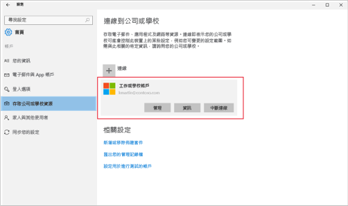

# 在 Intune 註冊 Windows 10 裝置

> [!NOTE]
> Windows 10 適用於所有類型的裝置。 不論您使用桌上型電腦、手機或平板電腦，您都會遵循相同的步驟 (即使與本頁上的影像稍微不同也一樣)。

> [!VIDEO https://channel9.msdn.com/Series/IntuneEnrollment/Windows-Enrollment/player]

1. 移至 [開始]。

  - 如果您在 **Windows 10 Desktop** 裝置上，請移至 [開始] 功能表。
  - 如果您在 **Windows 10 行動裝置版**裝置上，請移至**開始畫面**，然後滑到 [所有應用程式] 清單。

2.  在搜尋列中搜尋「設定」，以開啟 Windows [設定] 應用程式。

3. 選取 [帳戶] > [存取公司或學校資源] > [連接]。

    ![選取 [存取公司或學校帳戶]](./media/w10-enroll-rs1-connect-to-work-or-school.png)

3.  輸入您公司或學校的電子郵件地址，然後選取 [下一步]。

    

4. 使用您的工作或學校帳戶登入 Intune。

    

    您會看到一則訊息，指出您的公司或學校正在註冊您的裝置。

5. 當您看到 [已全部完成] 時 畫面，選取 [關閉]。 大功告成。

  ![在「已全部完成!」畫面上選取關閉 點選 [關閉]](./media/w10-enroll-rs1-youre-all-set.png)

6. 如果想要再次檢查您的連線是否正確，請回到 [設定]，現在您應該會看到這裡已列出您的工作或學校帳戶。

    

如果您已遵循前述步驟，但仍無法存取自己的工作或學校電子郵件帳戶和檔案，請遵循[針對如果看見 [存取公司或學校資源] 時需遵循的步驟進行疑難排解](troubleshoot-your-windows-10-device-windows.md#troubleshooting-steps-to-follow-if-you-see-access-work-or-school)中的步驟。
