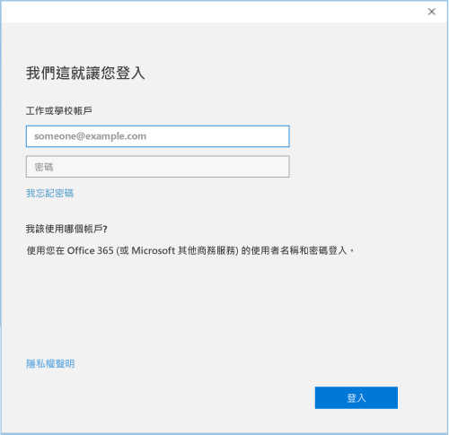

# 在 Intune 註冊 Windows 10 裝置

  > [!NOTE]
  > Windows 10 適用於所有類型的裝置。 不論您使用桌上型電腦、手機或平板電腦，您都會遵循相同的步驟 (即使與本頁上的影像稍微不同也一樣)。

1. 移至 [開始]。

   - 如果您在 **Windows 10 Desktop** 裝置上，請移至 [開始] 功能表。
   - 如果您在 **Windows 10 行動裝置版**裝置上，請移至**開始畫面**，然後滑到 [所有應用程式] 清單。

2. 在搜尋列中搜尋「設定」，以開啟 Windows [設定] 應用程式。

3. 選取 [帳戶]。

    ![前往 [設定] 與 [帳戶]](./media/W10-enroll-1-settings-accounts.png)

4. 選取 [您的帳戶]。

    ![選取 [您的帳戶]](./media/W10-enroll-2-accounts-your-account.png)

5. 選取 [新增公司或學校帳戶]。

    ![選取 [新增公司或學校帳戶]](./media/w10-enroll-3-add-work-school-acct.png)

6. 使用工作或學校認證登入。

    

仍然無法存取您的工作或學校電子郵件、檔案或其他資料嗎？ 嘗試[針對您的帳戶問題進行難排解](troubleshoot-your-windows-10-device-windows.md#troubleshooting-steps-to-follow-if-you-see-your-account)，修正您的存取權。 如果仍然無效，您將需要連絡公司支援人員以取得進一步的協助。

有一個輕鬆地從公司支援人員取得協助的方法，是透過公司入口網站應用程式中提供的連絡資訊，它也可讓您尋找並下載每日工作所需的建議與必要應用程式。 可能您已經在裝置上安裝公司入口網站應用程式。 快速確認的方法是在 [所有應用程式] 清單中尋找 [公司入口網站]。

如果應用程式清單中找不到 [公司入口網站]，請遵循下列步驟安裝它。

1. 選取 [開始] > [市集]

2. 選取 [搜尋]，然後鍵入**公司入口網站**。

3. 在結果清單中，選取 [公司入口網站] > [安裝]。

4. 選取 [安裝] 或 [免費]。 這兩個選項對您而言並沒有差別，所顯示的選擇取決於您的組織如何設定公司入口網站應用程式。
