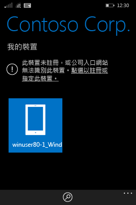
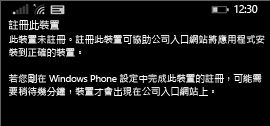

# 在 Intune 註冊 Windows Phone 8.1 裝置

如果您的公司或學校使用 Microsoft Intune，您可以註冊裝置來存取公司電子郵件、檔案和其他資源。 當您註冊裝置時，您的組織可確保公司資料的安全。 若要深入了解註冊，請參閱[如果您安裝公司入口網站應用程式並在 Intune 註冊裝置時，會發生什麼情況？](what-happens-if-you-install-the-company-portal-app-and-enroll-your-device-in-intune-windows.md)和[公司支援人員在您裝置上可看到和不可看到的項目](what-info-can-your-company-see-when-you-enroll-your-device-in-intune.md)。

若要在 Intune 註冊您的 Phone 8.1 裝置，請遵循適用於您公司或學校的指示：

-   [如果貴公司讓您從 Microsoft 網上商店使用公司入口網站](#if-your-company-lets-you-use-the-company-portal-from-the-windows-store)

-   [如果不允許您從 Windows Phone 存取 Microsoft 網上商店，或者如果您沒有 Microsoft 帳戶](#if-you-are-not-allowed-to-access-the-windows-store-from-your-windows-phone-or-if-you-do-not-have-a-microsoft-account)

## 如果貴公司讓您從 Microsoft 網上商店使用公司入口網站
在您的裝置上安裝公司入口網站應用程式：

1.  點選 [開始] &gt; [存放區]。

2.  點選 [搜尋]，然後鍵入**公司入口網站**。

3.  在結果清單中，點選 [公司入口網站]。

    

4.  點選 [公司入口網站] &gt; [安裝]。

    

註冊裝置：

1.  在裝置上，開啟 [Microsoft Intune 公司入口網站] 應用程式。

2.  提供您的認證。 如果適用的話，系統可能會要求您接受貴公司的條款和條件。

3.  滑到 [我的裝置]。

4.  點選 [點選以註冊或指定此裝置]。

    

5.  點選 [註冊此裝置]。

    

6.  點選 [新增帳戶]。

    

7.  依要求輸入其他資訊，然後點選 [登入] 完成註冊。 現在應該可以在 [設定] &gt; [工作場所] 頁面中看到您的工作場所帳戶。

    

## 如果不允許您從 Windows Phone 存取 Microsoft 網上商店，或者如果您沒有 Microsoft 帳戶

1.  點選 [設定] &gt; [工作場所]。

2.  點選 [新增帳戶]，然後使用工作帳戶登入。

3.  依要求輸入其他資訊，然後點選 [登入] 完成註冊。

4.  如果提示您安裝公司應用程式或集線器，請確定核取相關方塊，然後點選 [完成]。

如果您公司的支援人員已設定在註冊期間安裝公司入口網站，您的應用程式清單就會顯示公司入口網站。

是否仍需要協助？ 請連絡您公司的支援人員。 如需其連絡資訊，請查看[公司入口網站](https://portal.manage.microsoft.com)。
